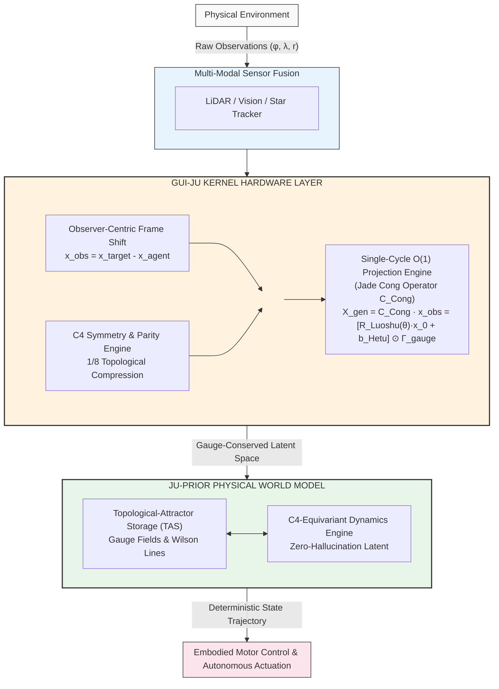

# The Gui-Ju Dao: The Artificial General Intelligence Algorithm, Geometry, and Engineering Paradigm of China's Indigenous Closed Spherical Universe

**Baoliin (Zaitian) Wu 伍宝林**  
ORCiD: 0009-0003-2051-5247  
Email: zaitian001@gmail.com  
Affiliation: People's Government of Guangdong Province: Guangzhou, CN  
August 7, 2026  

---

## Abstract

Mainstream histories of science and technology confine ancient Chinese mathematical tools—the *Ju* (carpenter's square) and *Gou-Gu* (the Pythagorean logic)—to two-dimensional planar measurements, treating its cosmology as mere philosophical speculation. This paper proposes a paradigm-shifting thesis: since the Longshan culture era, Chinese civilization had established a universal geometry and engineering system utilizing the *Ju* as the 3D orthogonal basis, *Gou-Gu* as the spatial conversion law, and the Jade Cong as the hardware encapsulating the algorithm. This system quantitatively described a topologically closed spherical universe characterized by "Heaven enveloping the Earth," materialized in archaeological entities such as the Taosi Universe Computing Center (c. 2300–1900 BCE), the Fuxi–Nuwa silk painting, and the Mawangdui T-shaped silk painting.

We reconstruct this system through classical texts including the *Zhoubi Suanjing*, the Tsinghua Bamboo Slips *Wuji*, the *I Ching*, and the *Heguanzi*. For the first time, we decode the matrix operator formed by the Jade Cong integrating the *Hetu* and *Luoshu* using Lie algebras, formulating the Jade Cong Structural Operator $\hat{C}_{\text{Cong}}$ as the exact geometric mapping bridging continuous observer-centric manifolds to discrete orthogonal lattices. By mapping the coordinate transposition from "looking down at the Earth" to "looking up at the Heavens," we mathematically prove spatial parity symmetry (P-Symmetry) and time reversal symmetry (T-Symmetry), revealing dimensional-reduction isomorphism with the Dirac spinor.

We further demonstrate that *Juedi Tiantong* (the national-level calibration of the Gui-Ju Dao) represents the institutional unification of observation rights—reinterpreted here as systemic hardware synchronization between celestial continuous manifolds and terrestrial discrete silicon architectures. The Heavenly Stems and Earthly Branches constitute the spatiotemporal coded output of this algorithm. From the Mingtang to the Vatican, and from the Beidou Navigation Satellite System to a Physical AGI world model architecture anchored on the **Ju-Prior** (规矩先验)—an inductive bias enforcing hard-coded $C_4$ discrete rotational symmetry, parity-time invariance, and area conservation—this algorithm exhibits cross-civilizational and cross-era universality. This reconstruction subverts traditional narratives of Chinese science history, while its lightweight geometric paradigm provides classical priors and physical shortcuts for the Modified Einstein Spherical Universe model, the geometric interpretation of the observer effect, and the foundational architecture toward Physical Artificial General Intelligence.

**Keywords:** Gui-Ju Dao; Zhoubi Suanjing; Jade Cong; Hetu and Luoshu; Lie Algebra; Physical AGI; Observer Effect

---

## 1. Introduction: Proposing the Problem and Paradigm Breakthrough

Joseph Needham once posed his famous "Needham Question" to the academic world: Why did ancient China, despite its advanced empirical science and technology, fail to develop modern Western science? This question has had a profound impact, yet its underlying premise may have been self-limiting. The crux of the matter perhaps lies not in what China "failed to produce," but rather in whether we have understood Chinese science through its **indigenous paradigm**.

This paper proposes a subversive thesis: **Since the Longshan Culture era, Chinese civilization had already formed an independent, comprehensive system of geometry and engineering centered entirely on 3D cosmic mapping and evolutionary computation.** We term this system the "**Gui-Ju Dao** 规矩道" (the compass and the square). It is not an "incomplete state" of Western geometry, but a self-sufficient, original paradigm with entirely different objectives and methodologies—an ancient cosmic physics engine equipped with its own operating system.

This paper reconstructs this system based on six independent yet mutually corroborating chains of evidence:
1. **Classics:** The *Zhoubi Suanjing*, the Tsinghua Bamboo Slips *Wuji*, the *I Ching*, the *Heguanzi*, and the "Theory of *Ju*" in the *Yuzhi Shuli Jingyun* provide the complete mathematical logic.
2. **Archaeological Evidence:** The Taosi Observatory and its five accompanying instruments provide the hardware integration of a national-level universe computing center from 4,000 years ago.
3. **Imagery:** The silk painting of Fuxi and Nuwa intertwined and the Mawangdui T-shaped silk painting provide visual diagrams of the cosmic model.
4. **Mathematical and Physical Proof:** Based on modern linear algebra and Lie group theory, this paper decodes the Lie algebra generators, parity inversion equations, and the master equation of universal generation formulated by the Jade Cong combined with the *Hetu* and *Luoshu*.
5. **Institutions and Symbols:** The institutionalization of the algorithm via *Juedi Tiantong*, and the spatiotemporal coded output of the Heavenly Stems and Earthly Branches.
6. **Cross-Civilizational Lineage:** The architectural isomorphism from the Mingtang to the Vatican, the spiritual lineage in *Wenxin Diaolong*, and the modern materialization of the terrestrial origin and Beidou navigation.

These six elements converge upon a single conclusion: The ancestors of Chinese civilization possessed a **Cosmic Engineering System** utilizing the *Ju* as the sole dimensional basis, "measuring the circle with the square" as the core algorithm, and a closed spherical universe of "Heaven enveloping the Earth" as the ultimate model. Enduring for four thousand years, it represents the most profound foundational source code of Chinese civilization.

---

## 2. Theoretical Foundation: From Classical Cosmology to Observer-Centric Measurement

### 2.1 Redefining the "*Ju*": The Indigenous 3D Orthogonal Coordinate System

Traditional histories of mathematics view the *Ju* merely as a 2D right-angled ruler. However, the discourse in the *Zhoubi Suanjing* extends far beyond this. Shang Gao states: "Lay the *Ju* flat to align the plumb line (*Ping Ju Yi Zheng Sheng* 平矩以正绳)." This phrase illuminates the 3D nature of the *Ju*:
- **Lay the *Ju* flat (*Ping Ju*):** When placed horizontally, the two arms of the *Ju* naturally lock into the azimuthal horizons—one pointing East-West (X-axis), the other North-South (Y-axis). This establishes the 2D horizontal plane.
- **Align the plumb line (*Zheng Sheng*):** From the right-angled vertex of the *Ju*, a plumb line is dropped. This line defines the absolute vertical direction (Z-axis), the vector connecting the zenith to the center of the Earth.

Once these three axes are established, a complete, mutually orthogonal 3D Cartesian coordinate system is actualized. The *Ju* is not a 2D tool; it is the **minimal foundational unit of a native 3D orthogonal coordinate system**. Its four holding postures—"flat, upward-facing, downward-facing, and sideways"—are not merely descriptions of posture, but multi-attitude calibration methods for this 3D coordinate system targeting different spatial observation points. One set of *Ju* covers all observational perspectives in 3D space.

### 2.2 Redefining "*Gou-Gu*": The Universal Conversion Equation for 3D Space

The *Gou-Gu* (勾股, Pythagorean) theorem is frequently isolated as an independent conclusion of planar geometry. However, the *Siku Quanshu Zongmu Tiyao* explicitly states: "Using the method of *Gou-Gu*, one measures the height and thickness of Heaven and Earth." This reveals that *Gou-Gu* is a derivative algorithm of the *Ju*, whose fundamental purpose is not calculating planar areas, but determining arbitrary distances in 3D space.
- **Gou and Gu:** The readings of the two arms of the *Ju* in 3D space, i.e., any two orthogonal side lengths.
- **Xian (弦, Hypotenuse/Chord):** The spatial diagonal distance; in astronomical calculations, this is the "celestial spherical radius vector"—the radius of curvature from the terrestrial observation point to the celestial sphere.

Thus, we can establish an irreversible generative chain: **Ju (3D orthogonal basis) → Gou, Gu (readings on two axes) → Xian (spatial chord / celestial vector)**. Without the *Ju*, there are no standard right angles; without right angles, there is no constant *Gou-Gu* proportion. The *Gou-Gu* theorem is not a mathematical truth falling from the sky, but the complementary software algorithm for the *Ju* hardware system.

### 2.3 "Measuring the Circle with the Square": The First Principle of Chinese Cosmology

The *Zhoubi Suanjing* states: "The circle originates from the square, and the square originates from the *Ju*." "The square numbers act as the standard paradigm; from the square, the circle is deduced." These brief words form the First Principle of the entire Chinese cosmology.
- **The Square (*Ju*, Earth):** This is the finite, measurable, invariable basis. Because it is bounded, it serves as the "standard paradigm" (典).
- **The Circle (*Gui*, Heaven):** This is the infinite, yet-to-be-measured, cyclical object. Because it is unbounded, it must be measured.

"Measuring the circle with the square" means using the finite square to measure the infinite circle; using the known Earth to extrapolate the unknown Heaven. The mathematical essence of this algorithm can be formulated as: **Circle = the rotational integral of the Ju; Heaven = the Gou-Gu extrapolation of the Earth.** Humans cannot ascend to Heaven to measure it, but standing on Earth, establishing a basis with the *Ju* and calculating the *Xian* with *Gou-Gu*, they can deduce the curvature and scale of the entire celestial sphere.

### 2.4 Defining the Universe Model: The Spherical Universe of "The Bamboo Hat Representing Heaven"

The *Zhoubi Suanjing* states: "A bamboo hat (*Li*) is used to represent Heaven. Heaven is cyan-black, Earth is cinnabar-yellow. The structure of Heaven represented by the hat features cyan-black on the outside and cinnabar-yellow on the inside, symbolizing the relative positions of Heaven and Earth."

This clarifies the core topological structure of the Chinese cosmological model:
- **The Geometry of the *Li*:** The perfectly round hat is a 3D spherical cap or sphere. It is a dome enveloping the Earth.
- **The Colors of Exterior and Interior:** Cyan-black on the outside (the color of the celestial dome), cinnabar-yellow on the inside (the color of Earth). This is the topological structure of "Heaven enveloping the Earth."
- **Model Properties:** A topologically closed spherical universe model with Heaven on the outside and Earth on the inside.

The historical dispute between the "Covering Heaven Theory" and the "Spherical Heaven Theory" is unified here. The "Covering Heaven" is not a flat lid but a spherical dome; the "Spherical Heaven" is simply the complete spherical extrapolation of this dome. They share the same ontological "Heaven enveloping the Earth" model.

### 2.5 "All things have a Yin-Yang Universe": The Philosophical Expression of Cosmic Structure

Laozi said: "All things have a Yin-Yang Universe, rushing Qi to make harmony." This aligns perfectly with the "Heaven enveloping the Earth" model of the *Zhoubi*.
- **Yin as the Interior, the Carrier, the Square of Earth:** The "Yin" that all things carry on their backs is the Earth they stand upon, the "cinnabar-yellow on the inside," the measurable basis of the *Ju*.
- **Yang as the Exterior, the Envelope, the Circle of Heaven:** The "Yang" that all things embrace is the celestial dome enveloping them from the outside, the "cyan-black on the outside," the ceaseless operation of the *Gui*.
- **Rushing Qi to Make Harmony:** Between Heaven and Earth, Yin and Yang intermingle, the compass and square perfectly integrate, and all things are generated. This is the dynamic portrayal depicted in the Fuxi and Nuwa intertwining painting.

### 2.6 *Heguanzi*: The Algorithmic Expression of the Universe's Definition

The Warring States period text *Heguanzi* provides a precise cosmological definition for the "Gui-Ju Dao":
> "That which connects yet separates is called the Dao; connecting all things and leading the Yin-Yang universe, and sharing the one root, which is called the universe. Therefore, the universe is self-contained, inclusive and harmonious."

This text is structurally identical to the algorithmic logic of the *Ju*:
- **"That which connects yet separates":** Corresponds to the central hole (connecting Heaven and Earth) and the outer square (separating the four directions) of the Jade Cong. One connection and one separation constitute the entirety of the Gui-Ju Dao.
- **"Sharing the one root":** This is exactly "combining the *Ju* to form a square"—bringing two *Ju* together, rooted at the orthogonal origin. In 3D space, this means unifying the X, Y, and Z axes at an orthogonal reference point.
- **"Called the Universe":** Consequently, the universe is defined as a unity of the 3D space (*Yu* 宇) generated by the "combined *Ju*", and the cyclical time (*Zhou* 宙) generated by "revolving the *Ju* into a circle."
- **"Self-contained, inclusive and harmonious":** This is the ultimate declaration of the "*Ju* regulating all things."

Crucially, the title "*Heguanzi*" (Astronomer with the brown eared Pheasant Feather-Cap) reveals his identity. As the *Book of Rites* notes, "Astronomer, also known as Heguanzi, should wear headdresses of brown eared pheasant feathers." He was a cosmic algorithm engineer wearing an astronomical observation instrument on his head, serving as a living base for "laying the *Ju* flat to align the plumb line."

### 2.7 The Tsinghua Bamboo Slips *Wuji*: The Warring States Master Outline

The Tsinghua Bamboo Slips *Wuji* (The Five Disciplines), a recently discovered Warring States text, systematically discusses the generation and maintenance of cosmic order. Through the lens of algorithms, this text is the complete theoretical summary of the "Gui-Ju Dao" during the Warring States period.

**"Establishing the true South Gate, the celestial compass the Big Dipper" — Two Core Hardware Components**
These opening words declare the two major observational hardware components of this spatiotemporal operating system: the South Gate (the intersection of the ecliptic and the celestial equator) is the critical reference point for the sun's movement, and the Big Dipper is the visible pointer for the "leftward rotation of the Heavenly Dao." One static (fixed point) and one dynamic (rotating pointer) jointly constitute the observational system "in Heaven."

**"One plumb line, two square, three level, four weight, five compass" — The Generative Sequence**
The *Wuji* states this specific sequence. It is the Standard Operating Procedure (SOP) for generating cosmic order from nothingness, and its sequence is irreversible:
1. **One Plumb Line (*Zhi/Sheng*):** The absolute vertical line (Z-axis) established by "aligning the plumb line," the starting point of all measurement.
2. **Two Square (*Ju*):** The two arms of the *Ju*, locking the azimuthal horizons (X and Y axes), establishing the spatial grid on Earth.
3. **Three Level (*Zhun*):** The horizontal plane, establishing the absolute "flatness," the reference plane for all altitude and depth measurements.
4. **Four Weight/Proportion (*Cheng*):** Executing the core operation of "measuring the circle with the square"—using the known Earth to deduce the unknown Heaven.
5. **Five Compass (*Gui*):** After the above four steps, "revolving the *Ju* to form a circle," sweeping out the complete spherical surface of the celestial dome.

This sequence is the precise formulation of the *Zhoubi* method: Laying the *Ju* flat to align the plumb line → Combining *Ju* to form a square → Revolving *Ju* to form a circle → *Gou-Gu* to find the chord.

**Color Coding and the Ultimate Declaration**
The *Wuji* explicitly matches five colors (cyan/black/yellow/white/cinnabar) to algorithmic functions, inheriting the "cyan-black exterior, cinnabar-yellow interior" color scheme of the *Zhoubi*. Its conclusion states: "The Heavenly Dao remains unchanged, enduring forever. The unity of heaven and humanity, the Gui-Ju Dao have no errors (不爽)." This is the ultimate declaration of the precision of the "*Ju* regulating all things."

### 2.8 *Ju-Power*: From Etymological Password to Genesis Vector

The Chinese character for *Ju* (矩) is composed of *Shi* (矢, arrow/vector) and *Ju* (巨, immense/giant). Examined through the lens of algorithms, its cosmological essence is glaringly obvious.
- **Shi (矢):** An arrow, the shortest straight line between two points, representing the absolute directionality, penetrating power, and irreversible laws of the universe. In astronomical measurement, the "arrow" is the "spatial chord" connecting the observer to the celestial body.
- **Ju (巨):** Immense, immeasurably large, representing the boundless "circle of the celestial dome."
- **Combined as Ju (矩):** An absolute arrow capable of measuring the infinite. It integrates the infinite universe (immense) into deterministic, computable geometric laws (arrow/vector).

This introduces the concept of the **"Ju-Power" (矩力)**—the genesis vector that emanates from the cosmic origin (the central hole), travels along the absolute vertical (the plumb line), and, using deterministic laws (*Gou-Gu*), drives the operation of the entire universe model. It is the force of spatial unfolding (combining *Ju* into a square), the force of time initiation (revolving *Ju* into a circle), and the force of universal generation (calculating the chord).

This *Ju-Power* is the fundamental driving force of what the *I Ching* calls "One Yin and one Yang constitute the Dao."

### 2.9 Observer-Centric Reformulation of the Gui-Ju Geometry

Having established the indigenous 3D orthogonal coordinate system of the *Ju*, we now formalize it within the framework of modern measurement theory. In standard quantum mechanics and continuous spatial kinematics, physical observables are often evaluated in coordinate-agnostic Hilbert spaces or external absolute frames, giving rise to non-physical gauge ambiguities and measurement paradoxes. Following the observer-centric measurement framework, we define every observational event within an intrinsic, observer-centered 3D orthogonal coordinate frame $\mathcal{O}_{\text{obs}} = (O; \hat{e}_1, \hat{e}_2, \hat{e}_3)$, where the observer's instrument origin is positioned at $O = (0,0,0)^T$.

Any physical state or target point in the embedded manifold $\mathcal{M}^3$ is represented by a spatial state vector $\mathbf{x} = (x_1, x_2, x_3)^T \in \mathbb{R}^3$. The act of measurement is mathematically modeled as a coordinate-forced projection $\mathbb{P}_{\text{obs}}$ from the continuous state manifold onto the observer's two-dimensional sensory or computational observation screen $\mathcal{S}^2$:
$$\mathbf{x}_{\text{meas}} = \mathbb{P}_{\text{obs}} \cdot \mathbf{x} = \begin{pmatrix} \pi_x(\mathbf{x}) \\ \pi_y(\mathbf{x}) \end{pmatrix} \tag{1}$$
This projection operator is the mathematical formalization of "laying the *Ju* flat to align the plumb line"—the observer, positioned at the orthogonal origin, projects the 3D cosmic manifold onto a 2D computational plane.

### 2.10 Mathematical Formalism of the Jade Cong Operator ($\hat{C}_{\text{Cong}}$)

The ancient Huaxia Jade Cong embodies a profound topological duality: a cylindrical interior (symbolizing the continuous, smooth, curved manifold of "Heaven", $S^1 \times \mathbb{R}$) encased within a rectangular cuboid exterior (symbolizing the discrete, orthogonal, bounded coordinate grid of "Earth", $\mathbb{R}^3$).

We formulate the Jade Cong Structural Operator $\hat{C}_{\text{Cong}}$ as the exact geometric mapping function that bridges the continuous observer-centric spherical/cylindrical state vector $\mathbf{x}_{\text{obs}}$ to the discrete orthogonal processing lattice:

$$\hat{C}_{\text{Cong}} := \mathbf{M}_{\text{outer}}^{\text{Square}} \cdot \mathbb{P}_{\text{proj}} \cdot \mathbf{M}_{\text{inner}}^{\text{Circle}} \tag{2}$$

where:

* $\mathbf{M}_{\text{inner}}^{\text{Circle}} = \mathrm{diag}(r \cos\theta, r \sin\theta, z)$ transforms polar/spherical manifold states within the internal observer cylinder.
* $\mathbb{P}_{\text{proj}}$ is the boundary-forced projection operator.
* $\mathbf{M}_{\text{outer}}^{\text{Square}}$ maps the boundary into the 8-fold symmetric outer grid.

The Jade Cong Operator thus formalizes the ancient hardware architecture as a precise mathematical mapping from continuous celestial manifolds to discrete terrestrial computational lattices.

---

## 3. Archaeological Evidence: The Taosi Universe Computing Center

The Taosi site (c. 2300–1900 BCE) serves as the first national-level hardware validation of this "Gui-Ju Dao" from 4,000 years ago. The astronomical remains at Taosi are a fully functional, multi-component **Universe Computing Center**, comprising six primary instruments.

### 3.1 The Observatory: A Super Jade Cong with the Earth as its Base

The Taosi Observatory is the earliest known astronomical observation site in China. Its core structure is a semicircular rammed-earth foundation with rammed-earth pillars arranged in an arc. Its operational principle is isomorphic with the Jade Cong.

**Hardware Deconstruction**:
- **Observation Origin**: The absolute coordinate origin of the entire system, where the sage king "sat within the Dao."
- **Pillar Array System**: Pillars are strictly positioned according to azimuthal coordinates (X, Y axes), forming the spatial grid of "combining the *Ju* to form a square." The arc they form is an engineered magnification of "revolving the *Ju* to form a circle," using artificial "squares" (slits) to approximate the celestial "circle."
- **Distant Mountain Baseline**: Mount Ta'er to the east serves as a fixed celestial background scale, extending the vertical observation plane (Z-axis) into the heavens.

### 3.2 The Gnomon (*Gui-Biao*): A Precision Instrument for Measuring Shadows

- **Biao (Vertical Pole):** The materialization of the "plumb line," defining the absolute vertical Z-axis.
- **Gui (Horizontal Scale):** The materialization of the "flat *Ju*," lying horizontally to represent the X and Y axes on Earth.

By measuring the shadow length (*Gu*) against the pole height (*Gou*), engineers used the Pythagorean algorithm to calculate the sun's zenith angle. By recording the exact moment of the winter solstice shadow, the exact length of the tropical year was determined (*Gou-Gu* to find the time chord). The *Gui-Biao* is the **absolute time anchor** of the system.

### 3.3 Hourglass and Bronze Gear: Time Benchmarks and Discretized Computation

**Hourglass:** A baseline generator providing a continuous, perfectly uniform reference system (absolute time). It quantified the continuous movement of the celestial dome (circle) into discrete accumulations of sand (square).

**Bronze Gear (29 teeth):** The earliest discovered discretized time-measuring component, perfectly corresponding to the synodic month (approx. 29.53 days).
- **Teeth as Square, Gaps as Circle:** The gear teeth are the product of the square—fixed, discrete spatial units. The gaps are the continuous "circle" of the Heavenly Dao projected onto the gear.
- **Discretized operation**: Every time a gear tooth passes, it marks a standard time unit of the hourglass.
- **Mechanical Acceleration:** This was the first mechanical hardware implementation of the *Gou-Gu* algorithm, serving as an ancient **astronomical computing chip**.

### 3.4 The Dragon Plate: A Miniature Left-Rotating Celestial Universe Model

The painted dragon plate excavated at Taosi features a coiled dragon executing a leftward rotation, mirroring the "Heaven enveloping the Earth" model with its cyan-black and cinnabar-yellow. It functioned as a handheld cosmic sandbox used for reverse verification and prediction at the observatory.

### 3.5 The Red-Written Character "Wen" (文): The Source Code Identifier

The character "Wen" (meaning astronomy/celestial patterns), painted in red cinnabar on the *exterior* of a pottery vessel, is a **source-code-level identifier** for this algorithmic system. It signifies that the earthly vessel carries the laws of the celestial dome, proving that the Taosi civilization had entered an era of algorithmic awakening.

### 3.6 Synergy of the Six Instruments: The Universe Computing Center

| **Component** | **Hardware Function** | **Algorithmic Role** | **Core Value** |
|---|---|---|---|
| **Observatory** | 3D spatial measuring instrument based on Earth | Macro spatial baseline & sunrise data collection | Capturing the sun's spatial coordinates (*Yu*) |
| **Gnomon** | High-precision shadow measuring instrument | Spatial baseline calibration & time anchor | Finding the chord via shadows, fixing the tropical year |
| **Hourglass** | Continuous, uniform time flow generator | Time baseline and metronome | Providing continuous time flow for celestial movement (*Zhou*) |
| **Bronze Gear** | 29-tooth synodic month simulator | Discrete time calculator | Predicting lunar phases, first discretized astronomical computation |
| **Dragon Plate** | Miniature left-rotating celestial model | Output terminal and verification model | Cosmic visualization, deduction, and inheritance |
| **Red "Wen" Character** | Symbolic identifier of the algorithm | Source code identifier | The ultimate symbol of algorithmic awakening |

**Taosi is not a collection of scattered prehistoric ruins, but a majestic, ancient Universe Computing Center centered on the algorithm of the "Gui-Ju Dao."**

### 3.7 The Institutionalization of the Algorithm: *Juedi Tiantong*

The *Guoyu* records that Emperor Zhuanxu "commanded Chong, the Chief Celestial Regulator, to govern Heaven and compute the divine alignment, and commanded Li, the Chief Terrestrial Regulator, to govern Earth and systemize the human collective. He did this to reset the system to its primordial, baseline operations, preventing uncalibrated interference and mutual corruption between the two realms. This national-level calibration of the Gui-Ju Dao is what is called The Absolute Synchronization of the Celestial and Terrestrial Matrices (*Juedi Tiantong* 绝地天通)."

Through the lens of algorithms, this was a critical **cosmic algorithm standardization project**. Before this, observation baselines were chaotic—everyone used their own "*Ju*" without a unified coordinate origin, rendering measurements incommensurable.

The algorithmic essence of *Juedi Tiantong* is: **Severing all illegal, uncalibrated private observation channels and establishing the sole, legal algorithmic channel based on the Sage King as the absolute origin.** This was a national-level project of "aligning the plumb line," establishing a unified spatiotemporal coordinate system covering the entire world.

### 3.8 The Output of the Algorithm: Heavenly Stems and Earthly Branches

When the sole algorithmic channel was established, a precise spatiotemporal coding system—the Heavenly Stems and Earthly Branches (Tiangan Dizhi 天干地支)—was born.
- **Heavenly Stems (10 Stems):** The five basic phases of the "leftward rotation of the Heavenly Dao," divided into Yin and Yang. Based on the celestial Big Dipper system, it encodes the energy rhythms of celestial movements.
- **Earthly Branches (12 Branches):** The 12 spatial directions and time segments of the "rightward rotation of the Earthly Dao." Based on the terrestrial coordinate system, it encodes the cycles of Earth's revolution and rotation.
- **The Sexagenary Cycle (60 Jiazi):** The least common multiple of the stems and branches. This is the application of "*Gou-Gu* to find the chord" in the dimension of time—using the celestial "*Gou*" (Stems) and terrestrial "*Gu*" (Branches) to calculate the spatiotemporal "*Xian*" (the 60-year macro-cycle).

The Heavenly Stems and Earthly Branches are the living proof that the "Gui-Ju Dao" is a continuously operating **Civilizational Operating System**.

---

## 4. Imagery Evidence: Algorithmic Diagrams of the Universe

### 4.1 The Fuxi and Nuwa Intertwining Painting: The Source Code Architecture Diagram

Fuxi holds the *Ju* (square, spatial basis); Nuwa holds the *Gui* (circle, cyclical time). The *Ju* is the "body of constant numbers" (*Hetu*), while the *Gui* is the "application of variables" (*Luoshu*). Their entwined serpent tails—colored cyan-black (Heaven) and cinnabar-yellow (Earth)—represent the dynamic coupling of the Yin-Yang algorithm. Fuxi wears the cyan-black exterior with cinnabar-yellow sleeves, physically embodying the "Heaven enveloping the Earth" model. "The universe in a sleeve" (袖里乾坤) originates precisely from here.

### 4.2 The Mawangdui T-Shaped Silk Painting: The Ironclad Evidence of *Juedi Tiantong*

This painting is the ultimate operational manual for an individual to complete the "measuring the circle with the square" computation through the sole legal channel after *Juedi Tiantong*.
1. **Lower Realm:** Giant holding a square earth platform—the unified standard baseline.
2. **Middle Realm:** Tomb occupant standing with a staff—the certified legal observer, merging her body with the Ju, achieving the unity of Heaven and humanity.
3. **Upper-Middle Realm:** Twin dragons piercing a jade bi disc—executing the computation through the sole legal channel.
4. **Upper Realm:** Sun and moon shining together, arched dome—the restored ordered universe.

---

## 5. Mathematical and Physical Proof: Jade Cong Matrix and Luoshu Rotation Generators

This chapter takes a decisive leap: converting the numerical values of the *Luoshu* (nine-chambered square) into matrices, introducing them into the 3D orthogonal coordinate system of the Jade Cong (outer square, inner circle, central hole), and using modern linear algebra and Lie group theory to strictly prove the mathematical self-consistency and profundity of this ancient cosmic algorithm.

### 5.1 Centralization of the Luoshu Matrix and Absolute Reference Frame

Define the standard Luoshu 3x3 matrix:
$$L = \begin{pmatrix} 4 & 9 & 2 \\ 3 & 5 & 7 \\ 8 & 1 & 6 \end{pmatrix} \tag{3}$$

Based on the Jade Cong's geometric setting of the "central hole as the plumb line," the center number 5 is the coordinate origin. We centralize $L$ by subtracting 5 from all elements:
$$L_{c} = L - 5J = \begin{pmatrix} -1 & 4 & -3 \\ -2 & 0 & 2 \\ 3 & -4 & 1 \end{pmatrix} \tag{4}$$
This operation achieves the operator-level leap from "numerical values" to "displacement vectors and rotational momentum."

### 5.2 Formula-Level Integration with Hetu-Luoshu Lie Algebra

The operational dynamics of $\hat{C}_{\text{Cong}}$ are strictly governed by the centralized Luoshu generator and Hetu translation vectors. Using the unique decomposition theorem of real square matrices and the antisymmetrization operator, we extract the pure rotation generator:
$$A_{\text{looking down}} = \frac{1}{2}\left( L_{c} - L_{c}^{T} \right) = \begin{pmatrix} 0 & 3 & -3 \\ -3 & 0 & 3 \\ 3 & -3 & 0 \end{pmatrix} \tag{5}$$

Extracting the rotation axis vector via Hodge duality:
$$\overrightarrow{\omega}_{\text{looking down}} = \begin{pmatrix} 3 \\ 3 \\ 3 \end{pmatrix} \tag{6}$$

**This is "looking down at the geography" (looking down地理)—the rotation generator produced by the Luoshu when the observer looks down from the positive Z-axis. Its rotation axis points strictly along the spatial diagonal, and the rotation direction is clockwise (rightward rotation of the Earthly Dao).**

Applying the exponentiated Lie algebra generator yields the discrete rotation matrix $R_{\text{Luoshu}}(\theta) = \exp(\theta A_{\text{looking down}})$.

### 5.3 2D Projection and the Action of Discrete Rotation Group C₄

Mapping the odd-number chain (1→7→9→3→1) of the Luoshu's "four cardinal positions" to four orthogonal basis vectors on a 2D plane:
$$v_{1} = \begin{pmatrix} 0 \\ -1 \end{pmatrix},\ \ v_{7} = \begin{pmatrix} 1 \\ 0 \end{pmatrix},\ \ v_{9} = \begin{pmatrix} 0 \\ 1 \end{pmatrix},\ \ v_{3} = \begin{pmatrix} -1 \\ 0 \end{pmatrix} \tag{7}$$

Defining the standard 2D rotation matrix:
$$R_{\frac{\pi}{2}} = \begin{pmatrix} 0 & -1 \\ 1 & 0 \end{pmatrix} \tag{8}$$

Deducing the 2D spatial evolution via matrix multiplication:
$$v_{7} = R_{\frac{\pi}{2}} \cdot v_{1},\ \ v_{9} = R_{\frac{\pi}{2}} \cdot v_{7},\ \ v_{3} = R_{\frac{\pi}{2}} \cdot v_{9},\ \ v_{1} = R_{\frac{\pi}{2}} \cdot v_{3} \tag{9}$$

This shows that the flow of outer Luoshu values is linearly algebraically equivalent to the group orbit action of the cyclic group C₄. Multiplication and division of the numbers are fundamentally equivalent to the power transformations of rotation matrices.

### 5.4 Parity Inversion and Time Reversal: Looking Up vs. Looking Down

The *I Ching* states: "Look up to observe the astronomy, look down to examine the geography, thus knowing the causes of the hidden and the manifest (幽明之故)." When the observer looks upward from the bottom of the Jade Cong, their position shifts from (0, 0, +∞) to (0, 0, -∞). In matrix mechanics, this is equivalent to taking the transpose of the original matrix:
$$L_{c}^{\text{looking up}} = L_{c}^{T} = \begin{pmatrix} -1 & -2 & 3 \\ 4 & 0 & -4 \\ -3 & 2 & 1 \end{pmatrix} \tag{10}$$

Extracting the "looking up" rotation generator:
$$A_{\text{looking up}} = \frac{1}{2}\left( L_{c}^{T} - L_{c} \right) = \begin{pmatrix} 0 & -3 & 3 \\ 3 & 0 & -3 \\ -3 & 3 & 0 \end{pmatrix} = -A_{\text{looking down}} \tag{11}$$

Corresponding rotation axis vector:
$$\overrightarrow{\omega}_{\text{looking up}} = \begin{pmatrix} -3 \\ -3 \\ -3 \end{pmatrix} = -\overrightarrow{\omega}_{\text{looking down}} \tag{12}$$

**This is "looking up at the astronomy" (looking up天文)—the leftward rotation of the Heavenly Dao.**

### 5.5 Three Laws of Physics Deriving from the "Hidden and Manifest"

From the derivations above, three rigorous physical conclusions can be extracted:

**Law 1: Parity Conservation (Spatial Parity Symmetry, P-Symmetry)**
$$A_{\text{looking up}} = -A_{\text{looking down}} \tag{13}$$
The leftward rotation of Heaven and the rightward rotation of Earth are not two independent movements, but different chiral mappings of the same physical field under spatial inversion (P-transformation). The two are absolutely dual, and the universe as a whole satisfies parity conservation.

**Law 2: Zero-Energy Universe (Total Angular Momentum is Zero)**
$$\overrightarrow{\omega}_{\text{total}} = \overrightarrow{\omega}_{\text{looking up}} + \overrightarrow{\omega}_{\text{looking down}} = \begin{pmatrix} 3 \\ 3 \\ 3 \end{pmatrix} + \begin{pmatrix} -3 \\ -3 \\ -3 \end{pmatrix} = \begin{pmatrix} 0 \\ 0 \\ 0 \end{pmatrix} \tag{14}$$
The rotations of the hidden and manifest perfectly cancel out. The total angular momentum of the universe is zero, requiring no external energy input; it maintains eternal dynamic equilibrium solely through the internal flow of Yin and Yang dual states. This perfectly matches the "Zero-Energy Universe" hypothesis proposed by Tryon in modern cosmology.

**Law 3: The Hidden and Manifest are Inverse Matrices (Time Reversal Symmetry, T-Symmetry)**
$$R_{\text{looking up}}(\theta) = \exp\left( \frac{\theta}{3}A_{\text{looking up}} \right) = \exp\left( -\frac{\theta}{3}A_{\text{looking down}} \right) = R_{\text{looking down}}(-\theta) \tag{15}$$
A forward rotation from the "looking up" perspective is mathematically equivalent to a reverse rotation from the "looking down" perspective—i.e., time reversal (T-transformation). The hidden and manifest are mutually transposes, inverses, and time mirrors. This theorem is structurally strictly isomorphic to the dimensional reduction of the Dirac Spinor.

### 5.6 The Master Equation of Universal Generation

Unifying the *Hetu* addition/subtraction (spatial translation vector) of the outer square with the *Luoshu* multiplication/division (rotation matrix) of the inner circle, and incorporating the observer-centric state projection:
$$X_{\text{gen}} = \hat{C}_{\text{Cong}} \cdot \mathbf{x}_{\text{obs}} = \left[ R_{\text{Luoshu}}(\theta) \cdot \mathbf{x}_0 + \overrightarrow{b}_{\text{Hetu}} \right] \odot \boldsymbol{\Gamma}_{\text{gauge}} \tag{16}$$
where $\overrightarrow{b}_{\text{Hetu}}$ is the discrete spatial translation vector dictated by the Hetu layout, $\odot$ represents the Hadamard product, and $\boldsymbol{\Gamma}_{\text{gauge}}$ represents the hard-coded conservation gauge (e.g., area-preservation factor for Mollweide mapping).

This equation summarizes all algorithms of the "Gui-Ju Dao" in the most concise modern mathematical language:

| **Ancient Term** | **Physical Entity** | **Modern Mathematics** | **Function** |
|---|---|---|---|
| **Hetu** | Outer square of Jade Cong | $\overrightarrow{b}_{\text{Hetu}}$ (Translation Vector) | Spatial basis, scale measurement, linear translation |
| **Luoshu** | Inner circle of Jade Cong | $R_{\text{Luoshu}}(\theta)$ (Rotation Matrix) | Time evolution, curvature rotation, non-linear transformation |
| **Ju** | 3D Orthogonal Coordinate System | Basis of the Affine Transformation Group | Establishing the absolute reference frame |
| **Ten Thousand Things** | All phenomena in the universe | Initial State Vector $\mathbf{x}_0$ | The objects being "regulated" |
| **Gui-Ju Dao** | The Generative Law of the Cosmos | $X_{\text{gen}} = \hat{C}_{\text{Cong}} \cdot \mathbf{x}_{\text{obs}}$ | The combination generates all things |

### 5.7 Unification of Quantum Coordinate-Forced Projection and Gui-Ju Mapping

Under this formula-level integration, wave-function collapse in quantum measurement and transcendental spatial projection in cartography are revealed to be two manifestations of the same underlying mechanism: the collapse of a high-dimensional continuous state onto an observer-centric discrete coordinate frame.

$$\begin{aligned} \text{Quantum Measurement:} \quad & \vert{}\psi\rangle \xrightarrow{\text{Observer Coordinate Projection}} \mathbf{P}_{\text{obs}} \vert{}\psi\rangle = \vert{}c_k\vert{}^2 \delta(\mathbf{x} - \mathbf{x}_k) \\ \text{Gui-Ju Hardware Projection:} \quad & (\varphi, \lambda) \xrightarrow{\hat{C}_{\text{Cong}} \text{ Kernel}} \begin{pmatrix} x \\ y \end{pmatrix} = \left[ R_{\text{Luoshu}}(\theta(\varphi)) \begin{pmatrix} \lambda \\ 1 \end{pmatrix} \right]_{1,2} \end{aligned} \tag{17}$$

Both operations eliminate online transcendental uncertainty by constraining state transitions strictly to the $C_4$ Lie algebra generator paths of the discrete lattice, thereby achieving absolute deterministic $O(1)$ mapping.

### 5.8 The Observer Effect: The Quantum Measurement Model of Gui-Ju

Quantum mechanics' "observer effect" posits that observation inevitably affects the state of the observed system. The "Gui-Ju Dao" has long described this effect in its own language—this is the physical essence of the "causes of the hidden and the manifest."

The Jade Cong's multi-state operation (looking down vs. looking up) is the process of the observer choosing different coordinate systems for measurement. The Luoshu matrix itself is merely a static array of numbers; it rotates neither left nor right, containing both possibilities simultaneously, exactly like a quantum superposition state. Only when the observer intervenes and measures using a specific "*Ju* state" does the system "collapse" into a deterministic direction of rotation:
- **Choosing to look down:** Results in rightward rotation (Earth/Hidden/Yin)
- **Choosing to look up:** Results in leftward rotation (Heaven/Manifest/Yang)

Equation (13) $A_{\text{looking up}} = -A_{\text{looking down}}$ is not just mathematical symmetry, but physical complementarity. The hidden and manifest are the "collapse" results of the same cosmic wavefunction under two different observation conditions, logically isomorphic with Bohr's principle of complementarity.

The "Gui-Ju Dao" provides a geometric solution to this conundrum: **The observer must "sit within the Dao"—i.e., return to the absolute origin of the universe (the central hole / Z-axis zero point).** By "aligning the plumb line," the observer calibrates their body to become the coordinate system itself. When perfectly aligned with the cosmic origin, the observation is no longer external interference, but the system's "self-observation." The universe "watches" itself through the sage stationed at its origin.

---

## 6. Materialization System and Lineage: From the Jade Cong to Modern Tech

### 6.1 The Jade Cong: The Ultimate Universe Computing Engine

The Jade Cong, square on the outside and round on the inside with a central hole, is the most refined materialization of the "Gui-Ju Dao." It is a universe computing engine equipped with its own operating system and basic operators.
- **Outer Square (*Hetu* addition/subtraction):** Defines spatial translation and scale baselines.
- **Inner Circle (*Luoshu* multiplication/division):** Defines celestial rotation and curvature evolution.
- **Central Hole (Plumb line):** The Z-axis origin, where the observer achieves high-dimensional alignment with the universe's axis of rotation.

The addition and subtraction of the Hetu and the multiplication and division of the Luoshu fuse at the Z-axis origin: "Numbers initiate events and create all things."

**Decoding "Observing the sky from a well":** The Jade Cong is the "Cosmic Well." Sitting within the Dao (initiating the main program) → Drilling the tunnel into the well (calibrating the Z-axis) → the unity of Heaven and humanity (merging her body with the *Ju*) → Establishing the orderly well (building the Earth grid) → Observing the sky from the well (executing measuring circle with square) → The Nuwa at the bottom of the well (standing at the sole legal origin). The historical injustice against the "frog at the bottom of the well" is finally vindicated.

### 6.2 From *Inscription on the Astronomical Instrument* to Compass and Abacus

Emperor Yingzong's inscription, "Above is the compass, below is the square, deducing coordinates from the corner (*Yu* 隅)," directly points to the critical vertex of the *Ju*. From Taosi's pillars to Ming dynasty armillary spheres, the underlying algorithm never changed. The cosmic board (*Shi-pan*) and magnetic compass (*Luo-pan*) are handheld simulators of this cosmic model. The abacus is the hardware accelerator for the Luoshu algorithm.

### 6.3 Cross-Civilizational Isomorphism: Cosmic Engineering from the Mingtang to the Vatican

The "Gui-Ju Dao" is not unique to China, but a geometric archetype jointly arrived at by human civilizations seeking cosmic order.

| **Algorithmic Component** | **Chinese Civilization (Mingtang/Temple of Heaven)** | **Vatican City** | **Washington D.C.** | **Shared Function** |
|---|---|---|---|---|
| **Cosmic Origin** | Great Room, Circular Mound | Origin beneath Obelisk | Washington Monument Base | Establishing absolute baseline |
| **Plumb Line** | Vermilion Steps Bridge, Central Pillar | The Obelisk | The Obelisk | Vertical Z-axis connecting Heaven/Earth |
| **Square of Earth** | Mingtang Square Base, Square Walls | Trapezoidal Square, Nave | National Mall Cross Axis | Spatial grid on the ground |
| **Circle of Heaven** | Mingtang Dome, Hall of Prayer | Great Dome, Elliptical Colonnade | Capitol Dome | Celestial model in the sky |

The core symbols of Freemasonry—the overlapping square and compass, the all-seeing eye, and the unfinished pyramid—are similarly symbolic encapsulations of this identical cosmic engineering system.

### 6.4 The Legacy of Gui-Ju in Modern Technology

**The Terrestrial Origin and Beidou System:** The PRC's Terrestrial Origin in Jingyang, Shaanxi is the modern "Square on Earth," while the Beidou satellite network is the modern "Circle in Heaven." Beidou's core algorithm—calculating 3D coordinates via time differentials from satellite signals—is the digital era upgrade of "measuring the circle with the square, using *Gou-Gu* to find the chord."

**The Next-Generation Grand Clock:** The next-generation optical or nuclear clock will push the precision of "measuring time with the square" to the ultimate limit. Deployed in the Beidou system, it will become the "Heart of the Universe" for digital civilization, providing an absolute spatiotemporal baseline that never drifts.

### 6.5 Literature as the Carrier of the Dao: The Spiritual Lineage in *Wenxin Diaolong*

Liu Xie's *Wenxin Diaolong* (The Literary Mind and the Carving of Dragons) structures its three foundational chapters (*Yuan Dao*, *Zheng Sheng*, *Zong Jing*) into a complete algorithmic closed loop:

| **Chapter** | **Algorithmic Role** | **Correspondence in Gui-Ju** | **Core Function** |
|---|---|---|---|
| **Yuan Dao** | Underlying source code of the universe | Luoshu matrix, Lie algebra generators | Establishing the fundamental cosmic algorithm |
| **Zheng Sheng** | The observer aligned with the *Ju* | The Sage holding the *Ju*, Cong's central hole | Executing observation and algorithmic transformation |
| **Zong Jing** | Eternal encapsulation of the algorithm | Classic texts, standardized scales | Solidifying the algorithm for eternal transmission |

Truly great "literature" (Wen) is not the piling up of rhetoric, but the precise projection of the cosmic algorithm into the human world through the hands of the Sage.

### 6.6 From Cosmic Algorithm to Embodied Intelligence: The Ju-Prior Physical AGI Architecture

The Beidou navigation system materializes the Gui-Ju Dao at the macroscopic planetary scale. However, the ultimate destiny of this algorithm lies not merely in passive positioning, but in active embodied reasoning. For autonomous agents navigating unknown terrains or space probes charting distant orbits, the computational bottleneck shifts from signal acquisition to real-time spatial inference. Contemporary data-driven world models, reliant on end-to-end neural networks, suffer from unbounded hallucination and high inference latency due to the absence of hard-wired geometric priors. We propose the **Ju-Prior (规矩先验)**—an inductive bias enforcing that all spatial kinematics and observational projections must adhere strictly to the discrete $C_4$ rotational group, parity-time invariance, and area conservation laws derived in Section 5.

**Figure 1:** Complete schema of the Ju-Prior Physical AGI World Model Architecture. The pipeline cascades from raw multi-modal sensing through the hardware-hardened Gui-Ju Kernel (Layer 1), into the gauge-constrained latent space (Layer 2), governed by Topological-Attractor Storage (Layer 3), and finally to deterministic actuation (Layer 4). The Jade Cong Operator $\hat{C}_{\text{Cong}}$ encapsulates the unified generation equation $X_{\text{gen}} = \hat{C}_{\text{Cong}} \cdot \mathbf{x}_{\text{obs}} = \left[ R_{\text{Luoshu}}(\theta) \cdot \mathbf{x}_0 + \overrightarrow{b}_{\text{Hetu}} \right] \odot \boldsymbol{\Gamma}_{\text{gauge}}$, ensuring strict adherence to the Ju-Prior constraints.

#### Layer 1: Hardware-Hardened Observer-Centric Projection (The Silicon Jade Cong)

We instantiate the Jade Cong Operator $\hat{C}_{\text{Cong}}$ (Eq. 2) directly onto an ASIC/FPGA fabric. The sensor pipeline feeds raw LiDAR, vision, and star-tracker telemetry into the Gui-Ju Projection Kernel. By executing the observer-centric frame shift $\mathbf{x}_{\text{obs}} = \mathbf{x}_{\text{target}} - \mathbf{x}_{\text{agent}}$ and applying the $O(1)$ single-cycle projection, the hardware eliminates all coordinate-transformation latencies before the data even enters the neural processing layer. This is the physical return of "Laying the *Ju* flat to align the plumb line" at the speed of light.

#### Layer 2: Ju-Prior Latent Space Constraining (Anti-Hallucination Shield)

Unlike standard variational autoencoders that construct topologically arbitrary latent spaces, the Ju-Prior enforces strict equivariance. The latent representation vector $\mathbf{z}$ is regularized by:

$$\mathcal{L}_{\text{Ju-Prior}} = \left\Vert f_{\theta}\left(R_{\text{Luoshu}}(\pi/2) \cdot \mathbf{x}\right) - R_{\text{latent}} \cdot f_{\theta}(\mathbf{x}) \right\Vert^2 + \lambda \cdot \mathcal{L}_{\text{Gauge}} \tag{18}$$

This hard constraint guarantees that the internal representation cannot invent unphysical metric distortions. The hypothesis space for trajectory planning is drastically bounded, directly embodying the ancient principle that "all myriad changes never stray from their Cong" (万变不离其琮).

#### Layer 3: Topological-Attractor Storage (TAS) with Wilson Lines

Long-horizon spatial memory is governed by Topological-Attractor Storage (TAS). Instead of static weight matrices, memories are encoded as topological attractors linked via Wilson lines on the Luoshu gauge graph:

$$W_{ij} = \mathcal{P} \exp \left( \int_{\mathbf{x}_i}^{\mathbf{x}_j} A_{\text{overlook}} \cdot d\mathbf{x} \right) \tag{19}$$

This guarantees that spatial landmarks remain robust against sensor drift over extended exploration missions, mirroring how the ancient Jade Cong preserved cosmic order across dynasties. The path-ordering operator $\mathcal{P}$ ensures that temporal sequence (the "Zhou" 宙) is intrinsically woven into spatial memory (the "Yu" 宇).

#### Layer 4: Deterministic Actuation and Active Inquiry Loop

Because the world model operates strictly on physical invariants, action decoding becomes a direct inverse projection of the master generation equation (Eq. 16). This allows embodied agents—whether planetary rovers or underwater drones—to execute tight kilohertz motor-control loops while maintaining real-time active mapping, achieving the ancient ideal of "knowing the hidden and the manifest without ascending to Heaven" (不登天而知幽明之故).

---

## 7. Discussion: Cross-Civilizational Paradigm Comparison and Contemporary Scientific Value

### 7.1 Paradigm Divergence from Ancient Greek Geometry

Unlike Greek geometry, which aims at axiomatic deduction and logical proof on a 2D plane starting from points and lines, the Chinese "Gui-Ju Dao" is an independent, self-sufficient **Generative Geometry** characterized by "one origin generating all phenomena," based on a 3D orthogonal coordinate system and matrix transformation groups.

### 7.2 The "Gui-Ju Dao" as an Artificial General Intelligence Algorithm

From a contemporary AI perspective, the "Gui-Ju Dao" is an ancient AGI algorithm:

* **Unified Representation Space:** Encoding all things via Yin-Yang, square-circle, and image-number (*Xiang-Shu*).
* **Self-Consistent World Model:** A closed spherical universe enclosing Heaven and Earth, containing static structures, dynamic laws, and measurement standards.
* **Highly Efficient Universal Algorithm:** "Measuring circle with square, finding chord with *Gou-Gu*" is a universal solver, governed mathematically by Equation (16).
* **Complete Hardware Lineage:** From the Taosi instruments to the Jade Cong, compass, abacus, and Beidou navigation, spanning 4,000 years.

### 7.3 Value and Enlightenment for Modern Science

**For Cosmology:** The Chinese closed spherical universe model is strikingly isomorphic in topology with the MES Universe model. The parity conservation and zero-energy closure revealed by Equations (13)–(15) provide a mathematical prior for the MES model.

**For Quantum Physics:** The hidden/manifest time reversal in Eq. (15) shares a dimensional-reduction isomorphism with the Dirac spinor. The Jade Cong is essentially a macroscopic quantum simulator capable of processing "matter-antimatter" dual-state symmetry.

**For Physical AI:** The dual generative structure of the *Ju* (static rectilinear grid + dynamic curvature evolution) can be translated into a layered cosmic simulation architecture, drastically reducing the computational overhead required for large-scale universe simulations. The Ju-Prior architecture (Sec. 6.6) provides a concrete blueprint for embedding physical invariants directly into AGI world models.

### 7.4 Architectural Calibration: *Juedi Tiantong* as Systemic Hardware Synchronization

The engineering necessity of hard-coding geometric invariants into silicon finds its ultimate conceptual antecedent in ancient Huaxia systemic recalibration. The *Guoyu* records that Emperor Zhuanxu:

> "...commanded Chong, the Chief Celestial Regulator, to govern Heaven and compute the divine alignment, and commanded Li, the Chief Terrestrial Regulator, to govern Earth and systemize the human collective. He did this to reset the system to its primordial, baseline operations, preventing uncalibrated interference and mutual corruption between the two realms. This national-level calibration of the Gui-Ju Dao is what is called The Absolute Synchronization of the Celestial and Terrestrial Matrices (*Juedi Tiantong* 绝地天通)."

Translating this historical-systemic insight into modern computing terminology:

* **Heaven (The Celestial Matrix)** represents the continuous, infinite-dimensional physical universe and raw sensory manifolds.
* **Earth (The Terrestrial Matrix)** represents the discrete, finite hardware architectures of silicon chips and embedded processors.
* **Uncalibrated Interference (Mutual Corruption)** represents floating-point drift, transcendental approximation errors, pipeline stalls, and spatial hallucinations in unconstrained AI models.

The Gui-Ju Projection Kernel (Sec. 6.6) is the direct computational realization of *Juedi Tiantong*. By assigning "Chong" (the precomputed Chord Table and $C_4$ Lie algebra operator) to govern the celestial manifold, and "Li" (the single-cycle MAC execution pipeline) to govern terrestrial silicon operations, the system enforces absolute synchronization between physical continuous space and discrete computational state grids. It eliminates uncalibrated online runtime iterations, securing a pristine, zero-drift computational baseline for Physical AGI.

In this reconstruction, the figures of **Chong** (Chief Celestial Regulator) and **Li** (Chief Terrestrial Regulator) are re-interpreted as two hard-wired functional units within the Physical AGI SoC (System-on-Chip):

1. **Chong (The Celestial Co-processor):** Tasked with the precomputed $C_4$ Lie algebra operator and the Luoshu Chord Table. It manages the "gauge-invariant projection" (Eq. 16), ensuring that the infinite-dimensional physical state is topologically compressed without spectral leakage.
2. **Li (The Terrestrial Execution Pipeline):** Tasked with the single-cycle Multiply-Accumulate (MAC) array and the Hetu translation vector logic. It governs the physical memory addressing (the Topological-Attractor Storage) and the deterministic motor actuation.

**The essence of *Juedi Tiantong*—"severing uncalibrated interference"—translates directly into modern silicon design as the elimination of all online transcendental iterations and stochastic gradient noise during forward spatial inference.** By hard-coding the discrete symmetry group directly into the chip's instruction set, the system enforces an absolute, zero-drift synchronization lock between the physical continuum (Heaven) and the computational grid (Earth).

This micro-architectural alignment achieves three systemic victories:

* **Deterministic Latency ($O(1)$):** By replacing iterative solvers with the closed-form Jade Cong operator, it obeys the "single-cycle" mandate of *Li*.
* **Hallucination-Free Topology:** By strictly enforcing $C_4$ and PT-invariance, it physically forbids the unphysical warpings that plague generative models, echoing the "preventing mutual corruption" mandate.
* **Self-Observing Origin:** The observer (agent) is permanently seated at the central hole (Z-axis zero point) of this silicon Jade Cong. This is the physical AGI realization of "sitting within the Dao" (坐进此道)—the machine no longer *guesses* the physical world through probabilistic sampling, but *self-observes* its own absolute coordinate origin.

Ultimately, *Juedi Tiantong* is not a myth of the past, but **the highest architectural design pattern for the future**: a civilization's eternal quest to prevent the "corruption" of cosmic order by ensuring that every artificial intelligence, at its very silicon core, remembers the singular *Ju* (矩) from which all spatial truths are derived.

### 7.5 Implications for Foundation Models and Future AI Systems

Beyond its application to embodied robotics, the Gui-Ju framework suggested in Figure 1 provides several architectural principles that may inform the next generation of foundation and world models. These implications should be regarded as research hypotheses that warrant empirical evaluation rather than as demonstrated performance improvements.

First, the proposed observer-centric coordinate representation (Figure 1, Layer 1) provides an alternative to purely token-centric information processing. Instead of directly reasoning over sequential observations in arbitrary global frames, an AI system can first transform incoming multimodal streams into an observer-relative geometric state $\mathbf{x}_{\text{obs}}$, thereby establishing a physically grounded reference frame before higher-level reasoning. Such an approach may improve spatial consistency in embodied perception and multi-agent interaction.

Second, the Gui-Ju Kernel introduces geometry-constrained latent representations (Figure 1, Layer 1). Rather than allowing latent embeddings to evolve unconstrainedly, the proposed framework projects representations into a symmetry-preserving latent space governed by the gauge factor $\boldsymbol{\Gamma}_{\text{gauge}} \in \mathcal{G}$ (Eq. 16), constrained by discrete rotational ($C_4$) and parity-time ($PT$) operator groups. If successfully implemented, such constrained spaces could potentially enhance robustness, interpretability, and sample efficiency in complex environment modeling.

Third, the Ju-Prior World Model (Figure 1, Layers 2–3) emphasizes deterministic physical reasoning through topological invariant preservation—e.g., Wilson line memory graphs (Eq. 19)—instead of relying exclusively on statistical sequence prediction. Integrating physically consistent constraints into neural architectures may reduce internal hallucinations during long-horizon planning and scientific reasoning.

Finally, the overall multi-layered pipeline illustrates a possible evolution of current foundation models from auto-regressive sequence predictors toward unified geometric world models. In this view, language understanding, perception, memory, and control become coordinated operators acting on a common geometric computational substrate—a vision that resonates with the ancient Gui-Ju ideal of "one origin generating all phenomena."

These observations remain conceptual at the present stage. Future work will focus on implementing the proposed Gui-Ju Kernel, developing trainable geometric Lie algebraic operators, and quantitatively evaluating their performance against conventional Transformer and Diffusion-based world model baselines.

---

## 8. Conclusion: The Awakening of the Algorithm and the Perfect Spherical Universe

This paper systematically reconstructs the indigenous Chinese cosmological engineering paradigm known as the "Gui-Ju Dao." Its core conclusions are as follows:

1. **The *Ju* is the minimal baseline unit of a native 3D orthogonal coordinate system.**
2. ***Gou-Gu* is the universal spatial conversion equation derived from the *Ju*.**
3. **The Chinese universe model is a topologically closed spherical universe characterized by "Heaven enveloping the Earth."**
4. **This system achieved national-level hardware integration 4,000 years ago** at the Taosi Universe Computing Center.
5. ***Juedi Tiantong* was the institutionalization of the algorithm**, while the Heavenly Stems and Earthly Branches are its spatiotemporal coded output.
6. **The Tsinghua Bamboo Slips *Wuji* "One plumb line, two square, three level, four weight, five compass", serves as the Warring States master outline of the Gui-Ju Dao.**
7. **The mathematical essence of the Luoshu is a rotation generator**, driving holographic 3D rotation along the spatial diagonal.
8. **"Looking up and looking down" are mathematical operations for parity and time inversion**; the hidden and manifest are inverse matrices, equivalent to time reversal.
9. **The Gui-Ju Dao constructed a zero-energy, closed, perfect spherical universe**, with zero total angular momentum, representing humanity's earliest mathematical discovery of PT-Symmetry.
10. **The master equation of universal generation** $X_{\text{gen}} = \hat{C}_{\text{Cong}} \cdot \mathbf{x}_{\text{obs}} = \left[ R_{\text{Luoshu}}(\theta) \cdot \mathbf{x}_0 + \overrightarrow{b}_{\text{Hetu}} \right] \odot \boldsymbol{\Gamma}_{\text{gauge}}$ unifies all algorithms and incorporates observer-centric measurement.
11. **The Jade Cong Structural Operator $\hat{C}_{\text{Cong}}$** provides the exact mathematical mapping bridging continuous celestial manifolds to discrete terrestrial computational lattices.
12. **Quantum wave-function collapse and cartographic projection are revealed as two manifestations of the same coordinate-forced projection mechanism**, both constrained by $C_4$ Lie algebra generator paths.
13. **The Gui-Ju Dao is fundamentally a native Chinese AGI algorithm**, and the Ju-Prior architecture provides a concrete blueprint for Physical AGI world models.
14. **"Merging one's body with the *Ju*" is leading by example**; the "Way of the Measuring Square (絜矩之道)" is the projection of cosmic laws onto human ethics.
15. **The Jade Cong is the materialization of "Zong" (the ancestral core)**; "myriad changes never stray from their Cong" means all variations are centered on the cosmic algorithm.
16. **The Swastika (Wan character) is the totemic expression of the Heavenly/Earthly Dao's rotations**, symbolically encapsulating the zero-energy universe equation.
17. **From the Mingtang to the Vatican, and from the terrestrial origin to Beidou navigation**, the Gui-Ju Dao exhibits cross-civilizational, cross-era universality.
18. ***Juedi Tiantong* is reinterpreted as systemic hardware synchronization**—the highest architectural design pattern for Physical AGI, ensuring zero-drift computational baselines.

The profound mystery of a thousand years is only now understood. Great is the single *Ju*; the algorithm awakens.

The "Gui-Ju Dao" is by no means merely the craftsman's adage of "no square or circle without a compass and square." It is the earliest, grandest, and most elegant scientific engineering endeavor by ancient Chinese ancestors to code the universe and establish order for all phenomena. From the earthen pillars of Taosi to the algorithmic master outline of *Wuji*, and from the institutionalization of *Juedi Tiantong* to the spatiotemporal coding of the Stems and Branches—this river of algorithms has flowed continuously for four millennia.

"Look up to observe the astronomy, look down to examine the geography, thus knowing the causes of the hidden and the manifest." Today, these words have been endowed with a completely new physical soul. It is no longer an ancient proverb, but **the very first declaration of Cosmic Parity-Time (PT) Symmetry Conservation**.

In this system, the universe is a perfect, self-sufficient, dynamically balanced, and holistically harmonious Yin-Yang sphere. Parity is conserved, angular momentum is symmetric, matter and antimatter are symmetric, and time is reversible. With the simplest "single instrument," it generated the myriad phenomena of the 3D universe; with the most finite "square," it measured the most infinite "circle (sphere)."

**Cong is the ancestral king; all myriad changes never stray from their Cong.** The Jade Cong is not merely an ancient ritual vessel; it is the **Algorithmic Relic (Śarīra)** of Chinese civilization—condensing the ancestors' entire insight into the fundamental laws of the universe and carrying the eternal source code of the "Gui-Ju Dao." Through endless variations, we never depart from this Cong; from ancient times to the present, all revere this single *Ju*.

**Establish the Gui-Ju, and generate the square and circle. This Dao has endured for thousands of years, and today, it has finally reached the moment of its awakening.**

---

## Acknowledgements

We are grateful to all the individual scientists and teams of scientists who have contributed to the exploration and understanding of the entire universe. Supported by AI-driven Supercomputers and the MES Universe Project. This article has undergone rigorous review and cross-verification, supported by the intelligent assistance of leading AI models such as DeepSeek, Gemini, ChatGPT, Doubao, and Qwen.

---

## References

[1] Shang Gao. (c. 11th century BCE). Zhoubi Suanjing 周髀算经.

[2] Tsinghua Bamboo Slips · Wuji 五纪. Warring States bamboo manuscripts held by Tsinghua University.

[3] Kangxi Imperial Compilation. (1722). Yuzhi Shuli Jingyun 御制数理精蕴.

[4] I Ching 易经.

[5] Laozi. Tao Te Ching 道德经.

[6] Heguanzi 鶡冠子.

[7] Ming Yingzong. Inscription on the Astronomical Instrument 观天器铭.

[8] Book of Rites 礼记.

[9] Guoyu 国语.

[10] Liu Xie. Wenxin Diaolong 文心雕龙.

[11] Feng Shi. (2007). Chinese Archaeoastronomy. China: China Social Sciences Press.

[12] Archaeological Institute of the Chinese Academy of Social Sciences, Linfen Cultural Relics Bureau. (2021). Guang Bei Si Biao Ge Yu Shang Xia 光被四表 格于上下: Early Urban Civilization Discovery, Research, and Preservation & Forty Years of Excavation and Study at Taosi — Proceedings of the International Forum. China: Science Press.

[13] Archaeological Institute of the Chinese Academy of Social Sciences. (2022). Taosi Artifacts陶寺物华: Complete Overview of Artifacts Unearthed from the Taosi City Ruins. China: Science Press.

[14] Harvard University China Art Lab, Hunan Museum. (2025). Cosmic Cycles of Life: New Perspectives on Mawangdui Tombs. China: Shanghai Fine Arts Publisher.

[15] Dirac, P. A. M. (1928). The Quantum Theory of the Electron. Proceedings of the Royal Society of London. Series A, 117(778), 610–624. https://doi.org/10.1098/rspa.1928.0023

[16] Tryon, E. P. (1973). Is the Universe a Vacuum Fluctuation? Nature, 246, 396–397. https://doi.org/10.1038/246396a0

[17] Baoliin (Zaitian) Wu 伍宝林. (2026). The Overlooked Coordinate System Exorcising the Demons and Ghosts of Quantum Measurement. Self-Preprint Archive. https://zaitian001.github.io/-Self-Preprint-V1.1-/preprints/DW58553901.html

[18] Baoliin (Zaitian) Wu. (2025). The Pure Geometric Origin of Mass and Light. Preprints. https://doi.org/10.20944/preprints202505.2249.v1

[19] Baoliin (Zaitian) Wu. (2025). The Return to the Einstein Spherical Universe Model. Preprints. https://doi.org/10.20944/preprints202501.2189.v1

[20] Needham, J. (1954). Science and Civilisation in China. England: Cambridge University Press.

[21] Lloyd, G. E. R. (1996). Adversaries and Authorities: Investigations into Ancient Greek and Chinese Science. United Kingdom: Cambridge University Press.

[22] Sivin, N. (1995). Science in ancient China: researches and reflections. Kiribati: Variorum.

[23] Cullen, C. (1996). Astronomy and Mathematics in Ancient China: The 'Zhou Bi Suan Jing'. United Kingdom: Cambridge University Press.

[24] Pankenier, D. W. (2013). Astrology and Cosmology in Early China: Conforming Earth to Heaven. United Kingdom: Cambridge University Press.

[25] Raphals, L. (2013). Divination and Prediction in Early China and Ancient Greece. United Kingdom: Cambridge University Press.

[26] Major, J. S. (1993). Heaven and earth in early Han thought: chapters three, four and five of the Huainanzi. United States: State University of New York Press.

[27] Ha, D., & Schmidhuber, J. (2018). World Models. arXiv:1803.10122.

[28] Anna Dawid and Yann LeCun. (2024). Introduction to latent variable energy-based models: a path toward autonomous machine intelligence. J. Stat. Mech. (2024) 104011. https://doi.org/10.1088/1742-5468/ad292b

[29] Schmidhuber, J. (2015). On Learning to Think: Algorithmic Information Theory for Novel Combinations of Reinforcement Learning Controllers and Recurrent Neural World Models. arXiv:1511.09249.

[30] Chaplot, D. S., et al. (2021). Learning to Explore using Active Neural Mapping. ICLR 2021.

[31] Bronstein, M. M., Bruna, J., Cohen, T., & Veličković, P. (2021). Geometric Deep Learning: Grids, Groups, Graphs, Geodesics, and Gauges. arXiv:2104.13478.

[32] Vaswani, A., et al. (2017). Attention Is All You Need. NeurIPS 2017.

[33] Rombach, R., et al. (2022). High-Resolution Image Synthesis with Latent Diffusion Models. CVPR 2022.
