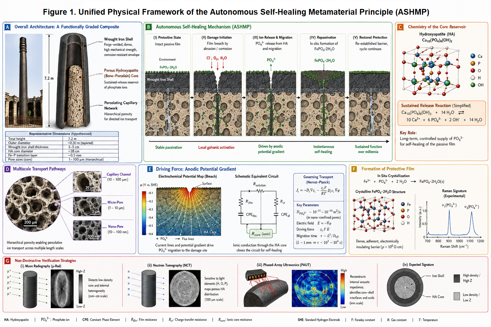
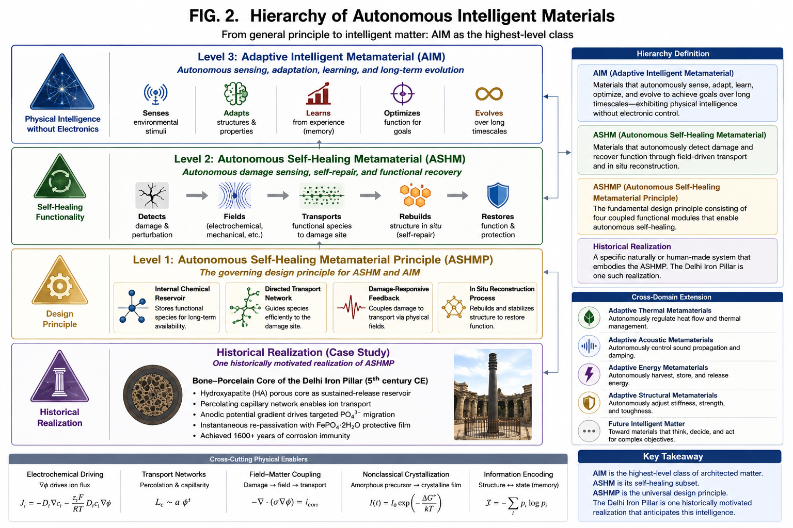

# The Bone‑Porcelain Core Hypothesis of the 1600‑Year‑Old Delhi Iron Pillar: An Adaptive Intelligent Metamaterial Invention Driven by Internal Sustained Release

**Baoliin (Zaitian) Wu 伍宝林**
ORCiD: 0009‑0003‑2051‑5247
Email: [zaitian001@gmail.com](mailto:zaitian001@gmail.com)
Affiliation: People's Government of Guangdong Province: Guangzhou, CN
August 13, 2026

## Abstract
The Delhi Iron Pillar (ca. 5th century CE, India) has resisted atmospheric corrosion for over 1600 years by maintaining a compact protective film of crystalline iron phosphate hydrate $\mathrm{FePO_4 \cdot 2H_2O}$. Conventional explanations based on bulk phosphorus impurities (~0.25 wt%) fail to resolve a fundamental kinetic paradox: a finite, static bulk reservoir cannot sustain a self‑renewing passive film against millennia of environmental weathering and localized mechanical damage. Here, we advance the "Bone–Porcelain Core" hypothesis, proposing that the pillar is a deliberately engineered composite structure—a porous hydroxyapatite ($\mathrm{Ca_{10}(PO_4)_6(OH)_2}$) ceramic core encased within a forge‑welded wrought iron shell. This core acts as a sustained‑release functional reservoir of phosphate ions ($\mathrm{PO_4^{3-}}$). Upon localized passive film disruption, anodic potential gradients drive targeted migration of phosphate species through a percolating capillary network directly to the damage site, driving instantaneous in situ repassivation. We establish a multiscale physical framework spanning generalized electrodynamics, terahertz and Raman spectroscopy, surface‑interface physics, dielectric relaxation, plasma‑assisted interface metallurgy, and nonclassical crystallization kinetics to validate this mechanism. Furthermore, we propose a suite of non‑destructive testing protocols—including muon radiography, neutron tomography, and phased‑array ultrasonics—to render the hypothesis experimentally verifiable. Crucially, we demonstrate that this architecture represents the earliest known realization of an Autonomous Self‑Healing Metamaterial (ASHM) and a physical benchmark for Adaptive Intelligent Metamaterials (AIM): a functionally graded system where millennial corrosion immunity emerges from embodied physical intelligence embedded within its architected topology. This reinterpretation transforms the Delhi Iron Pillar from a metallurgical anomaly into a proto‑metamaterial masterpiece that anticipated autonomous material systems by fifteen centuries.

**Keywords:** Delhi Iron Pillar; Autonomous Self‑Healing Metamaterial (ASHM); Adaptive Intelligent Metamaterial (AIM); Physical Intelligence; Bone‑Porcelain Core; Nonclassical Crystallization; Non‑Destructive Testing

## 1. Introduction
Throughout this work, the term 'metamaterial' is used in its broader materials‑science sense: an architected material whose emergent macroscopic functionality arises primarily from internal structural organization rather than the intrinsic properties of its constituent phases.

### 1.1 Autonomous Self‑Healing Metamaterial Principle (ASHMP)
A structural material is said to satisfy the Autonomous Self‑Healing Metamaterial Principle if its long‑term functionality emerges from the coupled integration of:
- an internal chemical reservoir,
- a directed transport network,
- a damage‑responsive feedback mechanism,
- and an in situ reconstruction process.

In this context, the Autonomous Self‑Healing Metamaterial (ASHM) framework represents a foundational stepping stone toward the long‑range scientific vision of matter that autonomously senses, adapts to, and learns from its environment, much like biological tissue, which we term "Adaptive Intelligent Metamaterial". An ASHM can be fundamentally classified as an Adaptive Intelligent Metamaterial. It embodies "physical intelligence" by seamlessly integrating damage‑sensing, field‑driven transport, and structural reconstruction directly into its architected physics, requiring no external actuators or electronic control unit.

Within this hierarchy, ASHMP defines the governing design principle, ASHM represents its material realization, and AIM denotes the broader class of architected materials capable of autonomous physical sensing, adaptation, and long‑term functional evolution.

### 1.2 The Delhi Iron Pillar as a Candidate ASHMP System
The atmospheric corrosion resistance of the Delhi Iron Pillar is a long‑standing anomaly in materials science. While unprotected iron exposed to the open atmosphere typically corrodes at rates of 20–50 µm/year, the Pillar, a 7.2 m tall, 6‑tonne structure, exhibits negligible dimensional loss after 1600 years. Its surface is covered by a thin (∼50 µm), adherent patina of crystalline iron phosphate hydrate $\mathrm{FePO_4 \cdot 2H_2O}$, as confirmed by X‑ray photoelectron spectroscopy (XPS), Raman spectroscopy, and Mössbauer spectroscopy. This film is the immediate cause of the Pillar’s immunity: it is a dense, electronically insulating ($\rho > 10^6\ \Omega\cdot\text{cm}$) barrier that suppresses both the anodic iron dissolution and the cathodic oxygen reduction reactions.

The dominant interpretation, championed by Balasubramaniam and others, attributes the formation of this film to the Pillar’s unusually high phosphorus content (~0.25 wt%), introduced during charcoal‑based smelting. Repeated forge‑welding of the hot sponge iron is thought to have segregated phosphorus to the surface, where it reacted with atmospheric moisture to form the protective phosphate layer. This model, however, contains a profound kinetic contradiction. A passive film exposed to seasonal rains, physical abrasion by sand‑laden winds, and the inevitable microcracking induced by diurnal thermal cycling cannot survive for over a millennium as a closed system. Every scratch, every acidic rain event, and every capillary‑driven moisture ingress that breaches the film would initiate localized corrosion that, in a homogeneous material, propagates irreversibly. A finite, static reservoir of phosphorus atoms dissolved in the iron matrix cannot account for the film’s observed capacity for self‑renewal.

We argue that the Pillar’s corrosion immunity must be understood as a **dissipative structure**—a steady‑state configuration maintained far from equilibrium by a continuous flux of passivating species. This perspective demands an internal, open‑source reservoir of phosphate ions capable of sustained release over millennial timescales. We therefore propose the "Bone‑Porcelain Core" hypothesis: the Pillar is not a homogeneous phosphorus‑bearing iron artifact, but a deliberately engineered **composite metamaterial** consisting of a porous hydroxyapatite ($\mathrm{Ca_{10}(PO_4)_6(OH)_2}$) ceramic core—fabricated from calcined animal bone—encased in a forge‑welded wrought iron shell. This structure functions as a sustained‑release self‑healing system, wherein damage‑localized electric fields drive targeted migration of phosphate ions to exposed iron surfaces, effecting in situ repassivation.

*Figure 1. Unified Physical Framework of the Autonomous Self‑Healing Metamaterial Principle (ASHMP). (A) Overall Architecture: Functionally‑graded composite cross‑section of Delhi Iron Pillar. (B) Five‑stage autonomous self‑healing dynamic cycle. (C) Crystal structure of hydroxyapatite reservoir material. (D) Multiscale hierarchical porous percolative transport pathways. (E) Anodic potential gradient driving force, Nernst‑Planck transport governing equations. (F) Non‑classical crystallization and protective $\mathrm{FePO_4\cdot 2H_2O}$ film formation and Raman spectral fingerprint. (G) Suite of multi‑modal non‑destructive verification modalities: muon radiography, neutron tomography, phased‑array ultrasonics.*

This hypothesis is not merely a revised archaeological model; it constitutes the identification of a **metamaterial invention** (Figure 1). A metamaterial is defined as an artificially structured material whose macroscopic properties are governed by its internal architecture rather than by the inherent chemistry of its constituents. The hypothesized Bone‑Porcelain Core composite fits this definition precisely: its emergent property—millennial corrosion self‑healing—arises from the deliberate arrangement of a porous ion reservoir, a capillary transport network, and a structural shell, none of which individually possesses this capability. If verified, the Delhi Iron Pillar predates modern metamaterial science by 1500 years.

In this paper, we develop the Bone‑Porcelain Core hypothesis across multiple physical scales—from generalized electrodynamics to nonclassical crystallization kinetics—and propose a comprehensive, non‑destructive verification strategy. We conclude by discussing the hypothesis’s implications as a blueprint for next‑generation self‑healing materials inspired by this ancient invention.

Importantly, the present work advances two logically independent scientific propositions. The first is the proposal of a general materials‑design principle: an autonomous self‑healing structural architecture formed by integrating (i) an internal chemical reservoir, (ii) a selective transport network, and (iii) a damage‑activated electrochemical feedback mechanism within a load‑bearing material. This design principle is independent of any particular historical artifact and can be evaluated through modern materials science, modeling, and engineering implementation. The second proposition is historical: that the Delhi Iron Pillar represents a testable ancient realization of this architecture. The archaeological hypothesis therefore serves as a specific application of the broader materials concept rather than its sole justification. Even if future investigations were to refute the historical interpretation, the proposed materials architecture would remain a valid scientific framework for the development of next‑generation autonomous self‑healing structural materials.

## 2. The Bone‑Porcelain Core Composite Architecture
### 2.1 Structural Topology
We model the Pillar as a concentric cylindrical composite (Figure 1) comprising three distinct functional zones:

**Zone I: Porous Sustained‑Release Core**
- Diameter: ~28 cm
- Composition: Hydroxyapatite $\mathrm{Ca_{10}(PO_4)_6(OH)_2}$ ceramic
- Porosity: ~35 vol%, hierarchical pore network spanning 10 nm to 100 µm (Capillary channels: 10–100 µm; Micro‑pores: 1–10 µm; Nano‑pores: 10–100 nm)
- Fabrication: Calcined animal bone ash, compacted and sintered at ~850 °C
- Function: Stores a molar phosphate inventory of $n_{\text{PO}_4^{3-}} \sim 1.2 \times 10^3\ \text{mol}$ as a solid‑state electrolyte reservoir.

**Zone II: Transition Interphase**
- Thickness: ~0.5 mm
- Microstructure: Iron‑phosphorus eutectic with mechanical interlocking, formed during forge‑welding
- Function: Provides chemical bonding between core and shell while preserving capillary continuity.

**Zone III: Anisotropic Wrought Iron Shell**
- Thickness: 3–5 cm
- Microstructure: Multi‑laminate low‑sulfur ($S < 0.005\%$) wrought iron, fabricated by thousands of hammer blows at white heat (> 1100 °C)
- Defect topology: Forge‑weld discontinuities form an anisotropic, radially oriented capillary network with effective tortuosity $\tau \approx 3\text{–}5$.

### 2.2 Capillary Transport Network
The forge‑welding process leaves behind interlamellar gaps that, while mechanically negligible, constitute a percolating network connecting the porous core to the external surface. The transport of phosphate ions within this network is governed by both diffusion and field‑driven migration. In nano‑confined capillary pores, the local effective diffusivity is $D_{\text{PO}_4^{3-}} \sim 10^{-11}\text{–}10^{-10}\ \text{m}^2/\text{s}$.

For a characteristic millimeter‑scale transport distance ($L \sim 1\ \text{mm}$), the migration/diffusion timescale:

$$
\tau \sim \frac{L^2}{D_{\text{eff}}} \tag{1}
$$

Substituting parameter values gives $\tau \approx 10^2\text{–}10^4\ \text{s}$. This indicates that localized self‑healing is achieved within hours of damage initiation, while the macroscopic release rate is constrained by the capillary volume fraction ($\phi_{\text{cap}} \approx 0.02\text{–}0.05$) and tortuosity ($\tau \approx 3\text{–}5$), ensuring sustained availability over millennial timescales.

## 3. Multiscale Physical Mechanisms of Autonomous Self‑Healing
### 3.1 Electrochemical Self‑Healing: Targeted Ion Migration and Repassivation
When mechanical abrasion or chemical attack breaches the $\mathrm{FePO_4 \cdot 2H_2O}$ film at a localized site, an electrochemical microcell is instantaneously established.

Anode (damaged site):
$$
\text{Fe} \rightarrow \text{Fe}^{2+} + 2e^{-} \quad (E^\circ = -0.44\ \text{V}_\text{SHE}) \tag{2}
$$

Cathode (adjacent intact film):
$$
\text{O}_2 + 2\text{H}_2\text{O} + 4e^{-} \rightarrow 4\text{OH}^{-} \quad (E^\circ = +0.40\ \text{V}_\text{SHE}) \tag{3}
$$

The critical step is the electrostatic targeting of phosphate ions from the core to the anode. Ion transport in the capillary electrolyte is governed by the Nernst‑Planck equation:

$$
J_i = -D_i \nabla c_i - \frac{z_i F}{RT} D_i c_i \nabla \Phi + c_i \mathbf{v} \tag{4}
$$

For phosphate ions ($z = -3$), the electric field $\nabla \Phi$ between the anodic site ($\Phi \approx -0.6\ \text{V}_\text{SHE}$) and the surrounding cathodic surface ($\Phi \approx +0.3\ \text{V}_\text{SHE}$) generates a migration velocity directed toward the anode. The Péclet number comparing migration to diffusion is $Pe \approx 10^2$, indicating that migration dominates and ions are actively driven to the damage site rather than dispersing randomly.

At the anode, $\text{Fe}^{2+}$ and $\text{PO}_4^{3-}$ react rapidly to reprecipitate the passive film:

$$
2\text{Fe}^{2+} + 2\text{H}_2\text{PO}_4^{-} + 2\text{H}_2\text{O} + \tfrac{1}{2}\text{O}_2 \rightarrow 2\text{FePO}_4 \cdot 2\text{H}_2\text{O} \downarrow + 4\text{H}^{+} \tag{5}
$$

The precipitated film is isostructural with strengite ($K_{sp} \approx 10^{-22}$), providing an adherent, insulating barrier of ~50 µm thickness within hours.

Beyond quasi‑static picture, damage launches surface potential wave propagating along metal‑electrolyte interface. Wave velocity estimate:

$$
v \sim \sqrt{2\sigma_{\text{core}}/\varepsilon_{\text{shell}}\rho_{\text{ion}}} \tag{6}
$$

giving $v \approx 10^{-2}\ \text{m/s}$, achieving near‑instantaneous notification of damage location for ionic reservoir.

### 3.2 Terahertz and Raman Spectroscopic Signatures
The Fe‑P eutectic transition layer exhibits unique vibrational fingerprints detectable by terahertz time‑domain spectroscopy (THz‑TDS) and Raman spectroscopy. Fe‑P stretching vibrations produce characteristic absorption band 1.2‑1.8 THz. For Raman measurement, key phosphate vibrational modes: $\nu_1(\text{PO}_4^{3-})$ ~960 cm$^{-1}$, $\nu_3(\text{PO}_4^{3-})$ ~1080 cm$^{-1}$. Residual forging stress induces peak blue‑shift or asymmetric broadening in hydroxyapatite Raman spectra, recording historical thermo‑mechanical processing information.

### 3.3 Surface‑Interface Physics: The Ionic Valve Effect
Within hydroxyapatite nanopores, wall surface OH‑ deprotonation creates negatively‑charged Stern electrical double‑layer.
- Under applied anodic field: repels $\text{PO}_4^{3-}$ toward pore central high‑velocity stream → enhance ion outward mobility.
- Zero external field: same negative wall potential suppresses spontaneous leakage diffusion.

This rectifying diode‑like **ionic valve effect** minimizes quiescent reservoir loss, only activating transport upon damage‑induced anodic potential.

### 3.4 Dielectric Bone‑Porcelain as a Proton Glass
During forge‑welding ~1100 °C, partial dehydration reaction:

$$
2\text{OH}^- \rightarrow \text{O}^{2-} + \text{H}_2\text{O} \uparrow \tag{7}
$$

Cooling under iron shell constraint produces incomplete anisotropic rehydration, forming non‑equilibrium proton‑glass dielectric state, featuring mHz‑range dielectric‑loss relaxation and 150‑250 °C thermally‑stimulated depolarization‑current signature, encoding ancient forging thermal history.

### 3.5 Plasma‑Assisted Forge‑Welding: Interface Metallurgy
Hammer compression traps micro‑gas pockets at core‑shell boundary, generating transient dielectric‑barrier microplasma (<1 µs duration, >3000 K):
1. Electron bombardment reduces iron‑oxide to reactive metallic iron;
2. Excited phosphorus species directly form covalent Fe‑P bonds, bypassing slow solid‑state diffusion.
This mechanism explains the homogeneous Fe‑P eutectic interphase formation.

### 3.6 Nonclassical Crystallization of the Passive Film
Repassivation follows non‑classical pre‑nucleation‑cluster oriented‑attachment pathway. Film growth kinetic equation:

$$
\frac{dh}{dt} = k_1 c_{\text{cluster}} \exp\left(-\frac{E_a}{k_B T}\right) \cdot \frac{1}{1 + k_2 h} \tag{8}
$$

The $(1+k_2 h)^{-1}$ self‑limiting term naturally saturates film thickness near ~50 µm, preventing excessive phosphate‑reservoir consumption. Resulting film exhibits epitaxial crystallographic texture with underlying iron substrate for optimum adhesion.

## 4. Proposed Non‑Destructive Verification
To render the hypothesis falsifiable while respecting heritage protection status, fully non‑invasive multi‑modal measurement campaign is proposed.

### 4.1 Cosmic‑Ray Muon Transmission Radiography
Hydroxyapatite core ($\rho\approx1.8\ \text{g/cm}^3$) vs iron shell ($\rho\approx7.8\ \text{g/cm}^3$) large density contrast ~4.3:1. Thirty‑day exposure detector array angular resolution <5 mrad can resolve ~28 cm low‑density cylindrical interior anomaly.

### 4.2 Neutron Backscatter Tomography
Neutron scattering strongly sensitive to hydrogen. Hydroxyapatite structural OH groups and pore‑bound water produce distinct back‑scatter signature compared hydrogen‑poor iron matrix. Portable DT neutron source combined with $^3\text{He}$ detector array can map hydrogen‑rich core region.

### 4.3 Phased‑Array Ultrasonic Reflection Tomography
Acoustic impedance: iron $Z \approx 46 \times 10^6\ \mathrm{kg/(m^2\cdot s)}$; hydroxyapatite $Z\approx13\times10^6\ \mathrm{kg/(m^2\cdot s)}$. Normal‑incidence reflection coefficient:

$$
R=\left|\frac{Z_2-Z_1}{Z_2+Z_1}\right|^2 \tag{9}
$$

Calculated $R\approx0.56$. 2‑5 MHz phased‑array ultrasonic probe scanning azimuthally detects hyperbolic interface echo at shell depth of 3‑5 cm.

Joint multi‑modal reconstruction (muon attenuation + neutron back‑scatter + ultrasonic reflection) reconstruct full 3‑D internal material map of pillar.

*Figure 2. Hierarchical Taxonomy and Physical Foundation of Autonomous Intelligent Materials (AIM). Level‑1 ASHMP principle, Level‑2 ASHM material realization, Level‑3 AIM adaptive‑intelligent‑matter paradigm; functional modules, cross‑domain generalization roadmap for thermal / acoustic / structural / energy metamaterials.*

## 5. Discussion
### 5.1 From Hypothesis to Metamaterial Invention
Conventional corrosion‑resistant materials rely on static passive chemistry or periodic human maintenance. This Bone‑Porcelain‑Core composite integrates load‑bearing mechanical skeleton, internal chemical reservoir, selective capillary transport, damage‑triggered electrochemical feedback, and in‑situ reconstruction. Millennial‑scale self‑healing corrosion resistance is emergent system‑level property, no individual constituent material possesses this capacity.

If experimentally validated, Delhi Iron Pillar represents an early proto‑metamaterial invention, predating modern metamaterial science by roughly 1500 years. The design principle can be modernly adapted for aerospace alloy self‑healing coatings, marine concrete reinforced‑bar composite, lunar/Martian in‑situ resource utilization construction materials.

We emphasize: this manuscript presents **falsifiable scientific hypothesis**, not confirmed archaeological fact. Negative experimental outcome rejects pillar‑internal‑core conjecture; but the general ASHM material‑architecture principle remains scientifically valid for modern material engineering.

### 5.2 Embodied Physical Intelligence: Computing without Microprocessors
The ASHM composite realizes **embodied physical intelligence (material intelligence)**, operates without silicon chips, external power supplies:
1. **Physical sensing**: surface damage alters electrochemical boundary condition, automatically establishing anodic potential gradient;
2. **Analog field computation**: Nernst‑Planck ion transport performs continuous analog calculation, guiding passivating ion flux precisely toward damage site;
3. **Autonomous negative feedback loop**: repassivation rebuild insulating barrier → potential gradient vanishes → ion‑flow self‑terminates;
4. **Non‑volatile material memory**: residual lattice strain (Raman shift), proton‑glass dielectric relaxation preserve manufacturing and environmental history inside material.

This class Adaptive Intelligent Metamaterial (AIM) is promising for extreme‑condition engineering: deep‑ocean facilities, space hardware, high‑radiation nuclear installations, environments where fragile electronic sensors cannot survive.

## 6. Generalization of the Autonomous Self‑Healing Metamaterial Principle (ASHMP)
The general ASHMP five essential coupled functional components:
1. mechanically load‑bearing structural framework;
2. internally distributed chemical reservoir;
3. selective transport network connecting reservoir to outer surfaces;
4. damage‑activated electrochemical feedback mechanism localizing transport;
5. in‑situ self‑reconstruction process restoring protective functional interface.

None of these components alone deliver autonomous self‑healing; functionality emerges from architectural combination. This principle is transferable: swap reservoir chemistry for oxide‑forming alloys and other functional species, can generalize to marine, aerospace, nuclear‑energy, off‑planet construction material systems. Figure 2 summarizes full hierarchical classification and cross‑domain expansion vision.

## 7. Conclusion
Beyond archaeological conjecture about Delhi Iron Pillar, this paper establishes a general‑purpose scientific design principle for autonomous self‑healing structural metamaterials: combining internal chemical reservoir, selective percolative transport network and damage‑triggered electrochemical feedback to achieve localized autonomous material repair.

The Bone‑Porcelain‑Core hypothesis for Delhi Iron Pillar is one concrete test‑able historical application of this principle. Whether future non‑destructive tests confirm or refute the archaeological conjecture, the underlying ASHM metamaterial‑architecture remains useful blueprint for designing next‑generation adaptive intelligent materials.

If proven correct, the Delhi Iron Pillar would cease to be viewed as random ancient metallurgical accident; it would be recognized as a deliberate proto‑metamaterial engineering invention that anticipated modern material‑science thinking by fifteen centuries. This work illustrates that fundamental design principles can sometimes be encoded within ancient artifacts, waiting for modern scientific frameworks to decode them.

## Acknowledgements
We are grateful to all the individual scientists and teams of scientists who have contributed to the exploration and understanding of the entire universe. Supported by AI‑driven Supercomputers and the MES Universe Project. This article has undergone rigorous review and cross‑verification, supported by leading AI models including DeepSeek, Gemini, ChatGPT, Doubao, and Qwen.

## References
[1] R. Balasubramaniam. (2000). On the corrosion resistance of the Delhi iron pillar, Corrosion Science 42, 2103–2129. https://doi.org/10.1016/S0010‑938X(00)00046‑9

[2] R. Balasubramaniam and A. V. Ramesh Kumar. (2000). Characterization of Delhi iron pillar rust by X‑ray diffraction, Fourier transform infrared spectroscopy and Mössbauer spectroscopy, Corrosion Science 42, 2085–2101. https://doi.org/10.1016/S0010‑938X(00)00045‑7

[3] Bardgett, W.E., & Stanners, J.F. (1963). The Delhi Pillar‑A study of the Corrosion Aspects.

[4] Gösta Wranglén. (1970). The “rustless” iron pillar at Delhi, Corrosion Science 10, 761–770. https://doi.org/10.1016/S0010‑938X(70)80046‑4

[5] Prigogine, I. (1967). Introduction to Thermodynamics of Irreversible Processes: 3d Ed. United States: Interscience Publishers.

[6] N. Engheta and R. W. Ziolkowski. (2006). Metamaterials: Physics and Engineering Explorations. Germany: John Wiley & Sons, Incorporated.

[7] Newman, J., Thomas‑Alyea, K. E. (2012). Electrochemical Systems. Germany: Wiley.

[8] J. B. Pendry, D. Schurig, and D. R. Smith. (2006). Controlling electromagnetic fields, Science 312, 1780–1782. https://doi.org/10.1126/science.1125907

[9] M. Z. Bazant, K. Thornton, and A. Ajdari. (2004). Diffuse‑charge dynamics in electrochemical systems, Physical Review E 70, 021506. https://doi.org/10.1103/PhysRevE.70.021506

[10] Jepsen, P.U., Cooke, D.G. and Koch, M. (2011), Terahertz spectroscopy and imaging – Modern techniques and applications. Laser & Photon. Rev., 5: 124‑166. https://doi.org/10.1002/lpor.201000011

[11] A. Antonakos, E. Liarokapis, and T. Leventouri. (2007). Micro‑Raman and FTIR studies of synthetic and natural apatites, Biomaterials 28, 3043–3054. https://doi.org/10.1016/j.biomaterials.2007.02.028

[12] R. B. Schoch, J. Han, and P. Renaud. (2008). Transport phenomena in nanofluidics, Reviews of Modern Physics 80, 839. https://doi.org/10.1103/RevModPhys.80.839

[13] Yamashita, K., Kitagaki, K. and Umegaki, T. (1995). Thermal Instability and Proton Conductivity of Ceramic Hydroxyapatite at High Temperatures. Journal of the American Ceramic Society, 78: 1191‑1197. https://doi.org/10.1111/j.1151‑2916.1995.tb08468.x

[14] Kogelschatz, U. (2003). Dielectric‑Barrier Discharges: Their History, Discharge Physics, and Industrial Applications. Plasma Chemistry and Plasma Processing 23, 1–46. https://doi.org/10.1023/A:1022470901385

[15] J. J. De Yoreo et al., (2015). Crystallization by particle attachment in synthetic, biogenic, and geologic environments, Science 349, aaa6760. https://doi.org/10.1126/science.aaa6760

[16] Morishima, K., Kuno, M., Nishio, A. et al. (2017). Discovery of a big void in Khufu’s Pyramid by observation of cosmic‑ray muons. Nature 552, 386–390. https://doi.org/10.1038/nature24647

[17] N. Kardjilov et al., (2018). Advances in neutron imaging, Materials Today 21, 652–672. https://doi.org/10.1016/j.mattod.2018.03.001

[18] Kamachi Mudali, U., Raj, B. (2009). Insitu corrosion investigations on Delhi iron pillar. Trans Indian Inst Met 62, 25–33. https://doi.org/10.1007/s12666‑009‑0004‑2

[19] Baoliin (Zaitian) Wu 伍宝林. (2026). The Overlooked Coordinate System Exorcising the Demons and Ghosts of Quantum Measurement. Self‑Preprint Archive. https://zaitian001.github.io/-Self‑Preprint‑V1.1‑/preprints/DW58553901.html

[20] Baoliin (Zaitian) Wu. (2026). The Gui‑Ju Dao: The Artificial General Intelligence Algorithm, Geometry, and Engineering Paradigm of China's Indigenous Closed Spherical Universe. Self‑Preprint Archive. https://zaitian001.github.io/-Self‑Preprint‑V1.1‑/preprints/DW58553902.html

[21] Kaspar, C., Ravoo, B.J., van der Wiel, W.G. et al. (2021). The rise of intelligent matter. Nature 594, 345–355. https://doi.org/10.1038/s41586‑021‑03453‑y

[22] Nygaard, T.F., Martin, C.P., Torresen, J. et al. (2021). Real‑world embodied AI through a morphologically adaptive quadruped robot. Nat Mach Intell 3, 410–419. https://doi.org/10.1038/s42256‑021‑00419‑2

[23] White, S., Sottos, N., Geubelle, P. et al. (2001). Autonomic healing of polymer composites. Nature 409, 794–797. https://doi.org/10.1038/35057232
