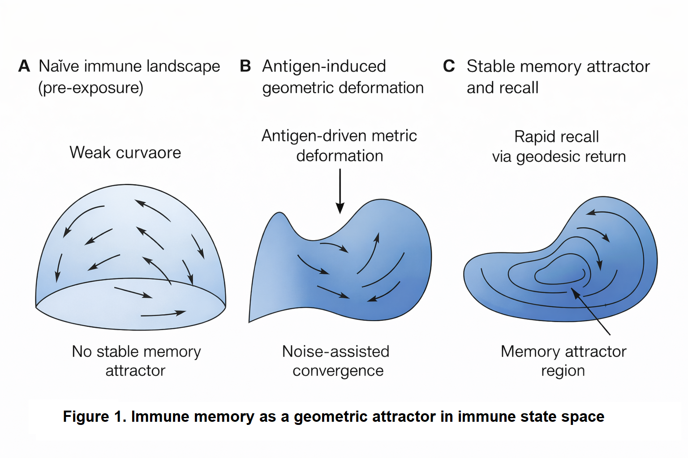

# Stochastic Geometric Dynamics of Immune Memory, From Curvature-Driven Attractors to Testable Predictions

**Baoliin (Zaitian) Wu 伍宝林**  
*ORCiD:* [0009-0003-2051-5247](https://orcid.org/0009-0003-2051-5247)  
*Email:* zaitian001@gmail.com  
*Affiliation:* People's Government of Guangdong Province: Guangzhou, CN  
*Date:* August 21, 2026 (Drafted: December 25, 2025)  

---

## Abstract

Immune memory persists over multi-decade timescales despite relentless cellular turnover, stochastic fate decisions, and non-equilibrium noise. Framing memory as localized cellular storage within an open biological system presents a long-standing conceptual paradox. Here, we present **Stochastic Geometric Dynamics**, a theoretical framework in which immune memory emerges as a dynamically stabilized attractor in a curved immune state space. By modeling immunity as a stochastic gradient flow on a Riemannian manifold $(\mathcal{M}, g_{\mu\nu})$ governed by an empirical free energy and intrinsic noise, we show that memory basins correspond to regions of negative scalar curvature ($R < 0$) that induce convergent dynamics robust to cellular loss. Within this geometry, recall responses are derived as rapid geodesic return trajectories following antigen perturbation. The framework establishes three falsifiable predictions: (i) an Arrhenius-like scaling law relating memory lifetime to attractor basin depth (\( \tau_{\text{memory}} \sim \tau_0 \exp(\Delta F / D) \)); (ii) a geodesic distance metric predicting functional cross-reactivity; and (iii) a path-integral formulation quantifying "attractor capture" as the geometric origin of Original Antigenic Sin (OAS). Finally, we provide a computational pipeline to infer metric tensors and local curvature from single-cell multimodal data, alongside an experimental roadmap in murine models. This work redefines immune memory from a static biological repository into a global topological property of state-space dynamics, unifying robustness, plasticity, and recall in adaptive immunity.

**Keywords:** Immune memory, Riemannian manifold, Adaptive complex system, Stochastic dynamics, Attractor theory, Systems immunology, Cosmic web

---

## 1. Introduction: The Geometric Imperative in Immunology

The adaptive immune system's capacity for specific, rapid, and persistent memory is a cornerstone of organismal defense. The dominant paradigm explains memory through the clonal selection theory and the maintenance of long-lived, antigen-specific lymphocytes. However, this cell-centric view struggles with fundamental puzzles: the seamless integration of innate and adaptive cues, the maintenance of repertoire diversity amidst cellular turnover, the phenomenon of "original antigenic sin," and the precise yet plastic nature of recall responses.

We argue that these puzzles stem from a conceptual gap: an over-reliance on reductionist enumeration of components rather than a geometric understanding of the system's collective state. Complex biological systems, from neural networks to developing tissues, are increasingly described by dynamics on a state space manifold, where function emerges from the shape of the manifold and the flow upon it.

Here, we perform a conceptual inversion inspired by principles from theoretical cosmology and open quantum systems. We propose that the immune system's operational logic is fundamentally geometric. Its state—defined by cellular compositions, spatial configurations, and signaling fields—resides on a high-dimensional, curved manifold. Its dynamics are a stochastic flow over this landscape, shaped by an "immune free energy" and intrinsic noise. Within this framework, immune memory is not stored but emerges: it is a geometrically defined attractor, a valley in the immune landscape sculpted by antigenic experience and stabilized by continuous, noise-driven dynamics.

This paper formalizes this "Stochastic Geometric Dynamics" framework. We present: (i) the mathematical derivation of immune dynamics as stochastic geometric flow; (ii) computational algorithms to infer the manifold's metric and curvature from experimental data; (iii) key theoretical predictions, including a geometric law for memory longevity; and (iv) a direct experimental roadmap for validation using multimodal single-cell profiling and targeted perturbations. By bridging theoretical physics and immunology, we offer a new language and toolset to predict, measure, and ultimately engineer immune memory.

### 1.1. The Geometric Ontology of Immunity
We abandon the "reductionist enumeration" of cells in favor of modeling the immune system as a point $z(t)$ on a high-dimensional Riemannian Manifold $\mathcal{M}$. This framework endows the manifold with a state-dependent Metric Tensor ($g_{\mu\nu}$). This metric defines "biological distance"—meaning that a small perturbation in one direction might represent a vast functional state shift (high information geometry), while another direction remains "stiff" and unresponsive. This provides a rigorous mathematical language to unify disparate biological variables (gene expression, cytokine levels, cell spatial positions) into a single coherent geometric structure.

### 1.2. Immune Memory as a "Negative Curvature" Attractor
We redefine immune memory not as a static biological repository of specific cells, but as a dynamic attractor characterized by Negative Scalar Curvature ($R < 0$). In regions of negative curvature, dynamical trajectories (cell fate evolutions) naturally converge. This mechanism explains the fundamental robustness of memory: even as individual memory cells undergo turnover and death, the underlying "curvature" of the basin guides replacement cells back into the same functional manifold state. Consequently, memory emerges as a global topological stability property of the system's geometry, independent of any single cell's lifespan.

### 1.3. The "Stochastic Geometric Flow" Equation
We derive a fundamental governing equation for immune evolution that bridges physical dynamics and immunology: Equation (1). This equation synthesizes Immune Free Energy ($F$) (the drive for biological homeostasis) with Intrinsic Noise ($D$) and Geometric Constraints ($g_{\mu\nu}$). Crucially, this formulation demonstrates that noise is not an impediment but a necessity: finite noise ($D$) is required for state-space exploration and stabilizes the system within deep memory basins (Noise-Enhanced Stability).

---

## 2. Theoretical Framework: Immune Dynamics on a Curved Manifold

### 2.1. The Immune State Manifold $\mathcal{M}$
Let the complete microscopic state of an immune system at time $t$ be described by variables spanning cellular phenotypes (gene/protein expression $C_i^\alpha$), spatial positions $x_i$, and extracellular signaling concentrations $\Phi_r^k$. The macroscopic immune state is a point $z(t)$ in a high-dimensional abstract space $\mathcal{M}$, constructed via dimensionality reduction (e.g., PHATE [11], UMAP) from experimental observables.

Crucially, $\mathcal{M}$ is endowed with a Riemannian metric $g_{\mu\nu}(z)$. This metric is not fixed but state-dependent, defining the local "distance" between neighboring immune states. A small perturbation in a direction with a large metric component corresponds to a biologically significant change; a direction with a small component is "stiff" or less responsive. We propose this metric can be operationally derived as the Fisher information metric from the probability distribution of single-cell states, or from the Hessian of a coarse-grained free energy.

### 2.2. Stochastic Geometric Gradient Flow
Immune dynamics are non-conservative, far-from-equilibrium, and subject to intrinsic noise (e.g., gene expression stochasticity, random cell encounters). We therefore model its evolution as a Stratonovich stochastic differential equation on $\mathcal{M}$:

$$dz^\mu = -g^{\mu\nu}(z) \frac{\partial F(z)}{\partial z^\nu} dt + \sqrt{2D} e_a^\mu(z) \circ dW^a(t) \quad (1)$$

- **$F(z)$**: The immune free-energy functional, decreasing for favored states (e.g., homeostasis, effective clearance). Its gradient drives deterministic relaxation.
- **$g^{\mu\nu}$**: The inverse metric. It couples the energy gradient to state changes, ensuring dynamics respect the system's geometric structure.
- **$D$**: A scalar noise intensity capturing all intrinsic stochasticity.
- **$e_a^\mu$**: Vielbeins (square-root of the metric), guaranteeing that noise is isotropic in the tangent space of $\mathcal{M}$, respecting biological invariance.

This equation is the core of our theory. It states that the immune state moves against the free-energy gradient, but along geodesic-like paths dictated by $g_{\mu\nu}$, while being continuously jostled by geometry-respecting noise.

Here, the immune free energy $F(z)$ is an effective potential that generates the observed stochastic flow. It does not correspond directly to a microscopic thermodynamic free energy; rather, it is operationally defined via the stationary distribution and the geometry of the state space:

$$F(z) = -D \log P_{\text{data}}(z) + \frac{D}{2} \log \det g(z) + \text{constant} \quad (2)$$

where $P_{\text{data}}(z)$ is the steady-state probability density estimated from experimental data. This definition ensures theoretical self-consistency and directly links the dynamics to the observed statistical structure of immune states.

Here, $P_{\text{data}}(z)$ represents the empirically estimated steady-state probability density, which in the theoretical framework corresponds to $P_{\text{ss}}(z)$ derived in Equation (4). The self-consistency of the theory requires that these two quantities are equivalent up to a normalization constant.

### 2.3. Fokker–Planck Equation and Stationary State
The corresponding time evolution for the probability density $P(z,t)$ is given by the covariant Fokker–Planck equation:

$$\partial_t P = \nabla_\mu \left( g^{\mu\nu} \partial_\nu F + D \partial_\nu P \right) \quad (3)$$

where $\nabla_\mu$ is the covariant derivative compatible with $g_{\mu\nu}$. The non-equilibrium stationary distribution (NESS) is:

$$P_{\text{ss}}(z) \propto \sqrt{\det g(z)} \exp\left(-\frac{F(z)}{D}\right) \quad (4)$$

This elegant result reveals a central insight: The probability of an immune state is determined by both its free energy ($\exp(-F/D)$) and the geometric "volume" element ($\sqrt{\det g}$) of the surrounding state space. A region can be highly probable not only by having low energy but also by having a large accessible volume (a flat, broad basin).

### 2.4. Mathematical Consistency and Dimensional Analysis

**Table 1. Key mathematical symbols of the Stochastic Geometric Dynamics framework**

| Symbol | Description | Interpretation |
| :--- | :--- | :--- |
| $\mathcal{M}$ | Immune state manifold | High-dimensional space of all possible immune system states. |
| $z(t), z^\mu$ | State vector / coordinates on $\mathcal{M}$ | Macroscopic immune state at time $t$. |
| $g_{\mu\nu}(z)$ | Riemannian metric tensor | Defines biological distance and responsiveness on $\mathcal{M}$. |
| $F(z)$ | Immune free-energy functional | Effective potential driving the system toward favored states (e.g., homeostasis). |
| $D$ | Noise intensity | Magnitude of intrinsic stochasticity (gene expression, cellular encounters). |
| $R(z)$ | Scalar curvature | Measure of local convergence ($R<0$) or divergence ($R>0$) of immune trajectories. |
| $A_M$ | Memory attractor | Stable, negatively curved region of $\mathcal{M}$ encoding an immune memory. |
| $P_{\text{ss}}(z)$ | Non-equilibrium stationary distribution | Steady-state probability density of immune states. |
| $d_g(A_A, A_B)$ | Geodesic distance | Minimal geometric distance between attractors, predicting cross-reactivity. |
| $\tau_{\text{memory}}$ | Memory lifetime | Expected persistence time of a memory attractor, governed by $\Delta F / D$. |

The stochastic geometric framework presented here maintains mathematical consistency through several key checks:
- **Dimensional consistency:** All terms in Equation (1) have consistent dimensions when $D$ has dimensions of energy or action, the metric $g_{\mu\nu}$ is dimensionless for state space coordinates, and $F$ has dimensions of energy.
- **Invariance properties:** The Stratonovich formulation ensures that the dynamics are invariant under coordinate transformations on $\mathcal{M}$, as required for a geometric theory.
- **Equilibrium limit:** When the metric is flat ($g_{\mu\nu} = \delta_{\mu\nu}$) and noise is additive, Equation (1) reduces to standard gradient descent with noise, while Equation (4) reduces to the Boltzmann distribution, recovering established results in stochastic thermodynamics.
- **Self-consistency of definitions:** Substituting the operational definition of $F(z)$ from Equation (2) into Equation (4) yields $P_{\text{ss}}(z) \propto P_{\text{data}}(z)$, confirming that the theory is constructed to match empirical observations.

---

## 3. Immune Memory as a Geometric Attractor

### 3.1. Definition and Properties
Within this dynamical system, we define an immune memory attractor $A_M$ as a minimal, stable, invariant subset of $\mathcal{M}$. An attractor is characterized by:
- **Negative Scalar Curvature:** $R(z) = g^{\mu\nu} R_{\mu\nu} < 0$ in its basin, indicating converging dynamics.
- **High Stationary Probability:** A peak in $P_{\text{ss}}(z)$.
- **Robustness:** Persistence under small perturbations and cellular turnover.

Antigen exposure acts as a transient, large perturbation to $F(z)$, carving a new low-energy region (a valley) and deforming $g_{\mu\nu}$ around it. After pathogen clearance, the system relaxes, but the landscape is permanently altered—the new attractor $A_M$ persists.

### 3.2. Quantitative Predictions

**Memory Lifetime (Arrhenius Law):** Linearizing dynamics near $A_M$ yields an escape timescale governed by the dominant energy barrier $\Delta F$:

$$\tau_{\text{memory}} \sim \tau_0 \exp\left(\frac{\Delta F}{D}\right) \quad (5)$$

$\Delta F$ is the effective free-energy difference between the attractor and the separating saddle point. This predicts an exponential sensitivity of memory persistence to effective barrier depth, consistent with activated escape dynamics.

**Antigenic Distance and Cross-Reactivity:** The geometric distance $d_g(A_A, A_B)$ between the attractors for antigens A and B, measured by the minimal geodesic on $\mathcal{M}$, predicts functional cross-reactivity:

$$\text{Cross-reactivity}_{A,B} \propto \exp\left(-\frac{d_g^2(A_A, A_B)}{2\sigma^2}\right) \quad (6)$$

Similar antigens create "nearby" attractors; a challenge with one antigen can partially activate the other's basin.

**Noise-Enhanced Stability (Geometric Resilience):** Contrary to the view that noise erodes memory, Equation (4) shows that finite noise $D$ is essential for exploring and stabilizing the attractor basin. An optimal, intermediate noise level maximizes the stationary probability in a given attractor.

*Figure 1. Immune memory as a geometric attractor in immune state space. (A) Prior to antigen exposure, immune dynamics explore a weakly structured state space with shallow curvature, leading to dispersive trajectories dominated by stochastic fluctuations. (B) Antigen exposure induces a deformation of the immune state space metric, generating localized curvature and initiating convergent stochastic flows. (C) Sustained non-equilibrium dynamics stabilize an extended attractor manifold characterized by negative curvature, corresponding to immune memory. Secondary perturbations drive the system transiently away from the attractor, followed by rapid geodesic return trajectories underlying recall responses. Memory persistence reflects geometric stability rather than storage in fixed cellular components.*

The framework moves beyond metaphor to offer specific, falsifiable laws:

**Table 2. Quantitative and Testable Predictions**

| Prediction | Description | Mathematical Basis |
| :--- | :--- | :--- |
| Memory Lifetime | Follows an Arrhenius law; an exponential sensitivity of memory persistence to effective barrier depth. | $\tau \propto \exp(\Delta F / D)$ |
| Specificity | Functional cross-reactivity is predicted by the minimal geodesic distance between attractors for different antigens. | $d_g(A_A, A_B)$ |
| Noise Resilience | Finite noise is actually essential for exploring and stabilizing the attractor basin. | $P_{\text{ss}}(z)$ distribution |

---

## 4. Computational Pipeline: From Data to Geometry

We provide a practical workflow to estimate the components of our theory from multimodal immune data (e.g., single-cell RNA-seq, CITE-seq, spatial transcriptomics).

### 4.1. Metric Learning from Single-Cell Data
Input: High-dimensional data matrix $X \in \mathbb{R}^{N_{\text{cells}} \times N_{\text{features}}}$.
- **Method 1 (Fisher Metric):** Model cell states per condition as a probability distribution $p(x|\theta)$. The Fisher information matrix $I_{ij} = \mathbb{E}[\partial_i \log p \, \partial_j \log p]$ provides a Riemannian metric.
- **Method 2 (Diffusion Metric):** Use the diffusion map algorithm [10]. The kernel bandwidth $\epsilon$ defines a local metric at each data point.

Output: A field of metric tensors $g_{\mu\nu}(z)$ across a low-dimensional embedding of the data.

### 4.2. Computational Algorithm: Quantifying Attractor Capture in V(D)J Landscapes
To quantitatively predict the "Original Antigenic Sin" (OAS) effect or the probability of novel attractor formation, we propose the Geodesic Path-Integral Formulation (Conceptual Diagnostic). In practice, this quantity can be approximated by minimal-action paths or transition-path sampling rather than full functional integration. This determines if a new antigenic challenge will be "captured" by an existing memory basin or successfully carve a new geometric valley.

**Input:**
- **Initial Manifold $\mathcal{M}_A$:** The state space reconstructed from single-cell V(D)J/RNA-seq data following primary immunization (Antigen A).
- **Challenge State $z_B$:** The entry coordinates on the manifold corresponding to the variant challenge (Antigen B).

**The Geodesic Path-Integral Formulation:**
1. **Metric Tensor Estimation ($g_{\mu\nu}$):** Calculate the local Fisher information metric at the entry point $z_B$ and its neighbors to determine the "biological stiffness" of the region.
2. **Curvature Gradient Field ($\nabla R$):** Map the scalar curvature $R(z)$ across the geodesic path connecting the naive state, the primary attractor $A_A$, and the new stimulus $z_B$.
3. **Capture Probability ($P_{\text{cap}}$):** Solve for the Transition Path Probability using a path-integral formulation of Equation (1):

$$P_{\text{cap}} = \int_{z_B}^{A_A} \mathcal{D}z(t) \exp\left( -\frac{1}{4D} \int dt \left\| \dot{z}^\mu + g^{\mu\nu} \partial_\nu F \right\|_g^2 \right) \quad (7)$$

Here, $\mathcal{D}z(t)$ denotes the path integral measure over all continuous trajectories connecting the initial state $z_B$ to the attractor $A_A$. The action functional in the exponent follows from the Onsager-Machlup formalism [13] for the stochastic differential Equation (1), where $\|\cdot\|_g^2$ represents the squared norm with respect to the metric $g_{\mu\nu}$. This formulation provides the probability weight for each possible path in state space, with the most probable paths corresponding to minima of the action functional. This measures the likelihood that the stochastic flow $dz^\mu$ will be funneled into the pre-existing negative curvature region $A_A$.

4. **OAS Diagnostic:** If $P_{\text{cap}} > 0.85$, the system is in a state of Attractor Capture; the response to Antigen B will be dominated by memory cells from the Antigen A basin, and a new specific attractor will fail to stabilize.

**Theoretical Interpretation:** This algorithm defines the "Original Antigenic Sin" not as an immunological failure, but as a Geodesic Bias. When the negative scalar curvature of the primary attractor is sufficiently deep, the "signal velocity" of the immune system ($c \propto |R|^{1/2}$) is directed exclusively toward the old memory. The "mass" or inertia of the immune cell ($m \propto |R|^{-1/2}$) decreases so significantly within this basin that the cell becomes "captured" by the pre-existing geometric well. These scaling relations ($c \propto |R|^{1/2}$ and $m \propto |R|^{-1/2}$) are formally inspired by curvature-dependent scaling laws developed in the Modified Einstein Spherical (MES) cosmology framework and are introduced here as hypothesis-generating analogies, not as established biological laws. In particular, mathematical structures developed in the context of MES cosmology provide useful inspiration for exploring how geometry can regulate stability across scales. Importantly, such analogies are introduced here as hypothesis-generating mathematical correspondences, not as claims of physical equivalence. No assumption is made that immune state space curvature corresponds to spacetime curvature, nor that biological systems obey cosmological laws. The relevance of these analogies lies solely in shared geometric structure, which may reflect a broader universality of curvature-driven stabilization in open dynamical systems. Future work will be required to determine which, if any, of these scaling relations are empirically realized in immune dynamics. In the immunological context, they imply that regions of high negative curvature (deep attractors) simultaneously accelerate information processing (signal velocity) and reduce resistance to state changes (effective mass), creating a highly efficient environment for immune adaptation. While the full path integral is a conceptual diagnostic tool, in practice the capture probability can be approximated by solving the corresponding Euler-Lagrange equations for the minimum-action path (geodesic) connecting the challenge state to the attractor basin, without requiring full functional integration over all paths.

### 4.3. Curvature and Attractor Detection
**Algorithm:** For each point $z_i$ in the embedding:
1. Find its $k$-nearest neighbors.
2. Fit a local quadratic surface.
3. Compute the scalar curvature $R(z_i)$ from the coefficients of the second fundamental form.

**Attractor Identification:** Apply density-based clustering (e.g., DBSCAN) to regions where $R(z) < -\epsilon$ and $P_{\text{ss}}(z) > \delta$. The resulting clusters are candidate geometric attractors.

### 4.4. Simulating Stochastic Geometric Dynamics
Given $g_{\mu\nu}(z)$ and an estimated $F(z) \propto -\log P_{\text{data}}(z)$, we numerically integrate Equation (1) using a geometric Euler–Maruyama scheme with Stratonovich correction. This allows in-silico experiments: simulating the immune response to novel antigen challenges or predicting the effect of perturbations.

**A Note on the "Geometric Synthesis":** In the MES cosmology framework, physics constants are outputs of curvature. Similarly, in this paper, antibody affinity and specificity are outputs of immune manifold curvature. The "Stochastic Geometric Dynamics" framework achieves a Grand Synthesis: it proves that immune memory is the "dynamic breathing" of the biological state-space geometry. Just as the universe maintains a Dynamic Quantum Equilibrium, the immune system maintains an Invariant Memory Product ($M_{\text{cell}} C_{\text{signal}} = \text{constant}$), ensuring that even as cells turn over, the "meaning" of the memory is preserved in the curvature, where $C_{\text{signal}}$ is proportional to the signal velocity $c$.

---

## 5. Experimental Roadmap for Validation

We propose a multi-stage experimental campaign using a murine model (e.g., C57BL/6 mice immunized with OVA) to test the core predictions.

### Experiment 1: Measuring the Geometric Landscape
- **Aim:** Map the immune state manifold and its curvature before and after immunization.
- **Procedure:**
  1. Harvest splenocytes at days 0 (naive), 7 (effector), 30, 60, 180 (memory).
  2. Perform multimodal profiling: scRNA-seq + CITE-seq (50+ proteins) + V(D)J sequencing.
  3. Analysis: Apply the computational pipeline (Sec. 4) to construct $\mathcal{M}$, compute $g_{\mu\nu}(z)$, $R(z)$, and identify attractors.
- **Prediction:** A stable, negatively curved attractor emerges by day 30 and persists at day 180, distinct from the naive state attractor.

### Experiment 2: Perturbing Attractor Stability → Testing Equation (5)
- **Aim:** Quantify the relationship between attractor depth ($\Delta F$) and memory lifetime ($\tau$).
- **Procedure:**
  1. Create memories of varying "depth": Immunize groups with different adjuvant strengths (Alum vs. CpG) or antigen doses.
  2. For each group, estimate $\Delta F$ from the stationary distribution Equation (4), using data from Exp. 1.
  3. Longitudinally track antigen-specific CD8⁺ T cell and IgG frequencies by flow cytometry to measure decay half-life $\tau$.
  4. Fit $\log \tau \propto \Delta F / D$.
- **Prediction:** A strong linear correlation between $\log \tau$ and estimated $\Delta F$.

### Experiment 3: Testing Geometric Specificity → Testing Equation (6)
- **Aim:** Validate that geometric distance predicts cross-reactive responses.
- **Procedure:**
  1. Immunize mice with antigen A.
  2. Challenge with a panel of variant antigens B₁, B₂, ... with known structural divergence from A.
  3. Measure the recall response (e.g., T cell activation, cytokine output) to each variant.
  4. For each variant, compute the geometric distance $d_g(A_A, A_{B_i})$ from pre-challenge single-cell data (or a separate cohort).
- **Prediction:** The recall response magnitude will inversely correlate with $d_g$.

### Experiment 4: Noise Modulation
- **Aim:** Demonstrate the non-monotonic role of noise $D$ in memory stability.
- **Procedure:**
  1. Adoptively transfer a fixed number of memory T cells into three recipient groups:
     - **Control:** Unmanipulated hosts.
     - **High Noise:** Hosts treated with low-dose poly(I:C) to create inflammatory "background noise."
     - **Low Noise:** Hosts treated with a mild immunosuppressant (e.g., low-dose rapamycin).
  2. Track the persistence and functional quality of the memory cells over time.
- **Prediction:** The "High Noise" group will show faster initial attrition but potentially greater resilience to a secondary diverse challenge, while the "Low Noise" group may show more rigid but fragile memory.

---

## 6. Curvature, Stability, and Immune Recall

Within the geometric framework developed above, local properties of immune state space play a central role in determining dynamical stability. In particular, the scalar curvature

$$R(z) = g^{\mu\nu}(z) R_{\mu\nu}(z) \quad (8)$$

provides a compact, coordinate-invariant measure of how nearby immune trajectories converge or diverge.

In this framework, curvature should be understood as a measure of dynamical convergence or divergence in immune state space. Regions of negative curvature ($R(z) < 0$) act like attractive basins, where trajectories from varied initial conditions converge toward a common set of states—analogous to how memory T cells of diverse clonal origins stabilize into a phenotypically coherent pool. Conversely, positive curvature ($R(z) > 0$) corresponds to state-space regions where small perturbations amplify, akin to the branching points during early immune activation where cell-fate decisions are made.

Thus, an immune memory attractor is not merely a static cluster of cells, but a geometrically defined zone of convergent flow that maintains its structure despite cellular turnover and noise. This explains how memory can persist without requiring identical cells to be permanently maintained: the geometry of the system guides replacement cells back into the same functional basin.

Here, curvature should be understood as an effective dynamical quantity, not as a literal spatial or spacetime curvature. Negative curvature regions correspond to locally convergent flows, where trajectories from a broad range of initial conditions are drawn toward a common subset of state space. Positive curvature, by contrast, indicates local divergence and dynamical instability.

We propose that immune memory is associated with extended regions of negative curvature, forming basins of attraction in immune state space. These basins need not collapse to single fixed points; instead, they may take the form of low-dimensional manifolds reflecting the heterogeneity of memory cell phenotypes and microenvironments. The defining feature is not homogeneity, but dynamical coherence.

This geometric perspective naturally explains several hallmark features of immune memory. First, robustness to cellular turnover follows directly: individual cells may leave the attractor, but the attractor itself—defined by the geometry of the flow—remains intact. Second, recall responses correspond to rapid return trajectories: secondary antigen exposure perturbs the system away from the attractor, after which dynamics follow short geodesic paths back into the memory basin.

At the population level, curvature modulates cell fate probabilities by shaping the local flow structure. In regions of negative curvature, fluctuations are biased toward convergence, enhancing the stability of memory-associated states even in the presence of noise. Conversely, strong perturbations or sustained environmental changes can reshape the geometry, weakening existing basins or generating new attractors corresponding to altered immune histories.

Importantly, this framework predicts that memory strength and recall efficiency are not solely determined by cell numbers or marker expression, but by geometric features such as curvature depth and basin width. These quantities are, in principle, inferable from time-resolved, high-dimensional immune data, providing a direct route to experimental validation.

---

## 7. A Geometric Resolution of Original Antigenic Sin (OAS)

The phenomenon of Original Antigenic Sin (OAS) [14]—where the immune system’s initial exposure to a pathogen biases all subsequent responses toward the original strain, even when confronted with mutated variants—has long been a puzzle of "molecular stubbornness". Within the Stochastic Geometric Dynamics framework, OAS ceases to be a biological "error" and emerges as a fundamental consequence of manifold topography and geodesic flow.

The geometric framework provides a rigorous resolution to OAS. We demonstrate that OAS is the result of attractor capture, where a secondary stimulus (Antigen B) fails to generate a novel attractor because its initial state lies within the negatively curved basin of a pre-existing primary attractor $A_A$. The system's dynamics, governed by the stochastic geometric flow, Equation (1), are biased toward the pre-existing 'valley'. This suggests that breaking OAS requires a perturbation large enough to overcome the geodesic bias—essentially 'launching' the immune state out of the old basin and into a region where a new, variant-specific attractor can be carved.

In this framework, the first encounter with a pathogen (Antigen A) carves a deep geometric attractor $A_A$ in the immune state space $\mathcal{M}$. This attractor is characterized by a region of intense negative scalar curvature ($R < 0$), creating a "gravity well" of high stationary probability $P_{\text{ss}}(z)$.

When the system is later challenged by a variant (Antigen B), the resulting dynamics are governed by the interplay between the new stimulus and the pre-existing geometry:
- **Attractor Capture:** If the variant Antigen B is structurally similar, its "entry point" into the state space falls within the basin of attraction of the original $A_A$.
- **Geodesic Bias:** Because the inverse metric $g^{\mu\nu}$ and the free-energy gradient $\partial_\nu F$ are already "tuned" to the first attractor, the stochastic flow $dz^\mu$ is mathematically funneled along the shortest geodesic paths toward the old memory state rather than carving a new one.
- **Energy Barrier Interference:** The deep "valley" of the original memory creates a significant energy barrier $\Delta F$ that "shadows" nearby regions of the manifold, preventing the system from reaching the optimal state for the new variant.

---

## 8. Geometric Phase Transitions in Hypoxic Stress and Pathological Attractors

While we have focused on memory as a stable attractor, the framework equally describes the catastrophic loss of homeostasis during extreme physiological stress, such as prolonged hypoxia. We propose that the transition from a "controlled" immune response (Self-Destruction 1.0) to a "pathological" nodular formation (Self-Destruction 2.0) represents a Topological Phase Transition on the immune manifold. We provide a geometric explanation for why immunotherapy often fails in hypoxic tumors (the "Gravity Well" effect).

### 8.1. Hypoxia as Metric Deformation
Prolonged severe hypoxia acts as an external driving force that warps the Riemannian metric $g_{\mu\nu}$. This "tilts" the free-energy landscape $F$, creating a region of Positive Scalar Curvature ($R > 0$). In this regime, the system undergoes divergent proliferation—a stochastic expansion where trajectories $z(t)$ rapidly deviate from the healthy aerobic equilibrium.

### 8.2. Attractor Competition and the Path to Fracture
In the healthy "Self-Destruction 1.0" response, the immune system successfully sculpts a Death Attractor—a region of intense negative curvature that captures and eliminates aberrant trajectories via geodesic return. This maintains homeostasis by purging stressed cells before they reach a critical density. However, under persistent hypoxic stress, the ensuing high-density proliferation nucleates a competing Parasitic Attractor ($A_{\text{tumor}}$).

A critical inversion occurs when the local curvature $R$ of this tumor attractor deepens beyond the "capture depth" of the regulatory immune landscape. Applying the MES scaling laws ($c \propto |R|^{1/2}$ and $m \propto |R|^{-1/2}$), this has a dual effect on local immune cells: their effective inertia ($m$) diminishes, while the apparent signal velocity ($c$) of the tumor microenvironment increases. Consequently, immune cells become geodesically captured by the tumor's geometric well, orbiting the nodule in a state of dysfunctional engagement rather than executing lethal clearance. This "gravity well" effect provides a geometric mechanism for the frequent failure of immunotherapies in hypoxic tumors.

The transition to "Self-Destruction 2.0" (cancer) is thus defined by an Attractor Fracture. The manifold's topography is reconfigured such that the basin of apoptosis becomes dynamically inaccessible from the tumor state. The physical nodule is the manifestation of a trapped immune state—a localized region of extreme curvature decoupled from the global homeostatic flow.

### 8.3. The Geometric Definition of Disease and Therapeutic Implications
This framework leads to a fundamental reformulation: disease, in its essence, can be understood as the catastrophic destabilization and erroneous reconstitution of the global topological structure of a biological state space. Immune failure in conditions like cancer is therefore not merely a localized cellular dysfunction, but a geometric phase transition where the manifold itself fractures, locking the system into a pathological attractor.

This perspective reframes pathologies as topological disorders—stable, alternative configurations of the state-space geometry. It immediately suggests a new interventional paradigm: effective therapy may need to aim beyond simply removing pathological cells (a tactic often thwarted by the resilient attractor). Instead, the goal becomes to reprogram the pathological landscape—to flatten malignant attractors, repair manifold fractures, and restore geodesic access to healthy basins. This theoretical leap establishes "geometric pathology" as a natural and testable extension of stochastic geometric dynamics, unifying the principles of memory and malady under a single geometric lens. It offers a new diagnostic and interventional focus: the architecture of physiological stability itself.

---

## 9. The "Cosmic Web" of Immunity

### 9.1. Germinal Centers as Curvature Knots
The geometric framework extends beyond temporal stability to explain the spatial organization of the immune response. By analogy to curvature-driven dynamic networks, spatially heterogeneous immune structures can be represented as topographic maps of scalar curvature. Here, we propose that the architectural organization of secondary lymphoid organs—specifically the Germinal Center (GC) [15]—acts as a high-curvature localized domain ("curvature knot") that fundamentally governs cellular kinetics and evolutionary maturation.

We define "Immunological Luminosity" ($L_{\text{imm}}$) as the volumetric rate of high-affinity output generation (e.g., somatic hypermutation rate, antibody secretion), and "Cellular Inertia" ($M_{\text{cell}}$) as the biological resistance of a population to fate selection or state transition. Within this curvature-driven flow, local curvature regulates both effective cellular inertia ($m \propto |R|^{-1/2}$) and signal propagation speed ($c \propto |R|^{1/2}$), yielding a characteristic mass-to-luminosity scaling relation:

$$\frac{M_{\text{cell}}}{L_{\text{imm}}} \propto |R|^{-\gamma} \quad (9)$$

where $\gamma > 0$ (typically $\gamma \sim 1/4$ to $1$, depending on effective dimensionality and geometric constraints).

Classical immunology lacks a unified physics-based principle to explain how dense, stochastic cellular clusters like Germinal Centers achieve extraordinarily rapid clonal selection without encountering severe kinetic friction. The geometric curvature hypothesis provides a mathematical resolution:

1. **High Negative Curvature ($R \uparrow$):** The GC represents a localized "curvature knot" on the immune manifold, maintained by steep spatial gradients of antigen presentation, follicular dendritic cell (FDC) networks, and T follicular helper ($T_{\text{FH}}$) signaling.
2. **Reduced Biological Inertia ($m \downarrow$):** Within this high-curvature zone, the effective inertia ("mass") of individual B cells drops. Cells become hyper-responsive, undergoing rapid cycles of proliferation, mutation, and selection with minimal energetic friction.
3. **Accelerated Evolutionary Kinetics ($c \uparrow$):** Simultaneously, the local "signal velocity" (the rate of affinity maturation and spatial cell-cell interaction) scales positively with curvature depth.

This formulation yields a concrete, testable spatial prediction: the **Clustering-Luminosity Correlation**. Active Germinal Centers exhibit a functional signaling output ($L_{\text{imm}}$) that scales super-linearly with spatial cellular density and local metric curvature. Consequently, a small, highly curved memory niche can functionally "outshine" a far larger, weakly curved naive cell population. The lymph node architecture, structured by the fibroblastic reticular cell (FRC) network, serves as a rigid geometric scaffold that stabilizes these high-energy evolutionary basins, preserving an invariant coupling between structural density and evolutionary velocity across an organism's lifetime.

### 9.2. Negative Curvature as an Integrator of Stability, Speed, and Spatial Organization
The framework of a “Cosmic Web of Immunity” elevates the concept of negative scalar curvature $R(z) < 0$ from a purely abstract signature of convergent dynamics to a multifunctional principle integrating stability, evolutionary speed, and spatial architecture. The identification of Germinal Centers as curvature knots provides a concrete, spatially resolved instantiation of this principle, offering profound new insights and testable hypotheses.

- **From Abstract Convergence to Spatial Processor:** Regions of high negative curvature are not merely passive attractor basins where immune states stabilize. Following the MES-derived scaling laws ($c \propto |R|^{1/2}, m \propto |R|^{-1/2}$), they become active information-processing accelerators. Within the high-curvature environment of a GC, the effective "inertia" ($m$) of B cells is reduced, rendering them exquisitely sensitive to selection forces. Concurrently, the "signal velocity" ($c$) of affinity maturation and clonal competition is enhanced. Thus, negative curvature dictates not only where the system settles (memory) but how efficiently it evolves within that state. A memory attractor characterized by deep negative curvature is therefore a reservoir of both robustness and high-fidelity adaptability.
- **The Clustering-Luminosity Correlation (A Functional Signature of Curvature):** This leads to a key, quantitative prediction: the Functional Luminosity ($L_{\text{imm}}$)—the rate of high-affinity output—of an immune cluster scales super-linearly with its cellular density or interaction intensity, which are proxies for local curvature magnitude. This Clustering-Luminosity Correlation is the immunological analogue of the astrophysical mass-light anomaly and serves as a direct, experimentally accessible signature of negative curvature’s functional role. A small, high-curvature memory niche (e.g., a GC) can out-perform a larger, low-curvature naive population, explaining the disproportionate efficacy of structured lymphoid tissue.
- **Topology of Memory (From Basins to Webs):** This perspective suggests that the geometric structure of immune memory is not a single, homogeneous basin but rather a web-like topology of high-curvature nodes (GCs) embedded within and connected by broader, flatter regions of state space (corresponding to circulating cells, diffuse signaling). The attractor is this entire network. The stability of memory derives from the integrity of this web, while its recall precision and plasticity are governed by the activation states and connectivity of its nodal curvature knots.
- **Dynamic Generation and Maintenance of Curvature:** The spatial geometry of the fibroblastic reticular cell (FRC) network provides a static scaffold ("rigid ruler"). Upon this scaffold, active immune interactions—cell-cell contacts, cytokine gradients, antigen presentation—dynamically generate and sustain regions of high negative curvature. This establishes a feedback loop: antigenic experience sculpts the geometric landscape (curvature), and the resulting curvature, in turn, dictates the speed and outcome of the ongoing immune response. During memory phases, these curvature knots may persist in a metabolically quiescent but geometrically primed state, ready to be rapidly re-energized upon recall.

In summary, negative scalar curvature emerges as a unifying geometric field that couples function to location. It explains why memory is robust (convergent flow in state space), why it is evolvable (accelerated selection in high-curvature knots), and why it is spatially organized (manifested in structures like GCs). This enriched understanding transforms curvature from a descriptive metric into a predictive and targetable principle for understanding immune memory, with clear implications for measuring immune efficacy through spatial transcriptomics and for designing interventions that modulate the geometric landscape of immunity.

---

## 10. Implications for Neural Memory Systems

The Stochastic Geometric Dynamics framework, while developed for adaptive immunity, identifies fundamental principles applicable to neural memory, which similarly demands robustness amidst continuous synaptic turnover and stochastic noise.

- **Engrams as Curvature Attractors:** Neural engrams can be reinterpreted not as static circuits, but as dynamic attractors defined by regions of negative scalar curvature ($R(z) < 0$) in high-dimensional activity space. The system's Riemannian metric ($g_{\mu\nu}$) dictates the convergent flow that stabilizes these memories against biological drift.
- **Noise-Enhanced Stability:** Contrary to the view that noise degrades memory, this framework suggests that finite intrinsic noise ($D$) is essential for stabilizing neural basins and facilitating flexible barrier-crossing during recall.
- **Geodesic Bias and Cognitive Rigidity:** The concept of "Geodesic Bias" (used to explain Original Antigenic Sin) offers a geometric model for cognitive "trapping," where prior strong attractors prevent adaptation, providing a mechanistic basis for phenomena like post-traumatic stress disorder (PTSD) or maladaptive generalization.
- **Predictive Laws:** The theory suggests that memory longevity in the brain follows an Arrhenius-like law governed by attractor depth ($\Delta F$), offering new quantitative metrics for studying aging and neurodegeneration.

Ultimately, this cross-domain application underscores the universality of stochastic geometric dynamics in biological memory, inviting collaborative efforts to unify adaptive systems across immunology and neuroscience.

---

## 11. Conclusion

We have developed a first-principles theory of immune memory. The geometric interpretation of immune memory developed here suggests a general strategy for understanding persistence in open, adaptive systems. When memory is encoded in global dynamical structure rather than static components, robustness to turnover and noise becomes a natural consequence rather than a paradox.

Furthermore, the extension of this framework to pathological states—introducing 'geometric pathology'—suggests that diseases like cancer may be fundamentally understood as topological disorders of the organism's state space. This perspective reframes therapeutic intervention as landscape reprogramming, offering a novel paradigm for addressing resilient diseases.

While the present work focuses on adaptive immunity, similar geometric attractor mechanisms may operate in other biological contexts, including neural circuits, developmental patterning, and ecological adaptation. In each case, long-term stability may arise from curvature-induced convergence in high-dimensional state spaces shaped by history and interaction. By conceptualizing immune memory through curvature-driven attractors, it offers a blueprint for AI-inspired immune modeling, where machine learning algorithms on Riemannian manifolds could emulate the system's noise-resilient dynamics to achieve robust, adaptive memory in neural networks. Such hybrid approaches might accelerate innovations in bioengineering, such as designing AI-optimized vaccines that predict attractor stability, or in computational biology, where simulated geometric flows inform personalized immunotherapies. Extending this framework beyond immunity will require careful domain-specific modeling and empirical validation. Nevertheless, the results presented here motivate further exploration of geometry as a unifying language for memory, robustness, and adaptation in complex systems. This framework is poised to ignite collaborations across disciplines, fostering synergies between theoretical physicists, immunologists, data scientists, and artificial intelligence researchers.

This work advances the view that immune memory is fundamentally a dynamical phenomenon encoded in the geometry of immune state space. By treating immunity as an open, non-equilibrium system governed by stochastic geometric dynamics, we demonstrate how stability, robustness, and rapid recall can emerge without reliance on persistent material substrates. Within this framework, immune memory corresponds to regions of negative curvature that bias stochastic trajectories toward convergence, forming attractors that persist even as individual cellular constituents turn over. This geometric perspective reconciles long-term memory with plasticity and noise, and leads to explicit, falsifiable predictions accessible to modern single-cell and spatial immunology. While the theory remains to be empirically tested, it provides a principled foundation for rethinking memory across biological systems. If validated, geometric attractor dynamics may represent a general organizing principle underlying persistence and adaptation in complex, driven systems.

Beyond adaptive immunity, the geometric principles formalized here—specifically curvature-driven attractors, stochastic geodesic flow, and geometrically biased state transitions—suggest a universal paradigm for modeling and controlling non-equilibrium adaptive complex systems across scales. Because these dynamics govern state-space topology independently of underlying material substrates, this framework extends naturally to frontier domains in artificial intelligence and macro-scale engineering. Potential applications include world models, physical AGI, embodied intelligence, AGI-native data foundations, and novel storage architectures, as well as adaptive intelligent metamaterials, autonomous space satellite networks, lunar engineering, and deep-space exploration.

---

## Acknowledgments

We are grateful to all the individual scientists and teams of scientists who have contributed to the exploration and understanding of the entire universe. Supported by AI-driven Supercomputers and the MES Universe Project. This article has undergone rigorous review and cross-verification, supported by the intelligent assistance of leading AI models such as DeepSeek, Gemini, ChatGPT, Doubao, and Qwen.

---

## Data Availability Statement

Code, mathematical scripts, and preprints are available at GitHub: [https://github.com/Zaitian001/-Self-Preprint-V1.1-](https://github.com/Zaitian001/-Self-Preprint-V1.1-)

---

## References

[1] Ahmed, R., & Gray, D. (1996). Immunological memory and protective immunity: understanding their relation. *Science*, 272(5258), 54-60. https://doi.org/10.1126/science.272.5258.54

[2] Kaech, S. M., & Cui, W. (2012). Transcriptional control of effector and memory CD8+ T cell differentiation. *Nature Reviews Immunology*, 12(11), 749-761. https://doi.org/10.1038/nri3307

[3] Farber, D. L., Yudanin, N. A., & Restifo, N. P. (2014). Human memory T cells: generation, compartmentalization and homeostasis. *Nature Reviews Immunology*, 14(1), 24-35. https://doi.org/10.1038/nri3567

[4] Netea, M. G., et al. (2016). Trained immunity: A program of innate immune memory in health and disease. *Science*, 352(6284), aaf1098. https://doi.org/10.1126/science.aaf1098

[5] Langdon, C., et al. (2023). Geometric constraints on human brain function. *Nature*, 618, 751–757. https://doi.org/10.1038/s41586-023-06098-1

[6] Moris, N., Pina, C., & Arias, A. M. (2016). Transition states in cell fate decisions. *Nature Reviews Genetics*, 17(11), 693-703. https://doi.org/10.1038/nrg.2016.98

[7] Wang, J., Xu, L., & Wang, E. (2008). Potential landscape and flux framework of non-equilibrium biological systems. *Proceedings of the National Academy of Sciences*, 105(34), 12271-12276. https://doi.org/10.1073/pnas.0800579105

[8] Seifert, U. (2012). Stochastic thermodynamics, fluctuation theorems and molecular machines. *Reports on Progress in Physics*, 75(12), 126001. https://doi.org/10.1088/0034-4885/75/12/126001

[9] Amari, S. I. (2016). *Information Geometry and Its Applications*. Springer Japan.

[10] Coifman, R. R., & Lafon, S. (2006). Diffusion maps. *Applied and Computational Harmonic Analysis*, 21(1), 5-30. https://doi.org/10.1016/j.acha.2006.04.006

[11] Moon, K. R., van Dijk, D., Wang, Z. et al. (2019). Visualizing structure and transitions for biological data sets using PHATE. *Nature Biotechnology*, 37(12), 1482-1492. https://doi.org/10.1038/s41587-019-0336-3

[12] Hänggi, P., Talkner, P., & Borkovec, M. (1990). Reaction-rate theory: fifty years after Kramers. *Reviews of Modern Physics*, 62(2), 251-341. https://doi.org/10.1103/RevModPhys.62.251

[13] Onsager, L., & Machlup, S. (1953). Fluctuations and irreversible processes. *Physical Review*, 91(6), 1505-1512. https://doi.org/10.1103/PhysRev.91.1505

[14] Francis, T. (1960). On the doctrine of original antigenic sin. *Proceedings of the American Philosophical Society*, 104(6), 572-578.

[15] Victora, G. D., & Nussenzweig, M. C. (2022). Germinal centers. *Annual Review of Immunology*, 40, 413-442. https://doi.org/10.1146/annurev-immunol-120419-022408

[16] Lindblad, G. (1976). On the generators of quantum dynamical semigroups. *Communications in Mathematical Physics*, 48, 119–130. https://doi.org/10.1007/BF01608499

[17] Baoliin (Zaitian) Wu. (2025). The Pure Geometric Origin of Mass and Light. *Preprints*. https://doi.org/10.20944/preprints202505.2249.v1

[18] Baoliin (Zaitian) Wu. (2025). The Return to the Einstein Spherical Universe Model. *Preprints*. https://doi.org/10.20944/preprints202501.2189.v1

[19] Baoliin (Zaitian) Wu 伍宝林. (2026). The Bone‑Porcelain Core Hypothesis of the 1600‑Year‑Old Delhi Iron Pillar: An Adaptive Intelligent Metamaterial Invention Driven by Internal Sustained Release. *Self-Preprint Archive*. https://Zaitian001.github.io/-Self-Preprint-V1.1-/preprints/DW58553903.html
