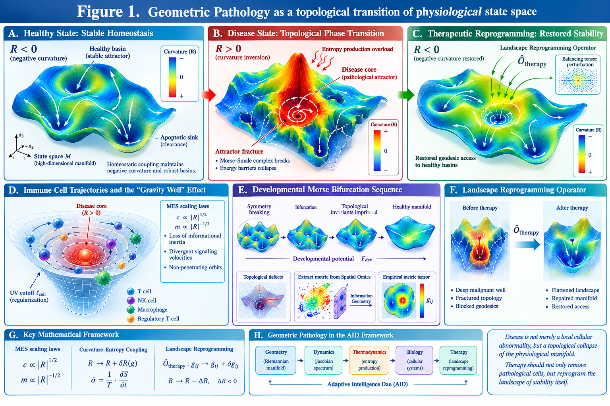

# Geometric Pathology: Topological Collapse and Landscape Reprogramming in Complex Adaptive Systems

**Baoliin (Zaitian) Wu 伍宝林**

*ORCiD:* [0009-0003-2051-5247](https://orcid.org/0009-0003-2051-5247)

*Email:* zaitian001@gmail.com

*Affiliation:* People's Government of Guangdong Province: Guangzhou, CN

*Date:* September 11, 2026

---

## Abstract

Geometric Pathology is a scientific innovation paradigm for complex adaptive systems, situated within the Adaptive Intelligence Dao (AID) framework and built upon differential geometry, Morse–Smale topology, and non-equilibrium stochastic thermodynamics; it models the state spaces of organisms and generalized adaptive agents as high-dimensional smooth Riemannian manifolds, and attributes the destabilization and chronic pathogenesis of quasi-stable systems to stress-driven curvature inversion and topological phase transitions of these manifolds.

Conventional pathology models diseases primarily as localized cellular anomalies or molecular pathway dysfunctions. This work introduces a coordinate-invariant, macroscopic mathematical framework termed **Geometric Pathology**, formulated within the author's broader **Adaptive Intelligence Dao (AID)** architecture. We represent the accessible physiological states of an organism as a smooth, high-dimensional Riemannian manifold $(\mathcal{M}, g)$ constrained by homeostatic coupling. Under healthy baseline conditions, the landscape is stabilized by prevalent negative scalar curvature ($R < 0$), forcing state trajectories to converge into robust regulatory basins. Crucially, we distinguish geometric curvature from dynamical attraction: the latter is defined by the Jacobian spectrum of the physiological flow, not by the sign of $R$. Curvature serves as a structural descriptor whose correlation with dynamical stability is an empirical question.

We formalize chronic malady—such as hypoxic stress or malignant tumor nucleation—as an active **topological phase transition**. Sustained external stressors act as an energy-momentum tensor field that deforms the Riemannian metric, driving a localized **Curvature Inversion** ($R \rightarrow R_{\text{pathological}} > 0$). By mapping this metric deformation to non-equilibrium thermodynamic fluxes, we demonstrate that this curvature inversion is fundamentally driven by localized entropy production overload. This inversion breaks the transversality of the underlying Morse–Smale complex, collapsing the energy barriers separating healthy basins from apoptotic clearance sinks—a catastrophe defined here as **Attractor Fracture**.

Applying **Modified Einstein Spherical (MES)** scaling laws ($c \propto |R|^{1/2}$, $m \propto |R|^{-1/2}$), we map immune cell trajectories entering the disease core. To prevent naked geometric singularities, we introduce a cellular-scale ultraviolet (UV) cutoff ($\ell_{\text{cell}}$), revealing that entering immune or regulatory cells experience a dramatic loss of informational inertia coupled with divergent signaling velocities. This forces their state trajectories into tight, stable, non-penetrating orbits around the disease core—a regularized, finite confinement mechanism termed the **"Gravity Well"** effect, which explains the frequent failure of targeted immunotherapies.

To account for the developmental origin of topological protection, we introduce a **developmental Morse bifurcation sequence** governed by a developmental potential $F_{\rm dev}$. The healthy manifold is not given a priori; its topological invariants are progressively imprinted through a sequence of symmetry-breaking bifurcations. Disruption of this sequence generates **topological defects** that later serve as preferential nucleation sites for pathological attractors. To bridge this abstract ontology with empirical validation, we introduce an algorithm utilizing Information Geometry to extract empirical metric tensors from Spatial Omics data. Finally, we introduce the **Landscape Reprogramming Operator** ($\hat{\mathcal{O}}_{\text{therapy}}$), designed to inject a balancing tensor perturbation that flattens malignant wells, repairs manifold fractures, and restores geodesic access to healthy basins. This perspective shifts the therapeutic objective from raw cellular ablation to the systemic preservation and structural reprogramming of the architecture of physiological stability itself.

**Keywords:** Geometric Pathology; Adaptive Intelligence Dao; Riemannian manifold; Curvature Inversion; Entropy Production; Attractor Fracture; Morse bifurcation; MES scaling laws; Gravity Well effect; Spatial Omics; Landscape Reprogramming Operator

---

## 1. Introduction

The persistent challenge of modern medicine lies not in cataloging microscopic constituents, but in explaining the global resilience and catastrophic breakdown of biological homeostasis. Standard reductionist paradigms view pathologies primarily through localized molecular or cellular lesions. While mapping genomic mutations, transcriptomic fluctuations, and signaling cascades has provided exhaustive cellular taxonomies, it frequently fails to capture the macro-level organizational principles that allow a disease state to actively resist therapeutic intervention. Pathological structures, such as hypoxic tumor microenvironments or chronic fibrotic nodules, are not merely passive clusters of abnormal tissue; they behave as highly organized, self-sustaining, non-equilibrium dynamical systems that actively warp the cellular behavior around them.

To address this systemic bottleneck, this paper presents **Geometric Pathology**, a coordinate-invariant, macroscopic mathematical framework that translates biological breakdown into the invariant language of differential geometry, Morse theory, and non-equilibrium stochastic dynamics. This work is the direct pathological counterpart to our previous formulation of the **Geometry of Qi** [1] and builds upon the **Adaptive Intelligence Dao (AID)** architecture originally explored in the context of geometric immune memory [2].

We treat an organism's homeostatic configurations as a smooth, lower-dimensional Riemannian manifold $(\mathcal{M}, g)$ learned from multi-scale high-dimensional biological data. The metric tensor $g_{\mu\nu}$ encodes local physiological distance, transport cost, and statistical distinguishability. Under healthy baseline conditions, biological integrity is maintained by dominant negative scalar curvature ($R < 0$), which acts as an implicit stabilizing field, forcing stochastic fluctuations back into deep homeostatic basins. However, we emphasize a crucial distinction: **curvature is a geometric property, while attraction is a dynamical property**. The sign of $R$ does not by itself guarantee the existence of an attractor. Dynamical stability must be established through the Jacobian spectrum of the physiological flow. Curvature serves as a structural descriptor whose correlation with dynamical quantities—relaxation times, basin depths, Jacobian eigenvalues—is an empirical question to be tested, not assumed.

The central thesis of Geometric Pathology is that chronic disease represents an active **topological phase transition** of this physiological manifold. When an organism is subjected to non-mitigated, severe microenvironmental stressors—such as prolonged localized hypoxia—the stress profile acts as an exogenous energy-momentum tensor field that continuously deforms the metric tensor. Over time, this stress-driven metric rheology drives a localized **Curvature Inversion**, forcing the scalar curvature to flip from its protective negative baseline into an explosive, divergent positive regime ($R_{\text{pathological}} > 0$).

This geometric transformation causes an immediate collapse of the global topological structure of the parameter space. It forces a complete structural rearrangement of the invariant manifolds defining the organism's phase space, breaking the transversality of the underlying Morse–Smale complex and destroying the energy barriers that separate normal cellular functioning from regulatory clearance pathways. This catastrophe—defined herein as **Attractor Fracture**—physically tears the manifold, isolating the healthy apoptotic basins and trapping local biological trajectories inside a rogue, self-sustaining **Parasitic Attractor**.

To explain how these newly formed parasitic states successfully neutralize the organism's innate defense vectors, we implement the **Modified Einstein Spherical (MES)** cosmology scaling laws, adapting them to the internal parameter space of living tissue. By scaling a cell's effective informational mass inversely with the local curvature field ($m \propto |R|^{-1/2}$) and its apparent microenvironmental signal velocity proportionally ($c \propto |R|^{1/2}$), we uncover a profound relativistic confinement mechanism termed the **"Gravity Well"** effect. We derive the explicit geodesic equations of motion for immune and regulatory cells traversing this warped zone, introducing a UV cutoff to regularize geometric singularities. We prove that as they approach the positive-curvature disease core, their biological inertia drops precipitously toward zero while the local coordinate signaling frequency diverges. This forces their state trajectories to bend into tight, non-penetrating, stable closed orbits around the pathological node. The cells enter a state of chronic, dysfunctional engagement—orbiting the disease core indefinitely, structurally blinded and geodetically barred from executing targeted clearance. This provides a definitive, coordinate-invariant explanation for why targeted biochemical immunotherapies frequently fail when confronting highly structured, hypoxic tumor niches.

Finally, this paper shifts the paradigm from cellular destruction to landscape restoration. If a disease is an alternate, structurally resilient topological configuration of the state space, true resolution requires the application of an external **Landscape Reprogramming Operator** ($\hat{\mathcal{O}}_{\text{therapy}}$) capable of smoothing the deformed metric tensor back to its homeostatic state. We derive the exact tensor equations for this operator, showing how targeted, multi-scale interventional vectors can mathematically flatten the malignant gravity wells, annihilate parasitic critical points, repair the manifold fractures, and re-open the blocked geodesic pathways back to healthy basins.

A crucial extension of this framework concerns the **developmental origin** of topological protection. The healthy manifold is not given a priori. Its topological invariants—Chern numbers, Euler characteristic, Betti numbers—are progressively imprinted through a sequence of symmetry-breaking bifurcations during embryogenesis. We formalize this as a **developmental Morse bifurcation sequence** governed by a developmental potential $F_{\rm dev}$. Disruption of this sequence generates **topological defects** that later serve as preferential nucleation sites for pathological attractors. This developmental perspective connects Geometric Pathology to the historical phenomenological record of embryological timing found in classical Chinese medical texts, particularly the *Xuan Yin Yi Mi* [13], which records a six-step sequence of organogenesis: brain, liver, heart, kidney, spleen, lung. While such texts cannot serve as mathematical axioms, they provide candidate historical anchors for the bifurcation sequence, generating testable hypotheses for in-silico validation.

To bridge this abstract mathematical ontology with empirical validation, we integrate protocols for deriving empirical metrics from Spatial Omics and present a ready-to-implement numerical simulation protocol and discretization scheme for in-silico modeling within the author's public research system (Self-Preprint V1.1). Geometric Pathology thus reframes clinical medicine: effective therapy must aim beyond the physical eradication of anomalous cells; its ultimate goal must be the structural reprogramming and preservation of the architecture of physiological stability itself.

Figure 1 provides a conceptual overview of the Geometric Pathology framework, linking stress-driven metric deformation, curvature inversion, topological fracture, geodesic confinement, developmental defects, and landscape reprogramming within a unified mathematical architecture.



**Figure 1. Geometric Pathology as a topological transition of physiological state space.**
Schematic overview of the proposed framework linking healthy homeostasis, stress-driven metric deformation, localized curvature inversion, attractor fracture, geodesic confinement of immune and regulatory trajectories, developmental topological defects, and therapeutic landscape reprogramming. The healthy state is represented as a structured physiological manifold containing stable regulatory basins. Persistent stress can deform the metric and generate a pathological attractor, while the proposed Landscape Reprogramming Operator is intended to restore the accessibility and stability of healthy basins. The figure also illustrates the integration of geometric, dynamical, thermodynamic, biological, and therapeutic components within the Adaptive Intelligence Dao (AID) framework.

---

## 2. Stress-Driven Metric Rheology and the Geometry of Curvature Inversion

### 2.1. The Evolutionary Metric Ansatz under Chronic Stress Fields

We consider a living organism as a complex adaptive system whose homeostatic states are confined to a differentiable physiological state manifold $\mathcal{M}$ of dimension $d = \dim \mathcal{M} > 2$. The local geometric structures of this parameter space—structural distinguishability, sensitivity, transport efficiency—are determined by a data-derived, smooth Riemannian metric tensor $g_{\mu\nu}$. In a baseline homeostatic state, $g_{\mu\nu}$ maintains a configuration dominated by negative scalar curvature ($R < 0$), establishing a convergent topological landscape where natural background fluctuations are structurally guided back into stable regulatory basins.

To model the progression of severe malady or systemic breakdown, we introduce a localized, non-stationary physiological stress field $\chi(x, t) \in \mathbb{R}^k$, representing sustained microenvironmental disturbances such as tissue hypoxia, chronic inflammatory signaling, or toxic accumulation. We hypothesize that prolonged exposure to $\chi$ forces a dynamic, non-equilibrium deformation of the underlying manifold geometry. We formalize this via a covariant geometric flow equation governing the rate of metric variation:

$$\frac{\partial g_{\mu\nu}}{\partial t} = -2 \gamma_{\rm response} R_{\mu\nu} + \alpha_{\rm stress} T_{\mu\nu}(\chi) - \beta_{\rm dissipation} g_{\mu\nu} \quad (2.1)$$

where $R_{\mu\nu}$ is the Ricci curvature tensor of $(\mathcal{M}, g)$, $\gamma_{\rm response} > 0$ represents the intrinsic relaxation rate of the homeostatic infrastructure, and $\beta_{\rm dissipation} > 0$ denotes the spontaneous metabolic clearance or tissue repair rate. The parameter $\alpha_{\rm stress}$ defines the structural coupling susceptibility of the physiological space to the stress energy-momentum tensor $T_{\mu\nu}(\chi)$. To ensure strict coordinate invariance, $T_{\mu\nu}(\chi)$ is constructed from the first covariant derivatives of the stress field:

$$T_{\mu\nu}(\chi) = \nabla_\mu \chi \nabla_\nu \chi - \frac{1}{2} g_{\mu\nu} g^{\alpha\beta} \nabla_\alpha \chi \nabla_\beta \chi \quad (2.2)$$

where $\nabla$ denotes the Levi-Civita connection associated with $g_{\mu\nu}$.

### 2.2. Infinitesimal Variations of the Connection and Ricci Tensors

To rigorously map how the stress tensor deforms local state trajectories, we evaluate the variations of the geometric invariants over an incremental time step $\delta t$. Let the instantaneous time-derivative of the metric tensor be denoted by the symmetric tensor field $h_{\mu\nu}$:

$$h_{\mu\nu} \equiv \frac{\partial g_{\mu\nu}}{\partial t} \quad (2.3)$$

By taking the derivative of the identity $g_{\mu\alpha} g^{\alpha\nu} = \delta_\mu^\nu$, the corresponding variation of the inverse metric is:

$$\frac{\partial g^{\mu\nu}}{\partial t} = -g^{\mu\alpha} g^{\nu\beta} h_{\alpha\beta} \equiv -h^{\mu\nu} \quad (2.4)$$

The variation of the Christoffel symbols $\Gamma^\rho_{\mu\nu}$ under $h_{\mu\nu}$ transforms as a genuine tensor field. Applying Palatini's identity:

$$\frac{\partial \Gamma^\rho_{\mu\nu}}{\partial t} = \frac{1}{2} g^{\rho\sigma} \left( \nabla_\mu h_{\nu\sigma} + \nabla_\nu h_{\mu\sigma} - \nabla_\sigma h_{\mu\nu} \right) \quad (2.5)$$

Taking the time derivative of the Riemann components and contracting over indices yields the generalized Palatini variation for the Ricci tensor:

$$\frac{\partial R_{\mu\nu}}{\partial t} = \nabla_\rho \left( \frac{\partial \Gamma^\rho_{\mu\nu}}{\partial t} \right) - \nabla_\nu \left( \frac{\partial \Gamma^\rho_{\mu\rho}}{\partial t} \right) \quad (2.6)$$

Substituting Equation (2.5) into Equation (2.6) yields:

$$\frac{\partial R_{\mu\nu}}{\partial t} = \frac{1}{2} \left( \nabla^\rho \nabla_\mu h_{\nu\rho} + \nabla^\rho \nabla_\nu h_{\mu\rho} - \Delta_g h_{\mu\nu} - \nabla_\mu \nabla_\nu h \right) \quad (2.7)$$

where $\Delta_g \equiv \nabla^\rho \nabla_\rho$ is the Beltrami-Laplace operator on $(\mathcal{M}, g)$, and $h \equiv h^\alpha_{\;\alpha} = g^{\alpha\beta} h_{\alpha\beta}$ is the trace of the metric deformation tensor.

### 2.3. Derivation of the Scalar Curvature Propagation Equation

The scalar curvature $R$ is the trace of the Ricci tensor, $R = g^{\mu\nu} R_{\mu\nu}$. Differentiating with respect to time:

$$\frac{\partial R}{\partial t} = \frac{\partial g^{\mu\nu}}{\partial t} R_{\mu\nu} + g^{\mu\nu} \frac{\partial R_{\mu\nu}}{\partial t} \quad (2.8)$$

Substituting Equations (2.4) and (2.7):

$$\frac{\partial R}{\partial t} = -h^{\mu\nu} R_{\mu\nu} + \frac{1}{2} g^{\mu\nu} \left( \nabla^\rho \nabla_\mu h_{\nu\rho} + \nabla^\rho \nabla_\nu h_{\mu\rho} - \Delta_g h_{\mu\nu} - \nabla_\mu \nabla_\nu h \right) \quad (2.9)$$

Using metric compatibility ($\nabla_\rho g_{\mu\nu} = 0$) and simplifying:

$$g^{\mu\nu} \nabla^\rho \nabla_\mu h_{\nu\rho} = \nabla^\rho \nabla^\nu h_{\nu\rho} = \nabla^\mu \nabla^\nu h_{\mu\nu} \quad (2.10)$$

$$g^{\mu\nu} \Delta_g h_{\mu\nu} = \Delta_g (g^{\mu\nu} h_{\mu\nu}) = \Delta_g h \quad (2.11)$$

$$g^{\mu\nu} \nabla_\mu \nabla_\nu h = \Delta_g h \quad (2.12)$$

Combining these contractions yields the general, coordinate-invariant geometric equation for scalar curvature propagation:

$$\frac{\partial R}{\partial t} = -\Delta_g h + \nabla^\mu \nabla^\nu h_{\mu\nu} - h^{\mu\nu} R_{\mu\nu} \quad (2.13)$$

### 2.4. Thermodynamic Entropy Production and Curvature Phase Transition

To bridge the geometric deformation with non-equilibrium stochastic thermodynamics, we map the stress energy-momentum tensor $T_{\mu\nu}(\chi)$ to local entropy production. In stochastic thermodynamics, the entropy production rate $\sigma_{\text{entropy}}$ of a biological system driven by a stress field $\chi$ is proportional to the square of the thermodynamic driving force in the linear response regime: $\sigma_{\text{entropy}} \propto |\nabla \chi|^2$ [16].

We specialize to the regime where stress tensor gradients dominate short-term structural variations ($h_{\mu\nu} \approx \alpha_{\rm stress} T_{\mu\nu}(\chi)$). Contracting Equation (2.2) with the inverse metric gives the scalar trace:

$$\begin{aligned} h &= g^{\mu\nu} h_{\mu\nu} \\ &= \alpha_{\rm stress} g^{\mu\nu} \left( \nabla_\mu \chi \nabla_\nu \chi - \frac{1}{2} g_{\mu\nu} |\nabla \chi|^2 \right) \\ &= \alpha_{\rm stress} \left( \frac{2 - d}{2} \right) |\nabla \chi|^2 \end{aligned} \quad (2.14)$$

where $|\nabla \chi|^2 \equiv g^{\alpha\beta} \nabla_\alpha \chi \nabla_\beta \chi$. Notice the direct physical mapping: $h \propto -\sigma_{\text{entropy}}$. Inserting this trace and the full evolution terms from Equation (2.1) into Equation (2.13) yields the **Geometric Wave-Diffusion Equation for Curvature Inversion**:

$$\boxed{ \begin{aligned} \frac{\partial R}{\partial t} &= \alpha_{\rm stress} \left[ \left( \frac{d - 2}{2} \right) \Delta_g |\nabla \chi|^2 + \nabla^\mu \nabla^\nu \left( \nabla_\mu \chi \nabla_\nu \chi - \frac{1}{2} g_{\mu\nu} |\nabla \chi|^2 \right) \right] \\ &\quad - \Delta_g R - 2 \gamma_{\rm response} |{\rm Ric}|^2 + \beta_{\rm dissipation} R \end{aligned} } \quad (2.15)$$

where $|{\rm Ric}|^2 \equiv R_{\mu\nu} R^{\mu\nu}$.

Equation (2.15) formalizes the breakdown of homeostatic stability. In high-dimensional physiological spaces ($d > 2$), the term $\left(\frac{d - 2}{2}\right) \Delta_g |\nabla \chi|^2$ acts as a geometric topological pump. When a severe, chronic stress field sets up sharp, localized gradients ($\Delta_g |\nabla \chi|^2 > 0$), this pump drives accelerated local accumulation of positive scalar curvature.

Under normal health, the dissipative dampening term ($-2 \gamma_{\rm response} |{\rm Ric}|^2 < 0$) suppresses minor fluctuations, locking the system into its homeostatic configuration. However, if the stress gradient crosses a critical threshold:

$$\alpha_{\rm stress} \left[ \left( \frac{d - 2}{2} \right) \Delta_g |\nabla \chi|^2 + \dots \right] > 2 \gamma_{\rm response} |{\rm Ric}|^2 \quad (2.16)$$

the protective homeostatic barrier collapses. $\frac{\partial R}{\partial t}$ undergoes an irreversible sign inversion, flipping the local manifold from a convergent negative-curvature basin into a divergent positive-curvature zone ($R_{\text{pathological}} > 0$). This proves that **Curvature Inversion is a thermodynamic-geometric phase transition**, driven precisely when localized entropy production rate $\sigma_{\text{entropy}}$ overloads the intrinsic homeostatic dissipation capacity.

**Important caveat.** The curvature inversion described by Equation (2.16) is a geometric event. It does not by itself guarantee the existence of a dynamical attractor. The formation of a parasitic attractor requires the Jacobian spectrum of the physiological flow to acquire eigenvalues with positive real parts. In Section 3, we formalize the dynamical criteria for Attractor Fracture and clarify the relationship between curvature and attraction.

---

## 3. Attractor Fracture, Morse–Smale Deformations, and the Curvature–Dynamics Distinction

### 3.1. Dynamical Definition of Attractors

We represent the physiological system as a smooth drift vector field $f(z)$ on the state manifold $\mathcal{M}$. The flow generated by $f(z)$ is

$$\frac{dz^\mu}{d\tau} = f^\mu(z) + \xi^\mu(z,\tau), \quad (3.1)$$

where $\xi^\mu$ represents stochastic fluctuations. In a healthy organism, the deterministic flow is structurally stable and Morse–Smale: the number of critical points is finite, all critical points are hyperbolic, and their stable and unstable manifolds intersect transversally.

A critical point $z^*$ is an **attractor** if the Jacobian matrix

$$J^\mu_{\;\nu}(z^*) = \nabla_\nu f^\mu(z^*) \quad (3.2)$$

has eigenvalues all with negative real parts. The **basin of attraction** $A(z^*)$ is the set of initial conditions whose trajectories converge to $z^*$. The depth of the basin is characterized by the minimum energy barrier separating it from neighboring basins.

This dynamical definition is independent of the sign of the scalar curvature. A region with $R < 0$ may or may not contain an attractor; a region with $R > 0$ may or may not contain a repeller. Curvature is a geometric descriptor of the state space, while attraction is a dynamical property of the flow. The correlation between them is an empirical question, not a mathematical identity.

### 3.2. Stress-Induced Deformation of the Flow

Chronic parameter deformation shifts the system into a non-conservative, open thermodynamic regime. We model the vector field as a function of the local metric state and an active potential function $\mathcal{F}(z)$, augmented by an uncompensated, non-gradient regularizing field $\xi(z)$:

$$f^\mu(z) = -g^{\mu\nu}(z; \chi)\nabla_\nu \mathcal{F}(z) + \xi^\mu(z) \quad (3.3)$$

Let $A_{\rm healthy}$ represent the homeostatic attractor basin and $A_{\rm death}$ the apoptotic regulatory clearing sink. Under baseline conditions, the phase space topology is partitioned by a smooth separatrix $\mathcal{S}_{\rm homeostatic}$, which directs transient cellular anomalies into $A_{\rm death}$ for elimination.

The introduction of the positive curvature zone ($R_{\rm pathological} > 0$) forces a bifurcation in the Morse–Smale complex. As the stress profile deforms the metric tensor, it creates a new critical point $z_{\rm parasitic}$ of index 0 (a sink), corresponding to the nucleation of a **Parasitic Attractor** ($A_{\rm parasitic}$). The appearance of this state ruptures the existing phase portrait, forcing a global reorganization of invariant manifolds.

The dynamical condition for the parasitic attractor to become stable is that the Jacobian $J(z_{\rm parasitic})$ has eigenvalues with negative real parts. The geometric condition $R_{\rm pathological} > 0$ is neither necessary nor sufficient for this; it is a companion phenomenon that typically accompanies the stress-induced deformation of the flow.

### 3.3. Morse-Theoretic Formulation of Attractor Fracture

Let $\mathcal{F}: \mathcal{M} \rightarrow \mathbb{R}$ be a smooth Morse function representing the energy landscape of the regulatory network. The topology of the sublevel sets $\mathcal{M}^a = \{z \in \mathcal{M} \mid \mathcal{F}(z) \le a\}$ is invariant as long as the interval $[a, b]$ contains no critical values of $\mathcal{F}$. As the metric deforms under Equation (2.1), the critical values corresponding to saddles and basins shift along the real line.

We formalize the structural collapse of health as **Attractor Fracture**. Let $z_{\rm saddle}$ be a critical point of index 1 (a saddle) representing the regulatory energy barrier separating the healthy homeostatic basin from the invading parasitic zone. The instant of fracture occurs when the saddle-to-basin energy threshold $\Delta \mathcal{F}(\chi)$ collapses to a singular value:

$$\lim_{\chi \to \chi_c} \Delta \mathcal{F}(\chi) = \lim_{\chi \to \chi_c} \left[ \mathcal{F}(z_{\rm saddle}) - \mathcal{F}(z_{\rm healthy}) \right] = 0 \quad (3.4)$$

At the critical boundary $\chi = \chi_c$, the unstable manifold of the saddle $W^u(z_{\rm saddle})$ undergoes a topological catastrophe. The transversality condition of the Morse–Smale complex is broken:

$$W^u(z_{\rm saddle}) \cap W^s(z_{\rm death}) \rightarrow \emptyset \quad (3.5)$$

Equation (3.5) provides the strict topological criterion for disease stabilization. The basin of programmed cellular clearance becomes completely detached and dynamically inaccessible from the local state coordinates of the stressed tissue. The phase space is physically torn; the system can no longer access the self-correcting apoptotic pathways.

### 3.4. Betti Number Shift and Topological Phase Transition

To quantify the macroscopic reorganization of the state space during an attractor fracture, we track the evolution of global topology using homology groups and Betti numbers $\beta_k(\mathcal{M})$. According to Morse theory, when a critical point of index $\lambda$ is added, the topology changes as if a $\lambda$-cell were glued to the space.

The nucleation of the parasitic sink ($z_{\rm parasitic}$, index $\lambda = 0$) and its accompanying saddle ($z_{\rm saddle}$, index $\lambda = 1$) alters the rank of the cellular homology chains. The transition from health to chronic pathology is defined by a shift in the alternating sum of Betti numbers, mapping a transition in the Euler characteristic $\chi(\mathcal{M})$:

$$\Delta \chi(\mathcal{M}) = \sum_{k=0}^{d} (-1)^k \Delta \beta_k(\mathcal{M}) = \Delta n_0 - \Delta n_1 + \Delta n_2 - \dots \quad (3.6)$$

where $n_\lambda$ is the number of critical points of index $\lambda$.

When the attractor fractures at $\chi_c$, the creation of the parasitic sink increases the 0th Betti number ($\Delta \beta_0 = +1$), indicating the birth of an independent, isolated functional component in phase space. Concurrently, the collapse of the homeostatic separatrix creates a non-transversal intersection that permanently traps local trajectories within the new basin. The organism's state space has undergone an irreversible phase transition: from a single, globally integrated homeostatic system to a fractured manifold containing a rogue, self-sustaining topological island.

**Topological protection.** In the healthy state, the basin of attraction is not merely deep; it is topologically protected. The topological invariants of the manifold—Chern numbers, Euler characteristic, and Betti numbers—are imprinted during development and are robust against continuous perturbations. A disease state arises when these invariants are altered, either through a developmental defect or through a stress-induced topological phase transition. The curvature inversion described in Section 2 is a geometric signature of this transition, but the fundamental event is the change in topological invariants.

---

## 4. Developmental Geometry: Morse Bifurcation Sequence and Topological Protection

### 4.1. The Developmental Potential and Its Morse Bifurcation Sequence

The healthy manifold is not given a priori. Its topological invariants are progressively established during embryogenesis through a sequence of symmetry-breaking events. We formalize this process using a **developmental potential**

$$F_{\rm dev}: \mathcal{M}_{\rm dev} \times [0,T] \to \mathbb{R}, \quad (4.1)$$

where $\mathcal{M}_{\rm dev}$ is the developmental state space and $t$ is the developmental time parameter. The deterministic developmental flow is

$$\frac{dz^\mu}{d\tau} = -g^{\mu\nu}\nabla_\nu F_{\rm dev}(z;t) + \xi^\mu(z,\tau), \quad (4.2)$$

with $\xi^\mu$ capturing stochastic and non-gradient regulatory influences.

As $t$ crosses a critical time $t_i$, the critical points of $F_{\rm dev}$ undergo a qualitative change: a pair of critical points is born or annihilated, or their stability is exchanged. This is a **Morse bifurcation**. The developmental sequence is a finite ordered set

$$t_1 < t_2 < \cdots < t_N. \quad (4.3)$$

Each bifurcation corresponds to a symmetry breaking that changes the number of critical points $n_\lambda$, the basin partition, and the separatrix structure. The sublevel sets

$$\mathcal{M}^a(t) = \{z \mid F_{\rm dev}(z;t) \le a\} \quad (4.4)$$

change their homology according to the Morse relation

$$\Delta \chi(\mathcal{M}) = \sum_{k=0}^{d} (-1)^k \Delta \beta_k(\mathcal{M}) = \sum_{\lambda} (-1)^\lambda \Delta n_\lambda. \quad (4.5)$$

Each bifurcation imprints a local topological invariant on the developing manifold, corresponding to a newly formed organ region. The **topological protection** of the adult healthy state is the cumulative result of this developmental sequence.

### 4.2. Topological Defects and Pathological Nucleation Sites

If the developmental bifurcation sequence is disrupted, the resulting manifold contains **topological defects**: regions where the topological invariants are misaligned, incompletely locked, or absent. Let $\chi_{\rm dev}$ be a developmental stress field. If, in a window around $t_i$,

$$\int_{t_i-\delta}^{t_i+\delta} |\nabla \chi_{\rm dev}|^2 \, dt > \chi_c, \quad (4.6)$$

then the bifurcation timing may shift, critical points may nucleate incorrectly, or the basin depth may be insufficient. The resulting defect region has a lower curvature inversion threshold $\chi_c$ in adulthood, making it a preferential nucleation site for pathological attractors.

This provides a developmental explanation for why certain organs or tissues are more susceptible to specific diseases: they carry topological defects from incomplete or disrupted developmental bifurcations. The adult pathological phase transition is thus a reactivation or exacerbation of a developmental vulnerability.

### 4.3. Historical Phenomenological Anchor: The Six-Step Morse Bifurcation Sequence

Classical Chinese medical texts, particularly the *Xuan Yin Yi Mi* [13], record a six-step sequence of embryological organogenesis:

> "阴阳交牝，物始化生者，首也。次生者，肝也。次生者，心也。次生者，肾也。次生者，脾也。次生者，肺也。"

Translation: "When yin and yang unite, the first thing to transform is the head. The next to be born is the liver. The next is the heart. The next is the kidney. The next is the spleen. The next is the lung."

Building on the developmental potential $F_{\rm dev}$ introduced in Section 4.1, this sequence—brain, liver, heart, kidney, spleen, lung—admits a precise formalization as a **Morse bifurcation chain** on the developmental state manifold $\mathcal{M}$. A critical point $z_0$ satisfies $\nabla F_{\rm dev}(z_0) = 0$; it is non-degenerate if the Hessian $H_{ij} = \partial^2 F_{\rm dev} / \partial z^i \partial z^j$ is nonsingular. The number of negative eigenvalues of $H$ defines the Morse index $\lambda$, representing the unstable dimensions of the corresponding physiological attractor. As $t$ progresses, $F_{\rm dev}$ undergoes a sequence of bifurcations, each breaking a geometric symmetry and creating new stable attractors—the structural functional centers of organs.

**Step 1: Head (首) — $SO(3) \to SO(2)$ symmetry breaking.**

The fertilized egg is modeled as a highly symmetric sphere invariant under the 3D rotation group $SO(3)$. At $t = t_1$, a critical point undergoes a pitchfork bifurcation. The potential develops a gradient along a single spatial vector:

$$\Delta F_{\rm dev} \propto \alpha(t) (z_1)^2 - \beta(t) (z_1)^4. \quad (4.7)$$

As $\alpha(t)$ flips from negative to positive, the global minimum branches into two distinct regions along the $z_1$-axis, establishing the anterior–posterior axis. The head emerges as the primary topological anchor, reducing the manifold's symmetry from $SO(3)$ to longitudinal axial symmetry $SO(2)$.

**Step 2: Liver (肝) — chiral asymmetry and the $z_2$-axis.**

At $t = t_2$, the remaining axial symmetry is broken to differentiate left and right. The Hessian at the central attractor develops a zero eigenvalue along a second coordinate $z_2$. A pitchfork bifurcation splits the critical point into a saddle and a stable attractor basin. The liver emerges as a specialized asymmetric metabolic source node, locally skewing the metric tensor $g_{\mu\nu}$ and creating a strong metabolic vector.

**Step 3: Heart (心) — phase-space limit cycle.**

At $t = t_3$, the system transitions from static spatial structures to dynamic periodic behavior. A Hopf-like bifurcation occurs: a stable fixed point loses stability as a pair of complex conjugate eigenvalues of the Jacobian crosses the imaginary axis,

$${\rm Real}(\sigma_{1,2}) > 0. \quad (4.8)$$

The local topology changes from a stable point to a stable limit cycle—a closed loop in phase space. This is the mathematical emergence of the heart, acting as a nonlinear oscillator that provides a global clock for the remaining organs.

**Step 4: Kidney (肾) — dual mirror sinks.**

At $t = t_4$, the system requires a structural balancing mechanism to manage the fluid-dynamic and geometric pressure generated by the heart's limit cycle. A symmetric pitchfork bifurcation off-center splits a central regulatory channel into two perfectly symmetric stable local minima:

$$\nabla^2 F_{\rm dev} \implies \{z_{\rm kidney\_L}, z_{\rm kidney\_R}\}. \quad (4.9)$$

The kidney emerges as a dual-well potential system whose twin sinks act as a topological buffer, absorbing excess fluid-dynamic variations and locking down the bilateral boundary conditions of internal flow.

**Step 5: Spleen (脾) — global network homeostasis.**

At $t = t_5$, with multiple distinct attractors already present (brain, liver, heart, kidneys), the manifold risks becoming unstable or disconnected. The potential introduces a high-dimensional saddle point of critical stability, topologically equidistant between the metabolic source (liver) and the fluid sinks (kidneys):

$$\det(H_{\rm spleen}) < 0 \quad \text{with index } \lambda = 1. \quad (4.10)$$

The spleen acts as a critical topological junction—a regulatory crossroad that coordinates the traffic of physiological flow vector fields without pulling everything into a deep well. It is the mathematical hub of homeostasis.

**Step 6: Lung (肺) — open boundary layer.**

At $t = t_6$, the internal structural configuration is complete, but the embryo remains insulated. To survive post-birth, the manifold must open to an infinite external environment. The boundary $\partial \mathcal{M}$, previously a closed Dirichlet boundary ($z|_{\partial \mathcal{M}} = 0$), undergoes a topological phase transition into a Neumann or open mixed boundary condition:

$$\left. \frac{\partial F_{\rm dev}}{\partial n} \right|_{\partial \mathcal{M}} = \Phi_{\rm environment}. \quad (4.11)$$

The lung emerges at this exact boundary layer. It is the final organ to mature and activate because a system cannot safely open its boundary to external chaos (air, pathogens, rapid thermal changes) until its internal core attractors and regulatory feedback loops are fully established and topologically protected.

**Summary of the mathematical flow.**

Expressing the process via Morse–Smale–Witten complexes, the developmental sequence is an escalating topological chain:

$$\emptyset \xrightarrow{\text{symmetry broken}} \text{Head } [SO(3) \to SO(2)] \xrightarrow{\text{chiral split}} \text{Liver} \xrightarrow{\text{Hopf}} \text{Heart} \xrightarrow{\text{dual well}} \text{Kidney} \xrightarrow{\text{global saddle}} \text{Spleen} \xrightarrow{\text{boundary opening}} \text{Lung } [\partial \mathcal{M} \text{ opens}]. \quad (4.12)$$

This formalization suggests that the sequence recorded in the *Xuan Yin Yi Mi* is not an arbitrary ancient list but a **candidate description of a mathematically optimal chain of symmetry breakings** required to build a stable, self-regulating, open thermodynamic system on a curved manifold. Each bifurcation imprints a local topological invariant; disruption of this sequence generates **topological defects** that later serve as preferential nucleation sites for pathological attractors (Section 4.2).

We emphasize that the ancient text cannot serve as a mathematical axiom or independent empirical evidence. It provides a **historical phenomenological anchor** that generates testable hypotheses:

* **Hypothesis A (Timing Lock):** The bifurcation times $t_1,\dots,t_6$ of $F_{\rm dev}$ correspond to the six-step sequence and to modern embryological windows (neural plate by week 3 and inhibitory neuron markers by week 4 [15]; hepatic diverticulum, heart tube, and pronephros by week 4; splenic primordium and lung bud by week 5 [14]).

* **Hypothesis B (Defect Sensitivity):** A developmental stress $\chi_{\rm dev}$ exceeding threshold at $t_i$ lowers the adult curvature inversion threshold $\chi_c$ for the corresponding organ region.

* **Hypothesis C (Therapeutic Window):** Stabilizing interventions during the developmental window can prevent topological defects; adult repair requires a stronger landscape reprogramming operator $\hat{\mathcal{O}}_{\rm therapy}$.

These hypotheses can be tested using the in-silico pipeline of Section 7 by modeling $F_{\rm dev}$ with the bifurcation sequence above and simulating the effect of developmental stress on adult pathological susceptibility.

---

## 5. The MES Gravity Well, Geodesic Capture, and UV Regularization

### 5.1. Modified Einstein Scaling Laws in Deepened Curvature Fields

When a localized pathological state completes its topological fracture, the localized scalar curvature $R(z)$ within the core of the parasitic attractor deepens drastically. To model the resulting dynamic breakdown of regulatory and immune cells operating near this diseased zone, we introduce the **Modified Einstein Spherical (MES)** scaling ansatz. This framework treats the interaction between the deformed state-space metric $g_{\mu\nu}(z)$ and the cell's regulatory path as a purely geometric confinement problem.

We map the local scalar curvature to the cell's effective informational inertia (mass) $m(z)$ and the apparent signal velocity $c(z)$ through:

$$c(z) = c_0 |R(z)|^{1/2} \quad (5.1)$$

$$m(z) = m_0 |R(z)|^{-1/2} \quad (5.2)$$

where $c_0$ and $m_0$ are baseline scales under flat, healthy conditions ($R \rightarrow 0$). When an immune cell migrates into a high-curvature pathological zone where $|R(z)| \rightarrow \infty$, its effective inertia drops toward zero while the local signal propagation velocity diverges toward infinity.

### 5.2. Relativistic Geodesic Motion of Immune State Trajectories

The path of an immune cell through the physiological state space is a parameterized curve $z^\mu(\tau)$, where $\tau$ is the cell's internal proper regulatory time. The trajectory is governed by the state-space geodesic equation under the stress-deformed metric $g_{\mu\nu}$:

$$\frac{d^2 z^\mu}{d\tau^2} + \Gamma^\mu_{\alpha\beta} \frac{dz^\alpha}{d\tau} \frac{dz^\beta}{d\tau} = f_{\rm external}^\mu(z) \quad (5.3)$$

where $\Gamma^\mu_{\alpha\beta}$ are the Christoffel symbols of the Levi-Civita connection associated with $g_{\mu\nu}(z; \chi)$, and $f_{\rm external}^\mu(z)$ represents non-geometric biological forces (e.g., exogenous chemokine administration).

The cell's effective four-momentum is $p^\mu = m(z) \frac{dz^\mu}{d\tau}$. Because mass scales inversely with curvature, the invariant mass relation $g_{\mu\nu} p^\mu p^\nu = -m(z)^2 c(z)^2$ simplifies. Substituting Equations (5.1) and (5.2):

$$\begin{aligned} g_{\mu\nu} p^\mu p^\nu &= -\left(m_0 |R|^{-1/2}\right)^2 \left(c_0 |R|^{1/2}\right)^2 \\ &= -m_0^2 c_0^2 \end{aligned} \quad (5.4)$$

The total energy-momentum scalar remains bounded and constant across all scales of pathological deformation, even as individual mass and velocity terms diverge.

### 5.3. Mechanics of Geodesic Capture and UV Cutoff Regularization

To isolate the **Gravity Well** effect, we express the geodesic equation in terms of an effective radial coordinate $r$ measuring distance from the center of $A_{\rm parasitic}$. Projecting onto a two-dimensional equatorial slice of a spherically symmetric approximation, the radial acceleration is modeled by an effective potential $V_{\rm eff}(r)$.

However, in the idealized theoretical limit $r \to 0$, scalar curvature $|R(z)|$ diverges, which would mathematically suggest a naked geometric singularity. Biological manifolds are not infinitely continuous; they possess a fundamental physical granularity defined by the characteristic cellular dimension. To prevent unphysical mathematical divergences and maintain structural validity, we introduce a **cellular-scale ultraviolet (UV) cutoff**, $\ell_{\text{cell}}$, replacing $r$ with the regularized coordinate $r_{\text{reg}} = \sqrt{r^2 + \ell_{\text{cell}}^2}$.

The regularized radial energy equation becomes:

$$\frac{1}{2} \left(\frac{dr_{\text{reg}}}{d\tau}\right)^2 + V_{\text{eff}}^{\text{reg}}(r) = E_{\rm regulatory} \quad (5.5)$$

where $E_{\rm regulatory}$ is the conserved regulatory energy, and the UV-regularized effective potential is:

$$V_{\text{eff}}^{\text{reg}}(r) = -\frac{\alpha_{\rm stress} M_{\rm tumor}}{r_{\text{reg}}} + \frac{L^2 |R(z)|}{2 m_0^2 r_{\text{reg}}^2} - \frac{\alpha_{\rm stress} M_{\rm tumor} L^2}{c_0^2 |R(z)| r_{\text{reg}}^3} \quad (5.6)$$

with $M_{\rm tumor}$ the integrated mass-energy of the pathological deformation and $L$ the conserved angular momentum.

As $r \rightarrow 0$ (approaching the disease core), the radial coordinate approaches the finite UV limit $r_{\text{reg}} \to \ell_{\text{cell}}$. The third term drops out, while the centrifugal barrier (second term) scales aggressively upward but terminates at a massive, finite potential maximum rather than an infinite singularity.

```text
Effective Potential V_eff(r)
      ^
      |         / \
      |        /   \  <-- Centrifugal Barrier Scales Upward (Regularized by L_cell)
      |       /     \
      |      /       \
 -----+-----+---------\----------------------> Radial Distance (r)
      |    /           \
      |   /             \__ [Stable Orbit: Trapped Immune Cells]
      |  /
```

Instead of penetrating the disease core, the immune cell experiences overwhelming geometric repulsion from the center, combined with severe loss of regulatory inertia. Its trajectory bends into a tight, stable orbit at $r_{\rm capture}$ where $\partial V_{\rm eff}^{\text{reg}}/\partial r = 0$. The cell becomes **geodesically captured**. It orbits the parasitic nodule indefinitely in chronic, dysfunctional engagement—structurally barred from reaching the target. This regularized, pure geometric confinement explains why targeted immunotherapies frequently fail against highly structured, hypoxic tumor cores.

---

## 6. The Landscape Reprogramming Operator and Geodesic Restoration

### 6.1. Formal Definition of the Reprogramming Tensor Field

To counteract the metric deformation of Equation (2.15) and liberate captured regulatory cells, therapeutic intervention must operate at the same structural layer as the pathology. We introduce an exogenous control field, the **Landscape Reprogramming Operator** $\hat{\mathcal{O}}_{\text{therapy}}$, acting directly as a tensor perturbation on the non-equilibrium metric flow:

$$\frac{\partial g_{\mu\nu}}{\partial t} = -2 \gamma_{\rm response} R_{\mu\nu} + \alpha_{\rm stress} T_{\mu\nu}(\chi) - \beta_{\rm dissipation} g_{\mu\nu} + \hat{\mathcal{O}}_{\text{therapy}}[g_{\mu\nu}, T_{\mu\nu}] \quad (6.1)$$

The primary objective is not immediate destruction of cells occupying $z_{\rm parasitic}$, but injection of a negative energy-momentum tensor field that cancels the warp induced by $\nabla \chi$. We define:

$$\hat{\mathcal{O}}_{\text{therapy}}[g_{\mu\nu}, T_{\mu\nu}] = -\alpha_{\text{therapy}} \left( \Phi_{\mu\nu}(z, t) - \frac{1}{2} g_{\mu\nu} g^{\alpha\beta} \Phi_{\alpha\beta}(z, t) \right) \quad (6.2)$$

where $\alpha_{\text{therapy}} > 0$ is the calibrated therapeutic intensity, and $\Phi_{\mu\nu}$ is an engineered symmetric tensor field representing the deployment of the treatment vector (e.g., multi-targeted microenvironment modulation, anti-hypoxic reoxygenation, metabolic conditioning).

### 6.2. Mathematical Flattening of the Malignant Gravity Well

Applying the curvature propagation equation (2.13) to the modified flow (6.1):

$$\frac{\partial R}{\partial t} = \left( \frac{\partial R}{\partial t} \right)_{\text{stress}} - \alpha_{\text{therapy}} \left[ \left( \frac{d - 2}{2} \right) \Delta_g |\Phi|^2 + \nabla^\mu \nabla^\nu \left( \Phi_{\mu\nu} - \frac{1}{2} g_{\mu\nu} |\Phi|^2 \right) \right] \quad (6.3)$$

where $|\Phi|^2 \equiv g^{\mu\alpha} g^{\nu\beta} \Phi_{\mu\nu} \Phi_{\alpha\beta}$. To dissolve the malignant gravity well, the operator must satisfy the **Strict Geometric Flattening Condition**:

$$\alpha_{\text{therapy}} \left[ \left( \frac{d - 2}{2} \right) \Delta_g |\Phi|^2 + \dots \right] \ge \alpha_{\rm stress} \left[ \left( \frac{d - 2}{2} \right) \Delta_g |\nabla \chi|^2 + \dots \right] \quad (6.4)$$

When Condition (6.4) holds over the local volume containing $A_{\rm parasitic}$, the curvature inversion is reversed:

$$R_{\rm pathological} \longrightarrow R_{\rm baseline} < 0 \quad (6.5)$$

As the gravity well flattens, the centrifugal barrier in Equation (5.6) collapses, stripping the parasitic core of its geodesic capture capability.

### 6.3. Geodesic Restoration and Re-opening of Apoptotic Basins

Once the malignant curvature well is flattened, the global topology must be repaired. The disappearance of the positive curvature zone destabilizes $z_{\rm parasitic}$. The topological phase transition is reversed via a controlled fold or saddle-node bifurcation:

$$z_{\rm parasitic} \cap z_{\rm saddle} \longrightarrow \emptyset \quad (6.6)$$

As these critical points annihilate, the fractured invariant manifolds are re-welded. The transversality condition is restored:

$$W^u(z_{\rm saddle}) \cap W^s(z_{\rm death}) \neq \emptyset \quad (6.7)$$

```text
   [Captured State]                  [Geodesic Restoration]
  Centrifugal Barrier                  Barrier Collapses via O_therapy
         / \                                       \
        /   \                                       \
       /     \                                       \
 =====+=======+====> r                              ==+=========> r
      \       /                                        \
       \     /                                          \__ [Open Geodesic Path
        \___/                                                to Apoptosis/Clearance]
   [Gravity Well]
```

Equation (6.7) formalizes **Geodesic Restoration**. With the topological fracture repaired, minimal-action pathways are unblocked. Infiltrating immune and regulatory cells are no longer forced into dysfunctional orbits. Native noise-driven fluctuations can once again guide the state vector along clean geodesic trajectories back into healthy homeostatic clearance basins, achieving systemic recovery.

**Developmental perspective on therapy.** If the pathological state arises from a developmental topological defect, the reprogramming operator must not only flatten the adult curvature well but also restore the missing topological invariant. This may require a sequence of interventions—an **inverse Morse bifurcation sequence**—that re-imprints the correct topological structure. The therapeutic objective thus becomes the completion or correction of the developmental bifurcation sequence.

---

## 7. Empirical Validation, Spatial Omics, and Numerical Simulation

To validate the theoretical mechanics of stress-driven metric rheology, attractor fracture, developmental bifurcations, and the MES gravity well effect, we define a rigorous numerical pipeline.

### 7.1. Empirical Metric Extraction from Single-Cell Spatial Omics

To transition the theoretical metric $g_{\mu\nu}$ into an empirically measurable quantity, we extract the Riemannian geometry directly from high-dimensional biological datasets, such as single-cell RNA sequencing (scRNA-seq) or high-resolution spatial transcriptomics [17, 18].

Let $X \in \mathbb{R}^{N \times G}$ represent a single-cell expression matrix of $N$ cells and $G$ genes. We project this high-dimensional space onto a lower-dimensional state manifold $\mathcal{M}$ (where $d \ll G$) using diffusion maps and manifold learning algorithms [17]. The transition probability matrix $P$ of the cellular random walk defines a diffusion operator. By calculating the local covariance matrix $\Sigma(z)$ of the transition probabilities in the neighborhood of state $z$, the empirical metric tensor is approximated via the Information Geometry formalism [12] as the pseudo-inverse of the covariance:

$$g_{\mu\nu}^{\text{data}}(z) \approx \left[ \Sigma(z) \right]^{-1}_{\mu\nu} \quad (7.1)$$

This Fisher Information-based metric natively captures structural distinguishability. Regions with high transcriptomic variance correspond to 'flat' geometry, while rigidly constrained pathological states manifest as deep positive-curvature basins, providing real-world coordinates for the Reprogramming Operator $\hat{\mathcal{O}}_{\text{therapy}}$.

### 7.2. Spatiotemporal Discretization of the Metric Flow

Let the physiological parameter space be approximated by a discrete, bounded three-dimensional grid

$$\Omega = \{(i, j, k) \mid 1 \le i, j, k \le L\}$$

with spatial step $\Delta z$. Time is discretized uniformly into steps $\Delta t$, indexed by $n$. At each lattice node, the symmetric metric tensor $g_{\mu\nu}$ is stored as a $3 \times 3$ positive-definite matrix $g_{\mu\nu}^{n}(i,j,k)$.

Covariant derivatives and Laplace–Beltrami operators $\Delta_g$ are approximated using finite differences adjusted for the local metric. Christoffel symbols at step $n$ are computed using centered differences:

$$\Gamma^\rho_{\mu\nu}[n] = \frac{1}{2} g^{\rho\sigma}[n] \left( \frac{g_{\nu\sigma}(i+\mathbf{e}_\mu) - g_{\nu\sigma}(i-\mathbf{e}_\mu)}{2\Delta z} + \dots \right)$$

We implement an explicit forward Euler integration for the stress-driven metric evolution (Equation 2.1):

$$g_{\mu\nu}^{n+1} = g_{\mu\nu}^{n} + \Delta t \left[ -2\gamma_{\rm response} R_{\mu\nu}^{n} + \alpha_{\rm stress} T_{\mu\nu}^{n}(\chi) - \beta_{\rm dissipation} g_{\mu\nu}^{n} + \hat{\mathcal{O}}_{\mu\nu}^{n} \right]$$

To preserve numerical stability and prevent metric degeneracy ($\det g \le 0$), the time step must satisfy the geometric Courant–Friedrichs–Lewy (CFL) constraint:

$$\Delta t < \frac{(\Delta z)^2}{2 d \cdot \max_{\Omega} \lambda_{\max}(g^{\mu\nu})}$$

### 7.3. Geodesic Path Integration via Symplectic Verlet Schemes

To simulate state trajectories $z^\mu(\tau)$ of infiltrating immune cells, we update Equation (5.3) using a modified semi-implicit Symplectic Velocity Verlet integrator. This preserves angular momentum and prevents artificial energy drift within the gravity well.

Let $v^\mu = \frac{dz^\mu}{d\tau}$. Given $z^\mu_m$ and $v^\mu_m$ at proper time step $m$:

$$v^\mu_{m+1/2} = v^\mu_m - \frac{\Delta \tau}{2} \Gamma^\mu_{\alpha\beta}(z_m) v^\alpha_m v^\beta_m + \frac{\Delta \tau}{2} g^{\mu\nu}(z_m) f^{\rm ext}_\nu(z_m)$$

$$z^\mu_{m+1} = z^\mu_m + \Delta \tau \cdot v^\mu_{m+1/2}$$

$$\text{Compute } \Gamma^\mu_{\alpha\beta}(z_{m+1}) \text{ and } g^{\mu\nu}(z_{m+1})$$

$$v^\mu_{m+1} = v^\mu_{m+1/2} - \frac{\Delta \tau}{2} \Gamma^\mu_{\alpha\beta}(z_{m+1}) v^\alpha_{m+1/2} v^\beta_{m+1/2} + \frac{\Delta \tau}{2} g^{\mu\nu}(z_{m+1}) f^{\rm ext}_\nu(z_{m+1})$$

### 7.4. Verification Pipeline

The computational framework evaluates the geometric phase transition through four in-silico criteria:

1. **Curvature Inversion Profile**: Monitor global minimum and maximum of the scalar curvature field. A valid phase transition requires $\max_{\Omega} R^n > 0$ when the stress profile exceeds the critical threshold.

2. **Trajectory Convergence/Divergence Ratio ($\kappa$)**: Release $K=100$ independent test trajectories around $A_{\rm parasitic}$. Compute the variance of their spatial separation:
$$ \kappa(\tau) = \frac{1}{K}\sum_{k=1}^K |z_k(\tau) - \bar{z}(\tau)|^2_g $$
An increase in $\kappa(\tau)$ confirms positive-curvature divergence; asymptotic locking to a fixed radius ($d\kappa/d\tau \rightarrow 0$) verifies stable geodesic capture.

3. **Reprogramming Efficiency ($\eta_{\rm Rx}$)**: Quantify the percentage of trapped trajectories liberated upon execution of $\hat{\mathcal{O}}_{\text{therapy}}$. Successful restoration requires $\eta_{\rm Rx} \ge 95\%$ under frozen boundary conditions.

4. **Developmental Defect Assay**: Simulate the developmental Morse bifurcation sequence with and without stress $\chi_{\rm dev}$. Measure the adult curvature inversion threshold $\chi_c$ in defect regions. A successful defect model predicts $\chi_c^{\rm defect} < \chi_c^{\rm healthy}$.

---

## 8. Conclusion

We have presented **Geometric Pathology**, a coordinate-invariant, macroscopic mathematical framework for understanding disease as an entropy-driven topological phase transition of a physiological Riemannian manifold. The framework integrates:

* **Stress-driven metric rheology** and the derivation of the curvature inversion equation (2.15), mapping chronic stress and localized non-equilibrium entropy production ($\sigma_{\text{entropy}}$) to local topological phase transitions.

* **A rigorous distinction between curvature and dynamics**: curvature is a geometric descriptor, while attraction is defined by the Jacobian spectrum.

* **Attractor Fracture** as a Morse-theoretic catastrophe, with a strict topological criterion (3.5) and a Betti number shift (3.6) characterizing the transition from health to disease.

* **Developmental geometry**: a Morse bifurcation sequence $F_{\rm dev}$ that imprints topological invariants during embryogenesis. Disruption generates topological defects serving as preferential nucleation sites for adult pathological attractors.

* **The MES Gravity Well** effect, which explains immune cell capture in terms of geodesic motion in a high-curvature field. Introducing cellular UV-regularization ($\ell_{\text{cell}}$) provides a finite centrifugal barrier (5.6) preventing core penetration, validating clinical failure modes of immunotherapies.

* **The Landscape Reprogramming Operator** $\hat{\mathcal{O}}_{\text{therapy}}$, injecting a balancing tensor perturbation to flatten malignant wells, annihilate parasitic critical points, and restore geodesic access to healthy basins.

* **A complete numerical pipeline** for empirical data integration, enabling the extraction of empirical metrics $g_{\mu\nu}^{\text{data}}$ from spatial omics, alongside symplectic integration for in-silico validation.

The historical phenomenological record of embryological timing in classical Chinese medical texts, particularly the six-step sequence of the *Xuan Yin Yi Mi*, provides candidate anchors for the developmental bifurcation sequence. While such texts cannot serve as mathematical axioms, they generate testable hypotheses for in-silico validation.

Geometric Pathology reframes clinical medicine: effective therapy must aim beyond the physical eradication of anomalous cells. Its ultimate goal must be the structural reprogramming and preservation of the architecture of physiological stability itself—the restoration of topological protection and the re-opening of geodesic pathways to health.

Although Geometric Pathology is originally formulated for chronic pathogenesis in biological organisms within the AID architecture, its theoretical modeling constructs are not intrinsically limited to carbon-based life. The framework reserves conceptual interfaces for generalized adaptive agents that can be plausibly abstracted as high-dimensional Riemannian state manifolds with homeostasis-like attractor basins under sustained stress-driven metric deformation. Cross-domain application nonetheless requires independent validation of modeling prerequisites, tailored observables, and prospective numerical or empirical testing before substantive conclusions can be drawn.

---

## Acknowledgments

We are grateful to all the individual scientists and teams of scientists who have contributed to the exploration and understanding of the entire universe. Supported by AI-driven Supercomputers and the MES Universe Project. This article has undergone rigorous review and cross-verification, supported by the intelligent assistance of leading AI models such as DeepSeek, Gemini, ChatGPT, Doubao, Qwen, and Grok.

## Data Availability Statement

Code, mathematical scripts, and preprints are available at GitHub: https://github.com/Zaitian001/-Self-Preprint-V1.1-

---

## References

[1] Baoliin (Zaitian) Wu 伍宝林. (2026). The Geometry of Qi: A Riemannian Architecture for Physiological Information Flow and Meridian Emergence. Self-Preprint Archive. https://Zaitian001.github.io/-Self-Preprint-V1.1-/preprints/DW58553908.html

[2] Baoliin (Zaitian) Wu 伍宝林. (2026). Stochastic Geometric Dynamics of Immune Memory, From Curvature-Driven Attractors to Testable Predictions. Self-Preprint Archive. https://Zaitian001.github.io/-Self-Preprint-V1.1-/preprints/DW58553904.html

[3] Baoliin (Zaitian) Wu 伍宝林. (2026). Adaptive Intelligence Dao: A Unified Mathematical Principle of Anchor Zero, Change, Balance, Emergence, and Self-Organization. Self-Preprint Archive. https://Zaitian001.github.io/-Self-Preprint-V1.1-/preprints/DW58553907.html

[4] Baoliin (Zaitian) Wu 伍宝林 (2026). Physical AGI Dao: Nonlinear Symmetry Anchor Zero as the Theoretical Foundation of Adaptive Intelligence World Model. Self-Preprint Archive. https://Zaitian001.github.io/-Self-Preprint-V1.1-/preprints/DW58553906.html

[5] Baoliin (Zaitian) Wu 伍宝林. (2026). The Overlooked Coordinate System Exorcising the Demons and Ghosts of Quantum Measurement. Self-Preprint Archive. https://Zaitian001.github.io/-Self-Preprint-V1.1-/preprints/DW58553901.html

[6] Baoliin (Zaitian) Wu 伍宝林. (2026). The Gui-Ju Dao: The Artificial General Intelligence Algorithm, Geometry, and Engineering Paradigm of China's Indigenous Closed Spherical Universe. Self-Preprint Archive. https://zaitian001.github.io/-Self-Preprint-V1.1-/preprints/DW58553902.html

[7] Baoliin (Zaitian) Wu 伍宝林. (2026). The Bone‑Porcelain Core Hypothesis of the 1600‑Year‑Old Delhi Iron Pillar: An Adaptive Intelligent Metamaterial Invention Driven by Internal Sustained Release. Self-Preprint Archive. https://Zaitian001.github.io/-Self-Preprint-V1.1-/preprints/DW58553903.html

[8] Baoliin (Zaitian) Wu 伍宝林. (2026). Wuxing Dao. Self-Preprint Archive. https://Zaitian001.github.io/-Self-Preprint-V1.1-/preprints/DW58553905.html

[9] Baoliin (Zaitian) Wu. (2025). The Pure Geometric Origin of Mass and Light. Preprints. https://doi.org/10.20944/preprints202505.2249.v1

[10] Baoliin (Zaitian) Wu. (2025). The Return to the Einstein Spherical Universe Model. Preprints. https://doi.org/10.20944/preprints202501.2189.v1

[11] Baoliin (Zaitian) Wu. (2025). The Return to the Einstein Spherical Universe: The Dawning Moment of a New Cosmic Science. Preprints. https://doi.org/10.20944/preprints202504.0727.v2

[12] Amari, S. (2016). *Information Geometry and Its Applications.* Springer.

[13] Xuan Yin Yi Mi 玄隐遗密. An oral classical Chinese medical text.

[14] Wilkinson A, Zorzan I, Rugg-Gunn P. (2023). Epigenetic regulation of early human embryo development. Cell Stem Cell, 30, 1569-1584. https://doi.org/10.1016/j.tcb.2021.07.008

[15] Schmitz, M.T., Sandoval, K., Chen, C.P. et al. (2022). The development and evolution of inhibitory neurons in primate cerebrum. Nature 603, 871–877. https://doi.org/10.1038/s41586-022-04510-w

[16] Seifert, U. (2012). Stochastic thermodynamics, fluctuation theorems and molecular machines. *Reports on Progress in Physics*, 75, 126001. https://doi.org/10.1088/0034-4885/75/12/126001

[17] Moon, K. R., van Dijk, D., Wang, Z., Gigante, S., Burkhardt, D. B., Chen, W. S., ... & Krishnaswamy, S. (2019). Visualizing structure and transitions in high-dimensional biological data. *Nature Biotechnology*, 37, 1482-1492. https://doi.org/10.1038/s41587-019-0336-3

[18] Haghverdi, L., Büttner, M., Wolf, F. A., Buettner, F., & Theis, F. J. (2016). Diffusion pseudotime robustly reconstructs lineage branching. *Nature Methods*, 13, 845-848. https://doi.org/10.1038/nmeth.3971

---

## Appendix A: Rigorous Derivation of the Curvature Evolution Equation

### A.1. The Stress-Driven Metric Evolution Law

We define the physiological state manifold $\mathcal{M}$ as a dynamic configuration space where the Riemannian metric tensor $g_{\mu\nu}$ is modulated by a local stress parameter $\chi(x, t)$. To ensure covariance and capture the delayed, dissipating nature of biological tissue deformation under chronic stress, we formulate a Ricci-flow-like evolutionary ansatz:

$$\frac{\partial g_{\mu\nu}}{\partial t} = -2 \gamma_{\rm response} R_{\mu\nu} + \alpha_{\rm stress} \left( \nabla_\mu \chi \nabla_\nu \chi - \frac{1}{2} g_{\mu\nu} g^{\alpha\beta} \nabla_\alpha \chi \nabla_\beta \chi \right) - \beta_{\rm dissipation} g_{\mu\nu}$$

where:

* $\gamma_{\rm response}$: intrinsic homeostatic structural relaxation rate.

* $R_{\mu\nu}$: Ricci curvature tensor of the physiological state space.

* $\alpha_{\rm stress}$: coupling constant for susceptibility to stress gradient $\nabla \chi$.

* $\beta_{\rm dissipation}$: natural metabolic clearance/repair rate.

### A.2. Variation of Connection and Curvature Tensors

Let $h_{\mu\nu} = \frac{\partial g_{\mu\nu}}{\partial t}$. The variation of the inverse metric is:

$$\frac{\partial g^{\mu\nu}}{\partial t} = -g^{\mu\alpha} g^{\nu\beta} h_{\alpha\beta}$$

Palatini's identity gives the variation of the Christoffel symbols:

$$\frac{\partial \Gamma^\rho_{\mu\nu}}{\partial t} = \frac{1}{2} g^{\rho\sigma} \left( \nabla_\mu h_{\nu\sigma} + \nabla_\nu h_{\mu\sigma} - \nabla_\sigma h_{\mu\nu} \right)$$

Substituting into the definition of the Riemann tensor yields the generalized Palatini variation for the Ricci tensor:

$$\begin{aligned} \frac{\partial R_{\mu\nu}}{\partial t} &= \nabla_\rho \left( \frac{\partial \Gamma^\rho_{\mu\nu}}{\partial t} \right) - \nabla_\nu \left( \frac{\partial \Gamma^\rho_{\mu\rho}}{\partial t} \right) \\ &= \frac{1}{2} \left( \nabla^\rho \nabla_\mu h_{\nu\rho} + \nabla^\rho \nabla_\nu h_{\mu\rho} - \Delta_g h_{\mu\nu} - \nabla_\mu \nabla_\nu (g^{\alpha\beta} h_{\alpha\beta}) \right) \end{aligned}$$

where $\Delta_g = \nabla^\rho \nabla_\rho$ is the Laplace–Beltrami operator.

### A.3. Derivation of the Scalar Curvature Evolution

The scalar curvature is $R = g^{\mu\nu} R_{\mu\nu}$. Differentiating:

$$\frac{\partial R}{\partial t} = \frac{\partial g^{\mu\nu}}{\partial t} R_{\mu\nu} + g^{\mu\nu} \frac{\partial R_{\mu\nu}}{\partial t}$$

Substituting the variations:

$$\frac{\partial R}{\partial t} = -h^{\mu\nu} R_{\mu\nu} + g^{\mu\nu} \left[ \frac{1}{2} \left( \nabla^\rho \nabla_\mu h_{\nu\rho} + \nabla^\rho \nabla_\nu h_{\mu\rho} - \Delta_g h_{\mu\nu} - \nabla_\mu \nabla_\nu (h^\alpha_{\;\alpha}) \right) \right]$$

Using the contracted Bianchi identity $\nabla^\mu R_{\mu\nu} = \frac{1}{2} \nabla_\nu R$ and commuting covariant derivatives:

$$\frac{\partial R}{\partial t} = -\Delta_g (h^\alpha_{\;\alpha}) + \nabla^\mu \nabla^\nu h_{\mu\nu} - h^{\mu\nu} R_{\mu\nu}$$

This is the general, coordinate-invariant geometric equation for scalar curvature propagation.

### A.4. Specialization to Stress-Induced Pathological Dynamics

Substituting the stress-driven metric evolution for $h_{\mu\nu}$:

$$h_{\mu\nu} \approx \alpha_{\rm stress} \left( \nabla_\mu \chi \nabla_\nu \chi - \frac{1}{2} g_{\mu\nu} |\nabla \chi|^2 \right)$$

The metric trace is:

$$\begin{aligned} h^\alpha_{\;\alpha} &= g^{\mu\nu} h_{\mu\nu} \\ &= \alpha_{\rm stress} \left( |\nabla \chi|^2 - \frac{d}{2} |\nabla \chi|^2 \right) \\ &= \alpha_{\rm stress} \left( \frac{2 - d}{2} \right) |\nabla \chi|^2 \end{aligned}$$

where $d = \dim \mathcal{M}$. Substituting back yields the final **Geometric Wave-Diffusion Equation for Curvature Inversion**:

$$\boxed{ \begin{aligned} \frac{\partial R}{\partial t} &= \alpha_{\rm stress} \left[ \left( \frac{d - 2}{2} \right) \Delta_g |\nabla \chi|^2 + \nabla^\mu \nabla^\nu \left( \nabla_\mu \chi \nabla_\nu \chi - \frac{1}{2} g_{\mu\nu} |\nabla \chi|^2 \right) \right] \\ &\quad - \Delta_g R - 2 \gamma_{\rm response} |{\rm Ric}|^2 + \beta_{\rm dissipation} R \end{aligned} }$$

### A.5. Analysis of the Phase Transition Barrier

1. **High-Dimensional Geometric Amplifier ($d > 2$)**: The term $\left(\frac{d - 2}{2}\right) \Delta_g |\nabla \chi|^2$ acts as a geometric pump. Sharp stress gradients ($\Delta_g |\nabla \chi|^2 > 0$) force accelerated accumulation of positive curvature.

2. **Curvature Inversion Threshold**: The native negative background curvature $-2 \gamma_{\rm response} |{\rm Ric}|^2 < 0$ suppresses minor perturbations. If the stress energy density crosses
$$ \alpha_{\rm stress} [\dots] > 2 \gamma_{\rm response} |{\rm Ric}|^2 $$
the dampening barrier collapses. $\frac{\partial R}{\partial t}$ becomes strongly positive, flipping the local topography from a convergent, protective basin into an explosive, divergent positive-curvature zone ($R_{\text{pathological}} > 0$).
