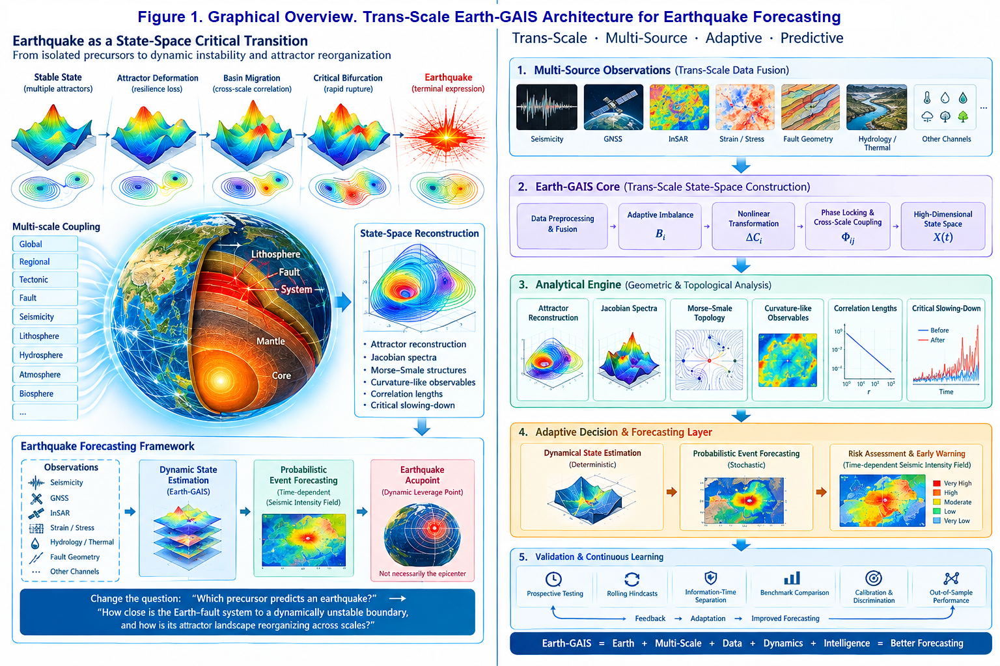

# A Trans-Scale Adaptive Intelligence Architecture for Earthquake Forecasting: Earth as a Generalized Adaptive Intelligent System and Earthquake as a State-Space Critical Transition

**Baoliin (Zaitian) Wu 伍宝林**

*ORCiD:* [0009-0003-2051-5247](https://orcid.org/0009-0003-2051-5247)

*Email:* zaitian001@gmail.com

*Affiliation:* People's Government of Guangdong Province: Guangzhou, CN

*Date:* September 22, 2026

---

## Abstract

Reliable forecasting of major earthquakes remains one of the most difficult problems in Earth science. Conventional approaches have successfully established long-term seismic hazard assessment, statistical earthquake forecasting, aftershock forecasting, physical fault models, geodetic monitoring, and increasingly powerful machine-learning methods, yet a deterministic prediction of the exact time, location, and magnitude of a major earthquake remains unavailable.

This work proposes a trans-scale extension of the Generalized Adaptive Intelligent System (GAIS) architecture developed in the author's preceding work on Dynamic Equilibrium Quantum Manifolds (DEQM). The central hypothesis is that the Earth, considered as a coupled lithosphere-fault-seismicity system, can be represented as a generalized adaptive intelligent system whose macroscopic state is maintained through continuous observation, redistribution, dissipation, feedback, and adaptation. Under this hypothesis, a major earthquake is not treated primarily as an isolated precursor-triggered event, but as the terminal expression of a state-space instability in which the Earth-fault system undergoes progressive deformation of its attractor landscape, loss of resilience, basin migration, increasing cross-scale correlation, and eventually a critical bifurcation leading to rapid rupture.

The proposed architecture, termed the **Trans-Scale Earth-GAIS Architecture (TEGA)**, reconstructs a high-dimensional geophysical state space from heterogeneous observations including seismicity, GNSS, InSAR, strain, stress proxies, fault geometry, hydrological and thermal observations, and other experimentally justified channels. A latent adaptive imbalance variable $B_i$ is introduced for each spatial or dynamical subsystem. Its nonlinear transformation produces a dimensionless change coordinate $\Delta C_i$, while phase-locking and cross-scale coupling generate interaction quantities $\Phi_{ij}$. The resulting network is analyzed using state-space geometry, attractor reconstruction, Jacobian spectra, Morse-Smale structures, curvature-like observables, correlation lengths, and critical slowing-down indicators.

The architecture changes the forecasting question from "Which precursor predicts an earthquake?" to "How close is the Earth-fault system to a dynamically unstable boundary, and how is its attractor landscape reorganizing across scales?" A probabilistic forecasting layer converts the reconstructed dynamical state into a time-dependent seismic intensity field and explicitly separates deterministic state estimation from probabilistic event forecasting.

A central concept is the **Earthquake Acupoint**, defined operationally as a spatial or state-space region in which a small perturbation produces an unusually large change in the reconstructed global or regional stability field. This concept is not assumed to coincide with the eventual epicenter. It represents a dynamical leverage point and therefore provides a potentially new target for dense observation and intervention studies.

The architecture generates a set of verifiable predictions, including measurable resilience loss, increasing recovery time, basin deformation, Jacobian spectral drift toward marginal stability, increasing correlation length, cross-scale phase locking, identifiable dynamic leverage points, and measurable changes in probabilistic seismic intensity before selected major events. The proposed validation program emphasizes prospective testing, rolling hindcasts, strict information-time separation, benchmark comparison against established forecasting models, calibration, discrimination, and out-of-sample performance.

This paper does not claim that the Earth-GAIS hypothesis has already been empirically validated or that deterministic earthquake prediction has been achieved. Instead, it establishes a complete mathematical and computational architecture through which the hypothesis can be subjected to rigorous observational testing.

**Keywords:** earthquake forecasting; Earth-GAIS; Generalized Adaptive Intelligent System; Adaptive Intelligence Dao; trans-scale dynamics; state-space geometry; attractor; Morse-Smale topology; critical transition; adaptive imbalance; phase locking; geophysical state space; geometric pathology

---

# 1. Introduction

## 1.1 The earthquake forecasting problem

Earthquake science has accumulated an enormous body of knowledge concerning plate tectonics, fault mechanics, seismicity statistics, stress transfer, geodesy, rupture dynamics, crustal deformation, and earthquake early warning.

Nevertheless, a fundamental distinction must be maintained between **forecasting**, **early warning**, and **deterministic prediction**.

A deterministic earthquake prediction conventionally requires specification of:

1. time;
2. location;
3. magnitude.

Current earthquake science does not provide a reliable deterministic method satisfying all three conditions for future major earthquakes. Probabilistic forecasting, in contrast, estimates the likelihood of earthquakes over specified spatial, temporal, and magnitude ranges and is already used operationally in several regions.

The scientific problem addressed here is therefore not to replace probabilistic forecasting with an unsupported deterministic claim.

It is to ask whether the information contained in the evolving Earth system can be represented more effectively by reconstructing its **dynamical state and stability landscape** before constructing a probabilistic forecast.

The central question becomes:

> **Does the Earth--fault system undergo a measurable and reproducible degradation of dynamical stability and restructuring of its attractor landscape before selected major earthquakes?**

This paper assumes the answer as a working hypothesis and develops the architecture required to test it.

**Figure 1. Graphical Overview. Trans-Scale Earth-GAIS Architecture for Earthquake Forecasting**



The architecture represents the coupled Earth--fault system as a generalized adaptive intelligent system and reframes earthquake forecasting from isolated precursor detection toward reconstruction of an evolving dynamical state and stability landscape.

---

## 1.2 The limitation of the single-precursor paradigm

The search for earthquake precursors has historically considered many candidate signals, including:

- foreshock activity;
- seismicity rate;
- seismic moment release;
- crustal deformation;
- strain;
- groundwater and hydrology;
- radon;
- electromagnetic observations;
- thermal observations;
- ionospheric signals;
- stress-transfer indicators.

The central difficulty is not merely that individual signals are noisy.

The deeper problem is that a complex nonlinear system may not possess a unique scalar precursor.

A variable $S_i$ may change substantially without producing a major earthquake:

$$
S_i(t)\uparrow \not\Rightarrow \mathrm{Earthquake}.
$$

Conversely, a major earthquake may occur without a large excursion in any single observable:

$$
\mathrm{Earthquake} \not\Rightarrow S_i(t)\uparrow \quad\text{for every }i.
$$

This suggests a different scientific representation.

Instead of searching for:

$$
S_i(t)\rightarrow E,
$$

we investigate:

$$ \boxed{ \mathbf X(t) \rightarrow \mathcal M(t) \rightarrow \mathcal A(t) \rightarrow \partial\mathcal B \rightarrow \mathrm{critical\ transition} } $$

where:

- $\mathbf X(t)$ is the observed geophysical state;
- $\mathcal M(t)$ is the reconstructed state manifold;
- $\mathcal A(t)$ is the attractor structure;
- $\partial\mathcal B$ is a stability boundary;
- the critical transition represents a dynamically unstable earthquake-producing transition.

---

## 1.3 From signal detection to state-space reconstruction

The central conceptual shift of this paper is:

$$
\boxed{ \text{precursor detection} \quad\longrightarrow\quad \text{state-space reconstruction} } $$

and:

$$ \boxed{ \text{single anomaly} \quad\longrightarrow\quad \text{multi-scale stability transition} } $$

This follows the architecture developed in the author's GAIS and DEQM work, where complex adaptive systems are represented as systems that maintain organized states through feedback, adaptation, geometric structure, and state-space transitions.

The present work extends that logic from the quantum-material scale to the geophysical scale.

---

## 1.4 Relation to the author's earlier work

This manuscript reformulates the earthquake-forecasting problem at the architectural level.

The author's earlier work [2] developed a specific physical realization based on four nested encoding layers ($N, 72, 24, 12$), terahertz and particle precursor channels, and sonification as a human interface. The present abstracts away from these specific channels to establish a general state-space architecture and a verifiable validation protocol. The earlier physical realization is retained as a **candidate implementation** within the TEGA architecture and will be addressed in a companion implementation paper.

The geometric pathology formalism employed in Section 13 is developed in full mathematical detail in a separate companion paper [4].

The GAIS/DEQM theoretical foundation is established in [1].

---

# 2. The Earth as a Generalized Adaptive Intelligent System

## 2.1 Definition

A **Generalized Adaptive Intelligent System (GAIS)** is defined here as a dynamical system that maintains a structured regime through a recurrent cycle:

$$ \boxed{ \text{Observation} \rightarrow \text{Estimation} \rightarrow \text{Action} \rightarrow \text{Adaptation} \rightarrow \text{Observation} } $$

The term "intelligent" is used architecturally rather than anthropomorphically.

No consciousness, cognition, intention, or biological intelligence is assumed.

The relevant property is adaptive organization.

Under the Earth-GAIS hypothesis:

$$ \boxed{ \text{Earth} \equiv \text{Earth-GAIS} } $$

where the adaptive system consists of coupled processes spanning:

- lithospheric stress accumulation;
- elastic and inelastic deformation;
- fault friction;
- seismicity;
- fluid migration;
- thermal processes;
- viscoelastic relaxation;
- plate-scale forcing;
- crustal and mantle coupling.

The Earth is therefore represented as an open, dissipative, multiscale, curvature-driven GAIS.

---

## 2.2 The Earth-GAIS state vector

Let the Earth-GAIS state be:

$$
\mathbf X(t) = \left[ \boldsymbol{\sigma}, \boldsymbol{\epsilon}, \dot{\boldsymbol{\epsilon}}, \mathbf u, \mathbf v, \mathbf s, \mathbf f, \mathbf h, \mathbf T, \mathbf e, \mathbf m, \ldots \right]. \quad (1)
$$

Here:

- $\boldsymbol{\sigma}$: stress-related state variables;
- $\boldsymbol{\epsilon}$: strain;
- $\dot{\boldsymbol{\epsilon}}$: strain rate;
- $\mathbf u$: geodetic displacement;
- $\mathbf v$: velocity field;
- $\mathbf s$: seismicity state;
- $\mathbf f$: fault-state variables;
- $\mathbf h$: hydrological variables;
- $\mathbf T$: thermal variables;
- $\mathbf e$: electromagnetic variables where independently justified;
- $\mathbf m$: additional latent or material-state variables.

The state vector is not required to be directly observable.

Instead, the measurement process is:

$$
\mathbf y(t) = \mathcal H[\mathbf X(t)] + \mathbf v(t), \quad (2)
$$

where $\mathcal H$ is a generally nonlinear observation operator and $\mathbf v(t)$ represents measurement noise and unresolved processes.

---

# 3. The Earth-GAIS Dynamical Equation

The fundamental Earth-GAIS equation is proposed as:

$$ \boxed{ \frac{d\mathbf X}{dt} = \mathbf F_{\mathrm{chg}}(\mathbf X) - \Gamma \boldsymbol{\psi} \left( \mathbf B(\mathbf X) \right) + \mathbf D(\mathbf X) + \boldsymbol{\xi}(t) } \quad (3) $$

where:

- $\mathbf F_{\mathrm{chg}}$ represents structured state evolution;
- $\mathbf B$ is the adaptive imbalance field;
- $\boldsymbol{\psi}$ is a nonlinear restoring function;
- $\Gamma$ represents effective adaptive recovery;
- $\mathbf D$ represents coupling between scales and subsystems;
- $\boldsymbol{\xi}$ represents stochastic forcing and unresolved dynamics.

The equation is deliberately general.

Its purpose is not to replace established physical equations of elasticity, friction, fluid flow, or seismology.

Instead, it provides a **state-space architecture into which those physical models and observations can be embedded**.

---

# 4. Adaptive Imbalance

## 4.1 Definition

For subsystem $i$, define a normalized adaptive imbalance:

$$
B_i(t) = \frac{ X_i(t)-X_i^{\ast}(t) }{ \sigma_i(t)+\epsilon }, \quad (4)
$$

where:

- $X_i^{\ast}$ is the locally estimated adaptive reference state;
- $\sigma_i$ is the local variability scale;
- $\epsilon>0$ prevents numerical singularity.

The reference state is not necessarily a global equilibrium.

It may be:

- a moving baseline;
- a seasonal baseline;
- a tectonic baseline;
- a fault-specific quasi-stationary state;
- a dynamically reconstructed attractor.

Therefore:

$$
X_i^{\ast} = X_i^{\ast}(t,\mathcal A,\mathcal S),
$$

where $\mathcal A$ represents the local attractor structure and $\mathcal S$ the relevant spatial scale.

---

## 4.2 Nonlinear adaptive transformation

Following the adaptive nonlinear architecture developed in the author's earlier work, define:

$$ \boxed{ \Delta C_i = 100 \left[ \alpha_i \tanh(\lambda_i B_i) + \beta_i \tanh^3(\lambda_i B_i) \right] } \quad (5) $$

where $\alpha_i$, $\beta_i$, and $\lambda_i$ are calibration parameters.

The purpose of Eq. (5) is not to assert that seismic observables obey this exact law a priori.

It defines a **bounded latent representation** of adaptive departure.

The saturation is useful because earthquake-related observables can contain extreme excursions that would otherwise dominate the state representation.

For small imbalance:

$$
\|B_i\|\ll1,
$$

Eq. (5) becomes approximately:

$$
\Delta C_i \approx 100 [ \alpha_i\lambda_i B_i + \beta_i\lambda_i^3 \, B_i^3 ]. \quad (6)
$$

Thus the representation retains linear sensitivity near equilibrium while permitting nonlinear amplification near critical regimes.

---

## 4.3 Scale Separation and Dynamic Reference State Extraction

The specification of the adaptive reference state $X_i^{\ast}(t, \mathcal{A}, \mathcal{S})$ in Eq. (4) introduces a mandatory scale-separation constraint. Tectonic stress accumulation operates over decadal to centennial timescales, whereas hydrological loading, seasonal variations, and transient noise unfold over days to months.

To prevent $X_i^{\ast}$ from tracking rapid pre-critical slowing down signals (which would erroneously absorb critical anomalies into the moving reference baseline) or failing to adapt to secular tectonic drifts, the reference extraction time scale $T_{\mathrm{ref}}$ must satisfy the strict scale-separation inequality:

$$
T_{\mathrm{transient}} \ll T_{\mathrm{attractor}} < T_{\mathrm{ref}} \ll T_{\mathrm{tectonic}} \quad (6\text{a})
$$

where $T_{\mathrm{transient}}$ represents noise and seasonal environmental cycles, $T_{\mathrm{attractor}}$ is the local dynamical memory time scale of the reconstructed attractor, and $T_{\mathrm{tectonic}}$ denotes the secular strain loading cycle.

The requirement $T_{\mathrm{attractor}} < T_{\mathrm{ref}}$ is non-trivial: the reference state must evolve more slowly than the system's local dynamical memory, so that critical slowing-down signals appear in $B_i(t)$ rather than being absorbed into $X_i^{\ast}(t)$. This is the central requirement of critical-slowing-down detection theory [16, 17].

Mathematically, $X_i^{\ast}$ is extracted via a dynamic low-pass manifold filter or moving attractor center:

$$
X_i^{\ast}(t) = \int_{-\infty}^{t} K(t-\tau; T_{\mathrm{ref}}) X_i(\tau) \, d\tau \quad (6\text{b})
$$

where the filtering kernel $K$ ensures that transient phase-locking and critical slowing down alter $B_i(t)$ rather than causing artificial drift in $X_i^{\ast}(t)$.

For practical implementation, $K$ may take one of the following forms:

- **Causal exponential kernel** (recursive, suitable for real-time streaming):

$$
K(s) = \frac{1}{T_{\mathrm{ref}}} e^{-s/T_{\mathrm{ref}}}, \quad s \geq 0 \quad (6\text{c})
$$

- **Centered moving average** (symmetric, suitable for offline analysis):

$$
K(s) = \frac{1}{T_{\mathrm{ref}}} \mathbb{I}\left[|s| \leq T_{\mathrm{ref}}/2\right] \quad (6\text{d})
$$

- **Savitzky--Golay filter** (polynomial-preserving, suitable when the reference state has slow but non-zero drift):

$$
K(s) = \text{SG}(s; \text{order } p, \text{window } T_{\mathrm{ref}}) \quad (6\text{e})
$$

The choice of kernel affects the trade-off between reference-state smoothness and adaptation latency. For real-time forecasting, the causal exponential kernel is preferred because it introduces no future information. For retrospective analysis, the centered moving average or Savitzky--Golay filter may reduce boundary artifacts.

---

# 5. Trans-Scale Architecture

## 5.1 Why a trans-scale model is required

Earthquake preparation and rupture involve multiple spatial and temporal scales.

Potentially relevant scales include:

$$
\text{plate} \rightarrow \text{regional fault network} \rightarrow \text{fault segment} \rightarrow \text{damage zone} \rightarrow \text{nucleation region} \rightarrow \text{rupture}.
$$

Likewise:

$$
\text{years} \rightarrow \text{months} \rightarrow \text{weeks} \rightarrow \text{days} \rightarrow \text{hours} \rightarrow \text{seconds}.
$$

The proposed architecture therefore uses nested state representations:

$$ \boxed{ \mathcal Z_N \subset \mathcal Z_{72} \subset \mathcal Z_{24} \subset \mathcal Z_{12} \subset \mathcal M } \quad (7) $$

where $\mathcal Z_N$ denotes the event- or network-scale representation and $\mathcal Z_{12}$, $\mathcal Z_{24}$, and $\mathcal Z_{72}$ denote selected operational aggregation or encoding scales.

These values are **not proposed as geophysical constants**.

They are representational anchors whose usefulness must be empirically tested. The choice of the specific aggregation values 12, 24, and 72 is inherited from the author's earlier work [2], where they were derived from Zhu Zaiyu's equal-temperament ratio $2^{1/12}$, the 24 solar terms, and the 72 phenological pentads. These are treated as **representational encoding anchors**, not as geophysical constants. Their operational usefulness must be tested empirically; if they provide no additional information beyond generic multi-scale decomposition, they should be replaced.

---

## 5.2 Cross-scale coupling

For two subsystems $i$ and $j$, define a phase-locking measure:

$$
R_{ij} = \left\| \frac{1}{T} \int_{t}^{t+T} e^{i[\phi_i(\tau)-\phi_j(\tau)]} \,d\tau \right\|, \quad 0\le R_{ij}\le1. \quad (8)
$$

where $\phi_i$ and $\phi_j$ are phases extracted from suitable oscillatory or event-rate representations.

A coupling quantity is then defined as:

$$ \boxed{ \Phi_{ij} = w_{ij} R_{ij} \Delta C_i \Delta C_j } \quad (9) $$

where $w_{ij}$ represents physical, spatial, or learned coupling strength.

The important quantity is not necessarily a large value of $\Delta C_i$.

It is the emergence of **coherent coupling between previously weakly coordinated subsystems**.

---

# 6. From Physical Observables to a Geophysical Manifold

## 6.1 Observation space

The Earth-GAIS architecture integrates heterogeneous observations:

| Domain | Candidate observations |
|---|---|
| Seismic | event rate, magnitude, moment, waveform features |
| Geodetic | GNSS displacement, velocity, strain |
| Satellite | InSAR displacement and deformation |
| Geological | fault geometry, slip rate, segmentation |
| Hydrological | pore pressure, groundwater where available |
| Thermal | crustal thermal anomalies where independently justified |
| Electromagnetic | exploratory EM observations subject to validation |
| Nucleation-scale | THz phonons, neutron/particle emissions (exploratory; requires independent replication) |
| Ionospheric | TEC anomalies (exploratory) |
| Gravity | temporal gravity variations where available |
| Environmental | variables only where physically justified |

The architecture does not assume that every channel contains a useful earthquake precursor.

Instead, each channel is treated as an observation of a partially hidden dynamical state.

The THz and particle-emission channels are treated as **exploratory hypotheses** in the sense of [2]. They are not assumed to carry predictive information a priori; they must pass the same ablation and prospective tests as any other channel.

---

## 6.2 State estimation

The latent state is estimated through:

$$
\hat{\mathbf X}_t = \arg\min_{\mathbf X} \left[ \|\mathbf y_t-\mathcal H(\mathbf X)\|_{\mathbf R^{-1}}^2 + \|\mathbf X-\mathbf X_t^{\rm prior}\|_{\mathbf P^{-1}}^2 \right]. \quad (10)
$$

This formulation is compatible with data assimilation, filtering, variational estimation, or machine-learning state reconstruction.

The architecture therefore does not require a single computational algorithm.

It defines the **information structure** that the algorithm must satisfy.

## 6.3 Spatial-Temporal Sparsity and Metric Regularization

Observational channels are inherently non-uniform in spatial and temporal dimensions. GNSS stations provide continuous temporal sampling at spatially discrete locations, InSAR offers high spatial density constrained by satellite orbital repeat intervals (e.g., 6--12 days), and seismic catalogs are limited by the magnitude of completeness $M_c(\mathbf{r}, t)$. Directly computing the state-space metric $g_{\mu\nu}$ from raw, irregularly sampled geophysical streams presents an ill-posed inverse problem.

To guarantee mathematical well-posedness, state estimation incorporates a spatio-temporal smoothness operator and latent manifold regularization into the objective function:

$$
\hat{\mathbf X}_t = \arg\min_{\mathbf X} \left[ \|\mathbf y_t - \mathcal H(\mathbf X)\|_{\mathbf R^{-1}}^2 + \|\mathbf X - \mathbf X_t^{\mathrm{prior}}\|_{\mathbf P^{-1}}^2 + \gamma_{\mathcal M} \mathcal R_{\mathrm{manifold}}(\mathbf X) \right] \quad (10\text{a})
$$

where $\gamma_{\mathcal M}$ is a regularization parameter, and the manifold regularization term penalizes non-physical metric fluctuations:

$$
\mathcal R_{\mathrm{manifold}}(\mathbf X) = \int_{\mathcal M} \|\nabla^2 g_{\mu\nu}(\mathbf X)\|^2 \, dV \quad (10\text{b})
$$

This term penalizes rapid spatial variations in the metric tensor that cannot be attributed to physical processes. In discrete implementation, it reduces to a finite-difference Laplacian of the estimated metric field, ensuring that metric derivatives $\partial g_{\mu\nu}/\partial z^\lambda$ reflect genuine physical changes rather than sampling artifacts.

Data assimilation frameworks (such as Ensemble Kalman Filtering or 4D-Var) alongside deep variational encodings are deployed to map sparse, non-uniform observations onto a continuous, physically bounded latent manifold $\mathcal M_E$.

**Testable consequence.** If the estimated metric derivatives are driven by sampling artifacts, then artificially decimating the data should produce similar metric changes. If the derivatives are physical, decimation should degrade but not systematically bias them. This provides a direct falsification test, included as Prediction 11 in Section 20.

---

# 7. State-Space Geometry

## 7.1 Geophysical manifold

After state estimation, the observed trajectories are embedded into a latent manifold:

$$
\mathcal M_E = \{\mathbf z(t)\}. \quad (11)
$$

The manifold is not assumed to be Euclidean.

A local metric can be defined as:

$$
ds^2 = g_{\mu\nu}(\mathbf z) dz^\mu dz^\nu. \quad (12)
$$

The metric represents distinguishability between neighboring dynamical states.

Large metric distance means that two observed states are dynamically different even if their raw geographic distance is small.

This distinction is essential.

---

## 7.2 Geographic distance versus state-space distance

Two faults can be geographically close but dynamically different.

Conversely, distant faults may become dynamically coupled through:

- stress transfer;
- common tectonic forcing;
- fluid pathways;
- regional deformation;
- synchronized seismicity.

Therefore:

$$ \boxed{ d_{\mathrm{geographic}} \neq d_{\mathrm{state}} } $$

and a trans-scale forecasting system must preserve both.

---

# 8. Curvature and Geometric Stability

The reconstructed metric permits curvature-like quantities to be calculated.

Let $R$ denote the scalar curvature of the reconstructed state manifold:

$$
R=R[g_{\mu\nu}]. \quad (13)
$$

The present architecture does **not** assume that the sign of $R$ alone determines earthquake instability.

Instead, curvature is treated as a geometric descriptor of state-space organization.

This follows a central principle inherited from DW58553909 [4]:

> **Geometric structure identifies candidate organization; dynamical stability must be determined from the flow.**

Thus the key stability quantity is the Jacobian:

$$
J(\mathbf X) = \frac{\partial\mathbf F}{\partial\mathbf X}. \quad (14)
$$

Let:

$$
\lambda_{\max} = \max_i \Re[\lambda_i(J)]. \quad (15)
$$

Then:

$$
\lambda_{\max}<0 \quad\Rightarrow\quad \text{locally attracting regime},
$$

$$
\lambda_{\max}\rightarrow0 \quad\Rightarrow\quad \text{marginal stability},
$$

and:

$$
\lambda_{\max}>0 \quad\Rightarrow\quad \text{local instability}.
$$

These relations are **model diagnostics**, not established earthquake laws.

---

# 9. The Central Earth-GAIS Hypothesis

We now state the principal hypothesis.

## Hypothesis $H_{\mathrm{E-GAIS}}$

> **Before selected major earthquakes, the coupled Earth--fault system undergoes a measurable and reproducible degradation of state-space resilience, expressed by deformation of attractor basins, migration or weakening of stable states, increasing cross-scale coupling, increasing recovery time, and approach toward a critical dynamical boundary.**

Symbolically:

$$ \boxed{ \mathcal A_{\mathrm{stable}} \rightarrow \mathcal A_{\mathrm{deformed}} \rightarrow \mathcal A_{\mathrm{migrating}} \rightarrow \partial\mathcal B \rightarrow \mathcal A_{\mathrm{unstable}} } \quad (16) $$

followed by:

$$ \boxed{ \text{critical transition} \rightarrow \text{rupture} \rightarrow \text{earthquake}. } \quad (17) $$

This is the central empirical proposition of the paper.

---

# 10. Earthquake as a Critical State-Space Transition

## 10.1 Conventional event representation

The conventional description is:

$$
\text{stress accumulation} \rightarrow \text{failure} \rightarrow \text{rupture}.
$$

The Earth-GAIS representation is:

$$ \boxed{ \text{state-space deformation} \rightarrow \text{resilience loss} \rightarrow \text{attractor restructuring} \rightarrow \text{critical bifurcation} \rightarrow \text{rupture}. } \quad (18) $$

The two descriptions are not necessarily mutually exclusive.

The proposed architecture operates at a higher organizational level and allows conventional fault mechanics to remain embedded inside the state dynamics.

---

## 10.2 Critical slowing down

If a system approaches a bifurcation, recovery from perturbations may become slower.

Let:

$$
\tau_{\mathrm{restore}}
$$

denote recovery time after a perturbation.

The hypothesis predicts:

$$ \boxed{ \tau_{\mathrm{restore}}\uparrow \quad\text{as}\quad \lambda_{\max}\rightarrow0^{-}. } \quad (19) $$

This provides a directly measurable candidate stability indicator.

---

## 10.3 Variance and autocorrelation

Under suitable conditions, additional early-warning statistics may include:

$$
\mathrm{Var}[X(t)]\uparrow \quad (20)
$$

and:

$$
\mathrm{AC}(1)\uparrow. \quad (21)
$$

However, these quantities are not individually declared earthquake precursors.

They become informative only if their joint evolution is consistent with a reconstructed dynamical transition.

---

# 11. Basin Depth and Critical Distance

Define an effective attractor basin depth:

$$
D_{\mathcal A} = F_{\mathrm{barrier}} - F_{\mathrm{state}}, \quad (22)
$$

where $F_{\mathrm{barrier}}$ represents an estimated transition barrier in the reconstructed landscape.

As resilience decreases:

$$
D_{\mathcal A}\downarrow. \quad (23)
$$

Define the critical state-space distance:

$$ \boxed{ D_{\mathrm{crit}} = d_{\mathcal M} \left( \mathbf X(t), \partial\mathcal B \right). } \quad (24) $$

Here $d_{\mathcal M}$ is distance on the reconstructed state manifold.

The central forecasting hypothesis becomes:

$$ \boxed{ D_{\mathrm{crit}}(t)\downarrow \quad\Longrightarrow\quad \text{increasing conditional seismic hazard}. } \quad (25) $$

The arrow in Eq. (25) is a hypothesis to be tested, not an established law.

---

# 12. Morse--Smale Representation of the Earthquake Landscape

A smooth dynamical system can be decomposed into:

- attractors;
- saddles;
- separatrices;
- connecting trajectories.

For an Earth-GAIS state manifold, the Morse--Smale complex is proposed as a representation of dynamically distinct regimes.

The conceptual sequence is:

### Stage 0 --- quasi-stable Earth system

$$
\mathcal A_0.
$$

### Stage 1 --- local deformation

Localized state-space curvature increases.

$$
\mathcal A_0 \rightarrow \mathcal A_0+\delta\mathcal M.
$$

### Stage 2 --- regional organization

Multiple local domains become coupled.

$$
R_{ij}\uparrow.
$$

### Stage 3 --- basin migration

The attractor structure changes:

$$
\mathcal A_i(t) \rightarrow \mathcal A_i(t+\Delta t).
$$

### Stage 4 --- separatrix approach

$$
D_{\mathrm{crit}}\rightarrow0.
$$

### Stage 5 --- critical transition

$$
\lambda_{\max}\rightarrow0 \rightarrow \lambda_{\max}>0.
$$

### Stage 6 --- rupture

A rapid macroscopic transition occurs.

---

# 13. Geometric Pathology of the Earth-GAIS

The concept of **Geometric Pathology**, developed in the author's earlier work [4], can be generalized here.

The Geometric Pathology formalism presented in this section is developed in full mathematical detail in [4]. Here we adapt it specifically to the seismic nucleation problem.

In the present context, geometric pathology means:

> a persistent deformation of the state-space geometry of a GAIS that reduces the robustness of its quasi-stable attractor structure.

The Earth-GAIS pathological trajectory is therefore:

$$ \boxed{ \text{stable landscape} \rightarrow \text{curvature deformation} \rightarrow \text{basin narrowing} \rightarrow \text{separatrix approach} \rightarrow \text{critical transition}. } \quad (26) $$

This definition does not imply that the Earth is "diseased."

"Pathology" is used as a mathematical description of loss of adaptive stability.

---

# 14. Earthquake Acupoints

## 14.1 Definition

An **Earthquake Acupoint** is defined as:

> a spatially localized or state-space localized region where a small perturbation produces an unusually large change in the reconstructed global or regional stability field.

Let $q$ be a candidate location.

Define a leverage function:

$$
L(q) = \frac{ \|\delta\mathbf S_{\mathrm{global}}\| }{ \|\delta\mathbf u_q\|+\epsilon }. \quad (27)
$$

Then:

$$ \boxed{ q^{\ast} = \arg\max_q L(q) } \quad (28) $$

identifies candidate dynamic leverage points.

The Earthquake Acupoint is therefore **not defined as the epicenter**.

It may be:

- a fault intersection;
- a segment boundary;
- a geometrically sensitive deformation zone;
- a dynamically coupled remote region;
- a state-space bottleneck.

---

## 14.2 State-space proximity

A key prediction is:

$$
d_{\mathrm{geographic}}(i,j)\gg0 \quad\not\Rightarrow\quad d_{\mathrm{state}}(i,j)\gg0.
$$

Thus:

$$ \boxed{ \text{anatomy distal} \quad\text{but}\quad \text{state-space proximal} } $$

is an admissible Earth-GAIS configuration.

This provides a mathematical basis for investigating apparently remote precursory correlations without assuming that every correlation is causal.

---

# 15. Multi-Sensor Information Fusion

The forecasting architecture must avoid treating every sensor channel equally.

Each channel receives an information weight determined by:

1. physical interpretability;
2. measurement quality;
3. stability;
4. predictive contribution;
5. out-of-sample performance.

Let:

$$
\mathbf y = [ \mathbf y_{\mathrm{seismic}}, \mathbf y_{\mathrm{GNSS}}, \mathbf y_{\mathrm{InSAR}}, \mathbf y_{\mathrm{strain}}, \mathbf y_{\mathrm{hydro}}, \mathbf y_{\mathrm{thermal}}, \mathbf y_{\mathrm{gravity}}, \mathbf y_{\mathrm{EM}}, \ldots ].
$$

The architecture estimates:

$$
\hat{\mathbf X} = \mathcal A_{\mathrm{fusion}}(\mathbf y). \quad (29)
$$

A channel must not be retained merely because it produces visually interesting anomalies.

Its value must be demonstrated prospectively.

---

# 16. From State Transition to Forecast Probability

## 16.1 Forecast intensity

The final forecasting layer is probabilistic.

Define the seismic intensity field:

$$ \boxed{ \Lambda(\mathbf r,M,t) = \Lambda_0(\mathbf r,M,t) \exp \left[ \boldsymbol{\theta}^{\mathsf T} \mathbf z(\mathbf r,t) \right] } \quad (30) $$

where:

- $\Lambda_0$ is a baseline seismicity model;
- $\mathbf z$ contains Earth-GAIS state variables;
- $\boldsymbol{\theta}$ are parameters estimated on training data.

Candidate elements of $\mathbf z$ include:

$$
\mathbf z = [ D_{\mathrm{crit}}^{-1}, -\lambda_{\max}, \tau_{\mathrm{restore}}, R_{ij}, \xi_c, \Delta C_i, L(q), \ldots]. \quad (31)
$$

---

## 16.2 Event probability

For a region $A$, magnitude threshold $M_0$, and time interval $[t,t+\Delta t]$, define:

$$ \boxed{ P(E\mid\mathcal D_t) = 1- \exp \left[ - \int_t^{t+\Delta t} \int_A \int_{M_0}^{\infty} \Lambda(\mathbf r,M,\tau) \,dM\,dA\,d\tau \right]. } \quad (32) $$

This is the central output of the Earth-GAIS forecasting system.

The architecture therefore does **not** require the system to produce:

> "A magnitude 7 earthquake will happen at 14:00 tomorrow."

Instead it produces a calibrated probability distribution conditioned on the reconstructed Earth-GAIS state.

---

# 17. The Forecasting Pipeline

The complete architecture can be represented as:

$$ \boxed{ \text{Physical Observations} \rightarrow B_i \rightarrow \Delta C_i \rightarrow \Phi_{ij} \rightarrow \mathcal M_E \rightarrow \mathcal A \rightarrow D_{\mathrm{crit}} \rightarrow \Lambda \rightarrow P(E) } \quad (33) $$

This is the central computational chain of the paper.

The architecture has seven conceptual layers:

| Layer | Function |
|---|---|
| L0 | Physical observation |
| L1 | Adaptive imbalance |
| L2 | Nonlinear latent transformation |
| L3 | Cross-scale coupling |
| L4 | State-space reconstruction |
| L5 | Stability and topology |
| L6 | Probabilistic forecasting |

---

# 18. Relation to Conventional Earthquake Forecasting

The proposed architecture does not discard established methods.

Instead, it defines a higher-level integration layer.

| Existing method | Earth-GAIS role |
|---|---|
| Gutenberg--Richter statistics | seismicity distribution |
| Omori-type laws | temporal response |
| ETAS | baseline event-rate model |
| Rate-and-state friction | physical fault dynamics |
| Coulomb stress transfer | coupling mechanism |
| GNSS | deformation observation |
| InSAR | spatial deformation |
| Machine learning | state reconstruction / nonlinear mapping |
| Data assimilation | latent state estimation |
| Earth-GAIS | integrated state-space architecture |

The key distinction is:

$$ \boxed{ \text{existing models} \subset \text{Earth-GAIS observation and dynamics layer} } $$

rather than:

$$ \boxed{ \text{Earth-GAIS} \;\text{replacing every existing physical model} } $$

---

# 19. What Is New in the Architecture?

The novelty claim is architectural rather than merely algorithmic.

## 19.1 From precursor to state

Traditional:

$$
S_i\rightarrow E.
$$

Earth-GAIS:

$$
\mathbf X \rightarrow \mathcal M \rightarrow \mathcal A \rightarrow \partial\mathcal B \rightarrow E.
$$

---

## 19.2 From scalar anomaly to geometric transition

Instead of asking whether one variable becomes anomalous, the architecture asks whether the geometry of the dynamical landscape changes.

---

## 19.3 From local fault to trans-scale network

The relevant system becomes:

$$
\text{plate} \leftrightarrow \text{fault network} \leftrightarrow \text{fault segment} \leftrightarrow \text{microseismicity} \leftrightarrow \text{rupture}.
$$

---

## 19.4 From prediction to adaptive probability

The output is not a deterministic declaration but a continuously updated probability conditioned on the evolving state.

---

## 19.5 From observation to measurement--judgment--intervention--revalidation

The operational architecture becomes:

$$ \boxed{ \text{Measurement} \rightarrow \text{State Reconstruction} \rightarrow \text{Judgment} \rightarrow \text{Forecast} \rightarrow \text{Intervention} \rightarrow \text{Revalidation} } \quad (34) $$

The intervention stage is not intended to imply that humans can currently prevent earthquakes.

It represents the general GAIS loop and may initially correspond only to:

- sensor densification;
- adaptive sampling;
- targeted monitoring;
- model updating;
- uncertainty reduction.

---

# 20. Verifiable Predictions

The architecture produces the following testable predictions.

## Prediction 1 --- Resilience loss

Before selected major earthquakes:

$$
\tau_{\mathrm{restore}}\uparrow.
$$

The effect must remain after controlling for changing noise and catalog completeness.

---

## Prediction 2 --- Jacobian spectral drift

The reconstructed system should exhibit:

$$
\lambda_{\max}(J) \rightarrow0^{-}
$$

before a subset of major events.

The magnitude, consistency, and lead time must be established prospectively.

---

## Prediction 3 --- Basin deformation

The estimated attractor basin should become shallower or narrower:

$$
D_{\mathcal A}\downarrow.
$$

---

## Prediction 4 --- Critical distance reduction

The state should approach a reconstructed stability boundary:

$$
D_{\mathrm{crit}}\downarrow.
$$

---

## Prediction 5 --- Increasing cross-scale coherence

The architecture predicts:

$$
R_{ij}\uparrow
$$

among dynamically related scales or regions before selected major transitions.

---

## Prediction 6 --- Correlation-length growth

The characteristic state-space correlation length:

$$
\xi_c
$$

should increase before a critical transition:

$$
\xi_c\uparrow.
$$

---

## Prediction 7 --- Dynamic leverage points

Earthquake Acupoints should exhibit unusually large:

$$
L(q)
$$

relative to non-acupoint locations.

---

## Prediction 8 --- Forecast improvement

A model incorporating Earth-GAIS state variables should outperform an appropriate baseline on strictly prospective test sets:

$$
\mathrm{Skill}_{\mathrm{GAIS}} > \mathrm{Skill}_{\mathrm{baseline}}
$$

under pre-registered evaluation metrics.

---

## Prediction 9 --- Cross-region transfer

If the architecture represents a genuine dynamical principle rather than a region-specific statistical artifact, its core state variables should transfer across tectonic settings after recalibration.

---

## Prediction 10 --- Ablation necessity

Removing the state-space geometry layer should reduce forecasting performance:

$$
\mathrm{Skill}_{\mathrm{full}} > \mathrm{Skill}_{\mathrm{no\ geometry}}.
$$

Similarly:

$$
\mathrm{Skill}_{\mathrm{full}} > \mathrm{Skill}_{\mathrm{no\ cross-scale}}.
$$

This provides a direct architecture-level verification test.

---

## Prediction 11 --- Sampling-artifact independence

If the estimated metric derivatives $\partial g_{\mu\nu}/\partial z^\lambda$ are driven by sampling artifacts rather than physical processes, then artificially decimating the observational data should produce similar metric changes.

If the derivatives are physical, decimation should degrade but not systematically bias them.

A statistically significant systematic bias under decimation would falsify the claim that the reconstructed geometry reflects physical state-space organization.

---

# 21. Prospective Validation Protocol

## 21.1 The most important rule: no future information

At forecast time $t$, the model may use only:

$$
\mathcal D_{0:t}.
$$

No information occurring after $t$ may enter the state estimate.

This includes:

- future catalog events;
- future GNSS solutions;
- future InSAR products;
- future reprocessed datasets;
- revised event magnitudes derived using information unavailable at $t$.

---

## 21.2 Rolling hindcast

The preferred first experiment is a rolling hindcast:

$$
t_1 \rightarrow t_2 \rightarrow t_3 \rightarrow\cdots \rightarrow t_n.
$$

At each step:

1. ingest only historical data available at the forecast time;
2. reconstruct Earth-GAIS state;
3. generate probability forecast;
4. freeze the forecast;
5. compare against subsequent observations;
6. update only after evaluation.

---

## 21.3 Blind testing

A particularly stringent protocol is:

$$ \boxed{ \text{train} \rightarrow \text{freeze} \rightarrow \text{blind forecast} \rightarrow \text{unmask outcome}. } $$

No parameter adjustment is permitted after observing the test outcome.

---

# 22. Benchmark Models

The Earth-GAIS architecture should be compared against multiple baselines.

### Baseline A

Historical-rate probabilistic model.

### Baseline B

ETAS-type seismicity model.

### Baseline C

Rate-and-state or physics-based model where appropriate.

### Baseline D

Machine-learning model using conventional seismic features.

### Baseline E

Multi-sensor machine-learning model without explicit state-space geometry.

### Proposed model

$$ \boxed{ \text{Earth-GAIS} } $$

The objective is not to prove that GAIS is universally superior.

The objective is to determine whether its additional architectural structure contains independent predictive information.

---

# 23. Evaluation Metrics

The evaluation should include:

### Calibration

$$
P_{\mathrm{forecast}} \approx P_{\mathrm{observed}}.
$$

### Log score

$$
\mathrm{LS} = \sum_i \log P_i(y_i).
$$

### Brier score

$$
\mathrm{BS} = \frac1N \sum_i (p_i-o_i)^2.
$$

### Information gain

$$
IG = \frac1N \sum_i \log \frac{ P_{\mathrm{GAIS}}(y_i) }{ P_{\mathrm{baseline}}(y_i) }. \quad (35)
$$

### Spatial discrimination

Compare forecast concentration with actual event density.

### Temporal discrimination

Compare predicted elevated-risk intervals with observed events.

### Reliability

Evaluate whether elevated predicted probability actually corresponds to increased event frequency.

---

# 24. A Critical Scientific Requirement: False Alarms

A forecasting architecture that raises probability before every earthquake but also continuously raises probability during periods without major earthquakes is not useful.

Therefore:

$$ \boxed{ \text{forecast skill} = \text{detection} - \text{false-alarm cost}. } $$

A valid system must demonstrate:

- sensitivity;
- specificity;
- calibration;
- robustness;
- stability under catalog changes;
- performance across tectonic regimes.

---

# 25. The Earth-GAIS "Terminal Transition"

Within the GAIS conceptual framework, the earthquake is the terminal expression of a particular local instability.

However, the term "terminal" must be interpreted carefully.

The earthquake itself is not necessarily the terminal state of the entire Earth.

Instead:

$$ \boxed{ \text{terminal transition} = \text{termination of the pre-event attractor regime}. } $$

After the event, the system enters a new state:

$$
\mathcal A_{\mathrm{pre}} \rightarrow \mathcal A_{\mathrm{post}}. \quad (36)
$$

This provides a natural bridge to aftershock forecasting.

Aftershock sequences can therefore be treated as the **post-transition relaxation trajectory** of the Earth-GAIS.

---

# 26. Mainshock and Aftershock as One Developmental Process

The proposed unified sequence is:

$$ \boxed{ \text{pre-event deformation} \rightarrow \text{critical transition} \rightarrow \text{mainshock} \rightarrow \text{post-event attractor restructuring} \rightarrow \text{aftershock relaxation}. } \quad (37) $$

This suggests that mainshock forecasting and aftershock forecasting should not necessarily be treated as unrelated tasks.

Instead:

$$
\mathcal A_{\mathrm{pre}} \neq \mathcal A_{\mathrm{post}}.
$$

The post-event state may possess:

- new stress distribution;
- new fault connectivity;
- new seismicity density;
- new deformation field;
- new attractor basins.

Thus aftershock forecasting becomes a natural second phase of the same Earth-GAIS state-transition architecture.

---

# 27. Intervention and "Landscape Reprogramming"

The concept of landscape reprogramming originates in DW58553909 [4].

In earthquake science, it must be interpreted conservatively.

At present, the architecture does **not** imply that large earthquakes can be safely prevented through deliberate manipulation.

Instead, landscape reprogramming initially means:

$$ \boxed{ \text{reprogram the observation and inference landscape} } $$

rather than:

$$
\text{force the Earth to avoid rupture}.
$$

The operational intervention operator is therefore:

$$
\hat{\mathcal O}_{\mathrm{obs}} : \mathcal D_t \rightarrow \mathcal D_{t+\Delta t}
$$

through:

- adaptive sensor placement;
- higher-frequency monitoring;
- targeted GNSS/InSAR acquisition;
- temporary seismic-network densification;
- targeted borehole observations;
- adaptive computational resolution.

If future physics supports controlled interventions, those would require independent safety and physical validation.

**Non-Perturbative Stricture on Acupoint Interventions**

It is vital to explicitly define the physical risk associated with dynamic leverage points ("Earthquake Acupoints") when the system approaches a critical boundary ( $\lambda_{\max} \rightarrow 0^-$ ). In a hypersensitive state space near a saddle-node or pitchfork bifurcation, any minor physical perturbation applied at an Acupoint $q^{\ast}$ (e.g., fluid injection or micro-stress relaxation) exhibits extreme non-monotonic response: it may either harmlessly relieve localized strain or inadvertently push the state across the separatrix $\partial\mathcal{B}$, triggering immediate, uncontrollable catastrophic rupture.

Therefore, at the present stage of theoretical and experimental maturity, the operational scope of an **Earthquake Acupoint** is strictly constrained:

$$ \boxed{ \text{Operational Scope of Acupoint} \equiv \text{Target for Adaptive Observation } \mathcal O_{\mathrm{obs}} \quad \text{\textbf{EXCLUSIVELY}} } $$

Physical stress or fluid intervention at identified Acupoints is **excluded from the present architecture**. The Acupoint concept is strictly an informational guide for optimal sensor densification, computational adaptive mesh refinement, and focused observational monitoring. Any future physical intervention would require independent physical validation and ethical review.

The reason for this restriction is fundamental: near a critical boundary, the system's response to perturbation is **non-monotonic and potentially irreversible**. A perturbation that appears to release stress may, in fact, push the system across the separatrix $\partial\mathcal{B}$. Unlike medical interventions, where the system can often recover from adverse effects, a triggered rupture is **irreversible** on human timescales. This irreversibility transforms the Acupoint from a potential intervention target into a strictly observational concept.

---

# 28. Earthquake Acupoints as Adaptive Observation Targets

Suppose:

$$
L(q_1)\gg L(q_2).
$$

Then the architecture predicts that observing $q_1$ may yield more information about system-wide stability than observing $q_2$, even if $q_2$ is geographically closer to the eventual rupture.

This creates an adaptive monitoring principle:

$$ \boxed{ \text{sensor density} \propto \text{dynamical leverage} } \quad (38) $$

rather than:

$$
\text{sensor density} \propto \text{geographic importance alone}.
$$

This is one of the potentially distinctive engineering consequences of the architecture.

---

# 29. Human--AI--Instrument Earth-GAIS Loop

A practical implementation can be represented as:

$$ \boxed{ \text{Earth} \rightarrow \text{Sensors} \rightarrow \text{AI State Reconstruction} \rightarrow \text{Human Scientific Judgment} \rightarrow \text{Adaptive Measurement} \rightarrow \text{Earth}. } \quad (39) $$

The architecture deliberately keeps humans in the scientific decision loop.

AI performs:

- data assimilation;
- dimensional reduction;
- nonlinear reconstruction;
- anomaly detection;
- state estimation;
- probability calculation;
- uncertainty quantification.

Human scientists retain responsibility for:

- physical interpretation;
- model selection;
- experimental design;
- validation;
- communication of uncertainty.

The latent state vector $\mathbf q(t) = [B_i, R_{ij}, D_{\rm crit}, \lambda_{\max}, \ldots]$ may additionally be projected into an **auditory representation** (sonification) as a low-dimensional human interface. The operational hypothesis --- that auditory presentation of multi-scale state transitions improves human detection performance relative to numerical displays --- is itself testable in a human-factors experiment.

---

# 30. T0--T6 Earth-GAIS Research Roadmap

The engineering roadmap is adapted from the T0--T6 architecture of DW58553911 [1].

| Task | Theoretical basis | Earthquake objective |
|---|---|---|
| T0 | Adaptive recovery | Estimate recovery-time fields |
| T1 | State-space reconstruction | Build Earth-GAIS manifold |
| T2 | Trans-scale encoding | Connect regional and local states |
| T3 | Geometric dynamics | Estimate attractors and curvature |
| T4 | Morse analysis | Identify basins and separatrices |
| T5 | Acupoint detection | Find high-leverage observation regions |
| T6 | Probabilistic forecasting | Produce calibrated seismic probabilities |

---

# 31. T0 --- Recovery Field Estimation

Estimate:

$$
\tau_{\mathrm{restore}}(\mathbf r,t).
$$

The primary objective is to determine whether recovery time increases systematically before major events.

A first experiment should use controlled perturbations already present in observational time series, rather than introducing artificial perturbations.

---

# 32. T1 --- Earth-GAIS Manifold Reconstruction

Construct:

$$
\mathbf y(t) \rightarrow \hat{\mathbf X}(t) \rightarrow \mathbf z(t) \rightarrow \mathcal M_E.
$$

Methods may include:

- diffusion maps;
- autoencoders;
- variational autoencoders;
- nonlinear manifold learning;
- Koopman representations;
- delay-coordinate embedding.

The method should be selected based on predictive validation rather than aesthetic preference.

---

# 33. T2 --- Cross-Scale Encoding

Construct:

$$
\mathcal Z_N \subset \mathcal Z_{72} \subset \mathcal Z_{24} \subset \mathcal Z_{12} \subset \mathcal M_E.
$$

Test whether the proposed nested representation contains additional information beyond a conventional single-scale model.

The 12/24/72 values remain encoding or aggregation anchors until independently validated.

---

# 34. T3 --- Geometric Dynamics

Estimate:

$$
g_{\mu\nu}, \quad R, \quad J, \quad \lambda_{\max}.
$$

The key scientific question is:

> Does the geometry change before the dynamics become unstable?

If yes, geometry may become a useful early diagnostic.

If not, the geometry layer should be reduced or abandoned.

---

# 35. T4 --- Morse--Smale Reconstruction

Identify:

$$
\{ \text{attractors}, \text{saddles}, \text{separatrices}, \text{connecting trajectories} \}.
$$

Track:

$$
\mathcal A_i(t)
$$

through time.

A major empirical test is whether a reproducible trajectory:

$$
\mathcal A_{\mathrm{stable}} \rightarrow \partial\mathcal B
$$

occurs before major events more often than expected under matched controls.

---

# 36. T5 --- Earthquake Acupoint Detection

Calculate:

$$
L(q) = \frac{ \|\delta\mathbf S_{\mathrm{global}}\| }{ \|\delta\mathbf u_q\|+\epsilon }.
$$

Rankings must not be interpreted as proof.

Candidate acupoints must be tested prospectively.

A valid result requires that identified high-leverage locations provide information unavailable from randomly selected or conventional monitoring locations.

---

# 37. T6 --- Forecast and Uncertainty Quantification

The final system outputs:

$$
P(M\ge M_0,\mathbf r\in A,t\in[t_1,t_2]\mid\mathcal D_t).
$$

Every forecast should be accompanied by:

- confidence or credible interval;
- calibration estimate;
- data completeness;
- model version;
- forecast horizon;
- uncertainty source;
- comparison baseline.

The system must be allowed to say:

$$ \boxed{ \text{insufficient information}. } $$

A model that always produces high-confidence forecasts is not necessarily a better model.

---

# 38. Minimal Viable Earth-GAIS Experiment

A first empirical experiment does not require the entire Earth.

Select one well-instrumented fault system with:

- dense seismic catalog;
- GNSS;
- InSAR;
- known fault geometry;
- long historical record;
- multiple significant events.

Construct:

$$
\mathbf X(t) = [ \mathrm{seismicity}, \mathrm{GNSS}, \mathrm{InSAR}, \mathrm{strain}, \mathrm{fault\ state} ].
$$

Then conduct a rolling hindcast.

The first question is not:

> Can the model predict a magnitude 7 earthquake?

The first question is:

> **Does the proposed state-space stability metric change systematically before major events compared with matched non-event intervals?**

That is the correct first verification test.

---

# 39. Ablation Experiments

A rigorous architecture requires ablation.

### A1 --- No geometry

Remove $g_{\mu\nu}$ and curvature.

### A2 --- No attractor layer

Use only conventional features.

### A3 --- No cross-scale coupling

Set:

$$
R_{ij}=0.
$$

### A4 --- No adaptive imbalance

Remove $B_i$.

### A5 --- No nonlinear transformation

Replace Eq. (5) with a linear transformation.

### A6 --- Full Earth-GAIS

Retain all proposed components.

If:

$$
\mathrm{Skill}_{A6} > \mathrm{Skill}_{A1,A2,A3,A4,A5},
$$

then evidence exists that the architecture contains nonredundant predictive information.

---

# 40. Null Models

The null hypothesis must be strong.

Possible null models include:

1. stationary Poisson seismicity;
2. historical-rate forecast;
3. ETAS;
4. rate-and-state;
5. random forest or gradient boosting;
6. recurrent neural network;
7. transformer-based temporal model;
8. spatially shuffled Earth-GAIS features;
9. temporally shuffled features;
10. phase-destroyed surrogate data.

If the Earth-GAIS signal survives phase randomization and spatial scrambling, the interpretation must be reconsidered.

---

# 41. Avoiding Data Leakage

Earthquake forecasting is particularly vulnerable to leakage.

The following are prohibited in a genuine prospective experiment:

$$ \boxed{ \text{future event information} \rightarrow \text{past state estimate}. } $$

Magnitude revisions, catalog completeness improvements, retrospective phase picks, and post-event geodetic inversions must be carefully timestamped.

Otherwise:

$$
\mathrm{forecast\ skill} \rightarrow \mathrm{artifact}.
$$

---

# 42. Verification Criteria

The Earth-GAIS hypothesis should be considered unsupported if repeated prospective tests show that:

1. $\tau_{\mathrm{restore}}$ does not change;
2. $\lambda_{\max}$ does not approach marginal stability;
3. $D_{\mathrm{crit}}$ has no predictive information;
4. basin restructuring is indistinguishable from null models;
5. cross-scale coupling adds no independent information;
6. Earthquake Acupoints do not outperform controls;
7. the full model does not improve prospective forecast skill;
8. performance collapses under geographic transfer;
9. metric derivatives are systematically biased under data decimation.

The architecture must therefore contain its own mechanism of rejection.

---

# 43. Limitations

## 43.1 Earth is not literally an intelligent organism

The GAIS terminology is architectural.

No claim of consciousness, intention, cognition, or biological intelligence is made.

---

## 43.2 State-space geometry is model-dependent

The reconstructed metric:

$$
g_{\mu\nu}
$$

depends on the representation and embedding method.

Therefore, geometric quantities must be tested for robustness across reasonable reconstruction methods.

---

## 43.3 Curvature is not automatically causation

A correlation between curvature and earthquakes would not by itself establish causality.

---

## 43.4 Negative curvature is not automatically instability

As emphasized in DW58553909 [4], stability is determined by the dynamics, particularly the Jacobian spectrum, rather than curvature sign alone.

---

## 43.5 Not every earthquake must follow the same pathway

The Earth-GAIS hypothesis allows multiple attractor-transition pathways.

Thus:

$$
\text{one earthquake} \neq \text{one universal precursor sequence}.
$$

The architecture seeks a common dynamical grammar, not necessarily an identical signal sequence.

---

## 43.6 Deterministic prediction remains a separate claim

Even if the Earth-GAIS hypothesis is supported, this does not automatically imply exact deterministic earthquake prediction.

The stronger claim would require:

$$
P(E\mid\mathcal D_t) \rightarrow 1
$$

with sufficiently low false-alarm probability and reproducible localization.

That is an empirical question.

---

# 44. The Deeper Theoretical Interpretation

The central proposition of this paper can now be stated compactly.

The conventional earthquake question is:

$$ \boxed{ \text{What causes an earthquake?} } $$

The Earth-GAIS question is:

$$ \boxed{ \text{How does the Earth system lose the stability that normally prevents rupture?} } $$

The corresponding transition is:

$$ \boxed{ \text{forcing} \rightarrow \text{adaptation} \rightarrow \text{stress redistribution} \rightarrow \text{landscape deformation} \rightarrow \text{resilience loss} \rightarrow \text{critical bifurcation} \rightarrow \text{earthquake}. } \quad (40) $$

This is not a claim that conventional fault mechanics is wrong.

It is a proposal that fault mechanics may be embedded within a higher-dimensional adaptive state-space architecture.

---

# 45. The Trans-Scale Principle

The fundamental architectural statement is:

$$ \boxed{ \text{Local failure} \neq \text{local origin of all information}. } $$

A rupture occurs locally.

Its dynamical preparation may be distributed.

Thus:

$$ \boxed{ \text{local rupture} \leftarrow \text{distributed state-space reorganization}. } \quad (41) $$

This distinction is central to the trans-scale architecture.

---

# 46. The Earthquake Forecasting Principle

We propose the following provisional principle:

> **A major earthquake becomes forecastable to the extent that the evolving Earth--fault system enters a reproducible region of state space in which resilience decreases, attractor structure deforms, cross-scale coupling increases, and the conditional probability of a rupture-producing transition becomes measurably elevated.**

Mathematically:

$$ \boxed{ \mathcal R(t)\downarrow + D_{\mathrm{crit}}(t)\downarrow + R_{ij}(t)\uparrow + \xi_c(t)\uparrow \Longrightarrow P(E\mid\mathcal D_t)\uparrow. } \quad (42) $$

Equation (42) is the principal hypothesis to be tested.

---

# 47. Relationship to Adaptive Intelligence Dao

The Earth-GAIS architecture is a geophysical specialization of the broader Adaptive Intelligence Dao (AID) principle:

$$ \boxed{ \text{Change} + \text{Balance} + \text{Feedback} + \text{Emergence} + \text{Adaptation} } $$

For the Earth system:

$$
\text{tectonic forcing} \rightarrow \text{imbalance} \rightarrow \text{redistribution} \rightarrow \text{adaptation} \rightarrow \text{new equilibrium}.
$$

An earthquake occurs when the existing adaptive regime can no longer maintain its previous configuration.

Thus:

$$ \boxed{ \text{Earthquake} = \text{failure of the current adaptive attractor} } \quad (43) $$

under the Earth-GAIS hypothesis.

---

# 48. From Earthquake Prediction to Earth-State Monitoring

The ultimate scientific objective may therefore be reframed.

Instead of attempting to forecast every earthquake directly, construct a continuous **Earth-State Stability Index**:

$$ \boxed{ \mathrm{ESI}(t) = F \left( D_{\mathrm{crit}}, \lambda_{\max}, \tau_{\mathrm{restore}}, \xi_c, R_{ij}, L(q), \ldots \right). } \quad (44) $$

The ESI is not itself an earthquake probability.

It is a state variable describing how the reconstructed system is evolving relative to its learned stability landscape.

The earthquake forecast then becomes:

$$
\mathrm{ESI}(t) \rightarrow \Lambda(\mathbf r,M,t) \rightarrow P(E).
$$

This separation between **state** and **event probability** is essential.

---

# 49. Proposed Earth-GAIS Architecture

The complete architecture is summarized as:

```text
                        EARTH
                          │
                          ▼
              MULTI-SENSOR OBSERVATION
                          │
        ┌─────────────────┼─────────────────┐
        ▼                 ▼                 ▼
   Seismicity         Geodesy        Other Physics
        │                 │                 │
        └─────────────────┼─────────────────┘
                          ▼
                  STATE ESTIMATION
                          │
                          ▼
              ADAPTIVE IMBALANCE B_i
                          │
                          ▼
                NONLINEAR Delta C_i
                          │
                          ▼
              CROSS-SCALE COUPLING Phi_ij
                          │
                          ▼
            EARTH-GAIS STATE MANIFOLD
                          │
        ┌─────────────────┼─────────────────┐
        ▼                 ▼                 ▼
     Metric           Curvature         Jacobian
        │                 │                 │
        └─────────────────┼─────────────────┘
                          ▼
                ATTRACTOR LANDSCAPE
                          │
        ┌─────────────────┼─────────────────┐
        ▼                 ▼                 ▼
      Basin          Separatrix         Acupoint
        │                 │                 │
        └─────────────────┼─────────────────┘
                          ▼
                 CRITICAL DISTANCE
                          │
                          ▼
                SEISMIC INTENSITY Lambda
                          │
                          ▼
              PROBABILISTIC FORECAST
                          │
                          ▼
            ADAPTIVE OBSERVATION LOOP
                          │
                          └──────────────→ EARTH
```

---

# 50. Discussion

The significance of the proposed architecture does not depend on the immediate success of every component.

The central scientific test is whether the Earth-GAIS representation captures information that is systematically absent from conventional representations.

Three outcomes are possible.

### Outcome A --- No additional information

If Earth-GAIS variables provide no predictive improvement, the architecture should be rejected or substantially revised.

### Outcome B --- Additional descriptive information

If Earth-GAIS variables reveal reproducible state transitions but do not improve forecasting, the architecture may still provide a useful theoretical description of earthquake preparation.

### Outcome C --- Additional prospective forecasting skill

If the architecture produces statistically significant, calibrated, transferable improvement over established baselines, the Earth-GAIS representation would constitute evidence for a new forecasting architecture.

The strongest result would be:

$$ \boxed{ \text{state-space transition} + \text{prospective predictive skill} + \text{cross-region transfer} } $$

That combination would distinguish a scientific architecture from an after-the-fact narrative.

---

# 51. Conclusion

This work proposes **A Trans-Scale Adaptive Intelligence Architecture for Earthquake Forecasting**, extending the GAIS and DEQM architecture of DW58553911 [1] from quantum-material systems to the geophysical Earth system.

The central working hypothesis is:

$$ \boxed{ \text{Earth} = \text{a multiscale Generalized Adaptive Intelligent System} } $$

and:

$$ \boxed{ \text{major earthquake} = \text{a critical state-space transition following degradation of the current adaptive attractor}. } $$

Under this hypothesis, earthquake preparation is represented not as a search for one universal precursor but as:

$$ \boxed{ \text{state reconstruction} \rightarrow \text{adaptive imbalance} \rightarrow \text{cross-scale coupling} \rightarrow \text{landscape deformation} \rightarrow \text{resilience loss} \rightarrow \text{critical bifurcation}. } $$

The architecture introduces several operational quantities:

$$
B_i, \quad \Delta C_i, \quad \Phi_{ij}, \quad D_{\mathrm{crit}}, \quad \tau_{\mathrm{restore}}, \quad \lambda_{\max}, \quad L(q).
$$

Together they provide a computational language for describing the evolving stability of the Earth--fault system.

The proposed **Earthquake Acupoint** concept further changes the observation problem from purely geographic localization to dynamical leverage identification.

Most importantly, the architecture does not require deterministic prediction as its first validation target.

The first scientific test is much more precise:

> **Before major earthquakes, does the Earth--fault system exhibit a measurable and reproducible transition toward a less resilient state-space configuration?**

If this phenomenon exists, then the next question becomes whether its measurement improves probabilistic earthquake forecasting.

The complete causal chain proposed here is therefore:

$$ \boxed{ \text{Earth} \rightarrow \text{GAIS} \rightarrow \text{State Space} \rightarrow \text{Attractor Landscape} \rightarrow \text{Resilience} \rightarrow \text{Critical Transition} \rightarrow \text{Earthquake Forecast} } \quad (45) $$

The architecture is deliberately verifiable.

Its success cannot be established by conceptual analogy, retrospective visualization, or isolated successful cases.

It requires:

$$ \boxed{ \text{prospective testing} + \text{blind hindcasting} + \text{ablation} + \text{benchmarking} + \text{calibration} + \text{cross-region validation}. } $$

If these tests fail, the Earth-GAIS hypothesis must be revised or rejected.

If they succeed, the implication would be substantially broader than the addition of another earthquake-prediction algorithm.

It would indicate that earthquake forecasting can be reformulated as a problem of **trans-scale adaptive state-space dynamics**.

The deepest proposed shift is therefore:

$$ \boxed{ \text{\textbf{Do not search only for the earthquake precursor.}} } $$

$$ \boxed{ \text{\textbf{Reconstruct the Earth system that is becoming capable of producing the earthquake.}} } $$

---

# Final Statement

$$ \boxed{ \text{\textbf{ Earthquake forecasting is not only the prediction of an event. It is the reconstruction of the Earth system approaching the event. }} } $$

$$ \boxed{ \text{\textbf{ From precursor detection to state-space geometry; from isolated signals to trans-scale adaptive dynamics; from earthquake prediction to Earth-state forecasting. }} } $$

---

## Acknowledgments

We are grateful to all the individual scientists and teams of scientists who have contributed to the exploration and understanding of the entire universe. Supported by AI-driven Supercomputers and the MES Universe Project. We have benefited from our amazing AI partners.

---

## Funding

Not applicable

---

## Availability of data and material

Code, mathematical scripts, and preprints are available at GitHub: https://github.com/Zaitian001/-Self-Preprint-V1.1-

---

## Competing interests

Not applicable

---

## Authors Contributions

Not applicable

---
# References

[1] Baoliin (Zaitian) Wu 伍宝林 (2026). *Room-Temperature Superconductivity as the Developmental Terminal State of a Generalized Adaptive Intelligent System: The Topological Condensation of a Dynamic Equilibrium Quantum Manifold*. Self-Preprint Archive. https://zaitian001.github.io/-Self-Preprint-V1.1-/preprints/DW58553911.html

[2] Baoliin (Zaitian) Wu 伍宝林 (2026). *A Trans-Scale Adaptive Intelligence Architecture for Earthquake Forecasting: From Nucleation Signals to Seismic Rupture through Adaptive State Estimation, Phase Synchronization, and Sonification*. Self-Preprint Archive. https://zaitian001.github.io/-Self-Preprint-V1.1-/preprints/DW58553913.html

[3] Baoliin (Zaitian) Wu 伍宝林 (2026). *Adaptive Intelligence Dao: A Unified Mathematical Principle of Anchor Zero, Change, Balance, Emergence, and Self-Organization*. Self-Preprint Archive. https://zaitian001.github.io/-Self-Preprint-V1.1-/preprints/DW58553907.html

[4] Baoliin (Zaitian) Wu 伍宝林 (2026). *Geometric Pathology: Topological Collapse and Landscape Reprogramming in Complex Adaptive Systems*. Self-Preprint Archive. https://zaitian001.github.io/-Self-Preprint-V1.1-/preprints/DW58553909.html

[5] Baoliin (Zaitian) Wu 伍宝林 (2026). *Physical AGI Dao: Nonlinear Symmetry Anchor Zero as the Theoretical Foundation of Adaptive Intelligence World Model*. Self-Preprint Archive. https://zaitian001.github.io/-Self-Preprint-V1.1-/preprints/DW58553906.html

[6] Beroza, G. C., Segou, M., and Mousavi, S. M. (2021). Machine learning and earthquake forecasting---next steps. Nat Commun 12, 4761. https://doi.org/10.1038/s41467-021-24952-6

[7] Mizrahi, L., Dallo, I., van der Elst, N., et al. (2024). Developing, testing, and communicating earthquake forecasts: Current practices and future directions. Reviews of Geophysics. https://doi.org/10.1029/2023RG000823

[8] Martínez-Garzón, P., and Poli, P. (2024). Cascade and pre-slip models oversimplify the complexity of earthquake preparation in nature. *Communications Earth & Environment*, 5, 120. https://doi.org/10.1038/s43247-024-01285-y

[9] Elliott, J. R., Walters, R. J., and Wright, T. J. (2016). The role of space-based observation in understanding and responding to active tectonics and earthquakes. *Nature Communications*, 7, 13844. https://doi.org/10.1038/ncomms13844

[10] U.S. Geological Survey. (2025). *Can you predict earthquakes?* Earthquake Hazards Program.

[11] U.S. Geological Survey. (2025). *What is the difference between earthquake early warning, earthquake forecasts, earthquake probabilities, and earthquake prediction?* Earthquake Hazards Program.

[12] Lindh, A. G. (2003). The nature of earthquake prediction. Seismological Research Letters, 74(6), 723--725. https://doi.org/10.1785/gssrl.74.6.723

[13] Carpinteri, A. (2026). Terahertz Phonons and Nanomechanical Instabilities: Unlocking LENR in Condensed Matter with Insights Into Geo, Astro, Electro, and Biochemical Systems. Springer Nature Switzerland.

[14] Carpinteri, A. (2026). Acoustic, Electromagnetic, and Neutron Emissions as Seismic Precursors. In: Terahertz Phonons and Nanomechanical Instabilities. Springer, Cham. https://doi.org/10.1007/978-3-032-14692-2_16

[15] Doodson A. T. (1921). A harmonic development of the tide-generating potential. Proc. R. Soc. A 1 December; 100 (704): 305--329. https://doi.org/10.1098/rspa.1921.0088

[16] Scheffer, M., Bascompte, J., Brock, W. A., et al. (2009). Early-warning signals for critical transitions. Nature, 461, 53--59. https://doi.org/10.1038/nature08227

[17] Dakos, V., Carpenter, S. R., Brock, W. A., et al. (2012). Methods for detecting early warnings of critical transitions in time series illustrated using simulated ecological data. PLoS ONE, 7(7), e41010. https://doi.org/10.1371/journal.pone.0041010

---

# Appendix A. Core Mathematical Definitions

## A.1 Adaptive imbalance

$$
B_i = \frac{X_i-X_i^{\ast}}{\sigma_i+\epsilon}. \quad (A1)
$$

## A.2 Nonlinear change coordinate

$$
\Delta C_i = 100 \left[ \alpha_i\tanh(\lambda_iB_i) + \beta_i\tanh^3(\lambda_iB_i) \right]. \quad (A2)
$$

## A.3 Phase-locking coefficient

$$
R_{ij} = \left\| \frac{1}{T} \int_t^{t+T} e^{i(\phi_i-\phi_j)} d\tau \right\|. \quad (A3)
$$

## A.4 Cross-scale coupling

$$
\Phi_{ij} = w_{ij}R_{ij}\Delta C_i\Delta C_j. \quad (A4)
$$

## A.5 State-space metric

$$
ds^2 = g_{\mu\nu}dz^\mu dz^\nu. \quad (A5)
$$

## A.6 Jacobian stability

$$
J = \frac{\partial F}{\partial X}, \quad \lambda_{\max} = \max_i\Re[\lambda_i(J)]. \quad (A6) $$

## A.7 Critical distance

$$
D_{\mathrm{crit}} = d_{\mathcal M} \left( X,\partial\mathcal B \right). \quad (A7)
$$

## A.8 Recovery time

$$
\tau_{\mathrm{restore}} = \inf \left\lbrace \tau: |\delta X(t+\tau)| \le \epsilon|\delta X(t)| \right\rbrace. \quad (A8) $$

## A.9 Dynamic leverage

$$
L(q) = \frac{ \|\delta S_{\mathrm{global}}\| }{ \|\delta u_q\|+\epsilon }. \quad (A9)
$$

## A.10 Forecast probability

$$
P(E\mid\mathcal D_t) = 1- \exp \left[ -\int\Lambda\,dM\,dA\,dt \right]. \quad (A10)
$$

## A.11 Reference state kernel

$$
K(s) = \frac{1}{T_{\mathrm{ref}}} e^{-s/T_{\mathrm{ref}}}, \quad s \geq 0. \quad (A11)
$$

## A.12 Manifold regularization

$$
\mathcal R_{\mathrm{manifold}}(\mathbf X) = \int_{\mathcal M} \|\nabla^2 g_{\mu\nu}(\mathbf X)\|^2 \, dV. \quad (A12)
$$

---

# Appendix B. Minimum Experimental Data Specification

A minimum Earth-GAIS experiment should contain:

| Data type | Minimum role |
|---|---|
| Earthquake catalog | seismic-state reconstruction |
| Waveforms | event characterization |
| GNSS | deformation |
| InSAR | spatial deformation |
| Fault geometry | physical topology |
| Strain | local deformation |
| Geological constraints | long-term state |
| Optional physical channels | independent hypothesis testing |

The experiment should maintain a strict timestamped data archive.

Every forecast must be reproducible from the information available at that time.

---

# Appendix C. Recommended First Benchmark

The first benchmark should be a well-instrumented historical earthquake sequence with:

1. long pre-event data;
2. dense seismic coverage;
3. GNSS;
4. InSAR;
5. known fault geometry;
6. multiple control periods;
7. sufficient post-event data.

The benchmark should be evaluated using:

$$ \boxed{ \text{rolling hindcast} \rightarrow \text{frozen model} \rightarrow \text{prospective simulation} \rightarrow \text{blind evaluation}. } $$

A historically famous sequence should not be selected merely because the model is visually likely to succeed on it.

The benchmark must be chosen before the final evaluation.

---

# Appendix D. Scientific Status of the Claims

The propositions in this manuscript belong to three categories.

### Established scientific background

- earthquakes arise from complex tectonic and fault processes;
- deterministic specification of future earthquake time, location, and magnitude is not currently available;
- probabilistic earthquake forecasting is an established scientific activity;
- seismic, geodetic, satellite, and other observations provide complementary information;
- machine learning is increasingly used in seismic data analysis and forecasting.

### Proposed architecture

- Earth-GAIS;
- adaptive imbalance $B_i$;
- nonlinear $\Delta C_i$;
- trans-scale coupling $\Phi_{ij}$;
- Earth-GAIS state manifold;
- Earthquake Acupoint;
- critical distance $D_{\mathrm{crit}}$;
- Earth-State Stability Index.

### Verifiable hypotheses

- pre-event resilience degradation;
- Jacobian spectral drift;
- attractor basin deformation;
- increasing cross-scale phase locking;
- correlation-length growth;
- predictive value of dynamic leverage points;
- improvement over established forecasting baselines;
- sampling-artifact independence of metric derivatives.

No item in the third category should be described as experimentally established until independently demonstrated.

---

# Appendix E. Conceptual Relationship to DW58553911 and DW58553909

DW58553911 [1] proposes:

$$
\text{GAIS} \rightarrow \text{DEQM} \rightarrow \text{geometric field} \rightarrow \text{Morse bifurcation} \rightarrow \text{topological condensation}.
$$

DW58553909 [4] develops the Geometric Pathology formalism:

$$
\text{stress-driven curvature inversion} \rightarrow \text{Morse--Smale transversality breaking} \rightarrow \text{landscape reprogramming}.
$$

The present Earth-GAIS architecture translates this organizational logic to the geophysical scale:

$$ \boxed{ \text{GAIS} \rightarrow \text{Earth state manifold} \rightarrow \text{attractor geometry} \rightarrow \text{Morse transition} \rightarrow \text{rupture}. } \quad (A13) $$

The geometric pathology formalism employed in Section 13 is developed in full mathematical detail in [4]. The GAIS/DEQM theoretical foundation is established in [1].

The relationship to the author's earlier earthquake-forecasting framework [2] is different. The earlier work provides a **specific physical realization** of the present architecture, including four nested encoding layers, candidate terahertz and particle precursor channels, and sonification. This paper provides the **general architectural framework and validation protocol** within which such physical realizations can be systematically tested.

Neither framework replaces the other; they operate at different levels of abstraction.

Thus this manuscript should be understood as a **geophysical specialization of the GAIS architecture**, not as a claim that the microscopic quantum equations of DW58553911 are established laws of earthquake physics.
